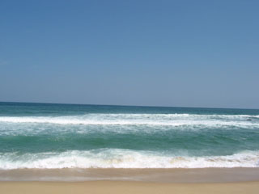
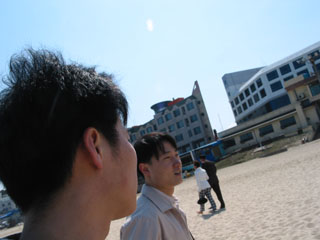
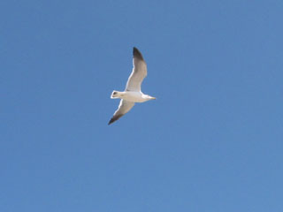
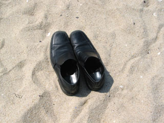
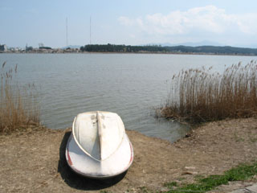
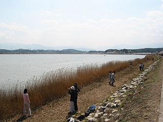
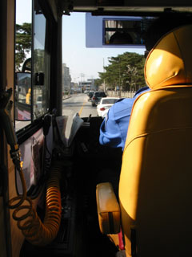
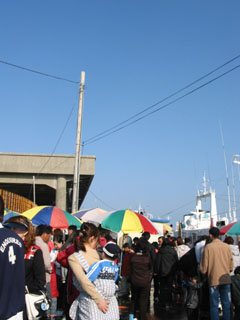

4월 4일 오후에 airis군과 안부를 나누다가  
잠시후 고속터미널에서 만난 후  
- 서울 남쪽엔 터미널이 2개가 있다. 고속터미널과 남부터미널 !  

<!-- truncate -->

강릉으로 가는 차표를 샀다.  
그리고 기다리는 동안 서점에서 2시간 정도 책을 봤다.  
  
아무런 계획 없이 가는 여행.  
  
[20040406-1.jpg](./20040406-1.jpg)  
강릉의 새벽은 추웠고, 시장은 반찬이었다.  
airis군과 이야기를 하다가 문득 몇일 전 읽었던 씨네 21의 기사  
- 허문영이 쓴 [한국영화의 ‘소년성’에 대한 단상](http://www.cine21.co.kr/kisa/sec-002100100/2004/04/040406100702083.html)이 생각 났다.  
조금 다른 맥락이었지만 airis군에게 비슷한 이야기를 해주었다. '너는 소년 같다고.'  
  

바다

바람에 내 머리만...-\_-

  

너 혹시 조나단?

내 신발

  
그리고, 시원한 바다를 걸었다. 바람이 시원한 바다.  
바다 위로 갈메기는 날아다녔지만 아직 바닷물은 차가웠다.  
  
경포대 해수욕장 옆에 경포호가 있다는 걸 처음 알았다.  
뭐, 길치에 방향치가 하루 이틀은 아니지만 이젠 좀 그러지 말아야지.  
기억하고 살아야지.  
  

경포호

사진찍는 사람들

  
벚꽃이 피고, 갈대가 있고, 사람들이 쏟아져 나왔다.  
(서울처럼 전날 비가 왔던 모양인지 벚꽃이 조금 졌다. 아쉬웠다.)  
강릉 지역방송 GTB에서는 노래자랑 방송을 찍고 있었고,  
나이드신 분들과 어린이들은 마냥 즐거워했다.  
  
무계획으로 바다만 보고 오자던 계획은 시간이 지날수록 알차지더니  
한번도 게으름 피우지 않았음에도 불구하고 우리는 더욱 서둘러야만 했다.  
  

색깔이 참 좋았단 말이지..

사람들의 압박;;

  
버스를 타고 주문진으로 이동, 간단히 저녁을 먹고나서야  
가까스로 서울로 돌아오는 버스를 탈 수 있었다.  
  
멀리 나갔다 오지 않으면 못견딜 것 같았는데  
그냥 나갔다 오게 되는 것.  
재밌는 일이야.  
  
  
 그리고, 서비스.. 

[20040406-a.jpg](./20040406-a.jpg)  
GTB 노래자랑의 사회자 중 한명이 너훈아였다.  
너훈아였는지, 나운아였는지는 잘 모르지만 어쨌든.  
아주머니, 할머니들에게 인기만발이었고, 그 역시 매너가 매우 좋았다.
