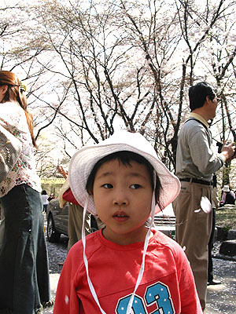
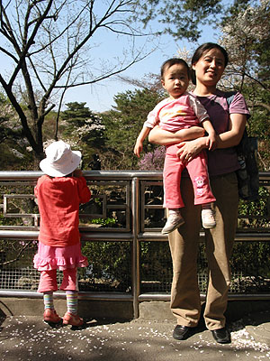
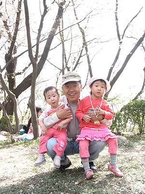
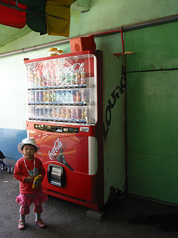
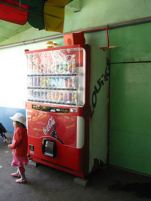
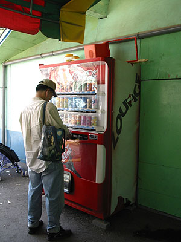
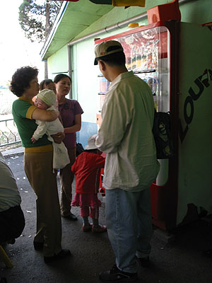

4월 11일 일요일 (어제).  

<!-- truncate -->

누나와 매형과 어머니와 세명의 꽃같은 조카들과 함께 외출을 했다.  
  
사실 꽃이 지기 전에 윤중로를 한번 걸어보고 싶긴 했지만  
상상만으로도 미어터지는 인파 속 막히는 호흡이 느껴져  
엄두도 내지 못했던 게 사실.  
  
(아, 꽃놀이 장소는 경희대 캠퍼스)  
  
신기하지 ?  
뭐, 그리 보고 즐거울 일이 있다고  
때가 되면, 철이 바뀌면 이리저리 놀러 다니고 싶어진다니.  
  
(그렇지만, 그리 신기한 것도 아냐.  
 풀어내고, 담아내고... 그러면서 살아야하거든.)  
  

도착전에 이미 졸린 도연

처음으로(?) 꽃비를 맞은 주연

  

소연이의 당당한 포즈;;;

분홍옷 시스터즈 -\_-;

  
예전에 처음으로 가족 외식을 나간 적이 있었다.  
뭐랄까, 고기도 먹어본 놈이 먹어본다고, (비유가 맞는지;;; )  
가족 외식의 초보들이 일구어내는 요절복통 코미디였지.  
  
서로 너 먹어라, 내 걱정 말아라, 거기 음식 흘렸다, 음식값이 비싸다 등등  
식사를 입으로 하는지 코로 하는지 도저히 알 수가 없었던 첫 외식.  
  
주연이와 소연이, 그리고 도연이도 언젠가 그런 때가 기억나겠지.  
그리고, 점점 능숙하고, 세련되지고,  
자신을 표현하고, 남을 배려하는 방법들을 익혀나가겠지.  
  
[20040412-5.jpg](./20040412-5.jpg)  
봄 햇살에 타면 내님도 못알아본다(?)는 옛 이야기가 맞는지  
따사로운 봄날씨에도 불구하고 갔다오니 도연이의 볼이 빨갛게 익어있었다.  
  
 그리고, 주연이의 위력 

주연이는 세자매의 큰언니인 만큼  
대체로 집안에서도 대단한 위력을 자랑한다.  
  
이를테면 이런 식이다. (이건 사소한 예일 뿐이지만)  
  

(1) 주연이가 음료수에 눈독을 들인다.

(2) 눈길만 살짝 주고 자리를 뜬다.

  

(3) 매형이 와서 음료수를 사고,

(4) 모든 가족이 모여 음료수를 먹는다.
