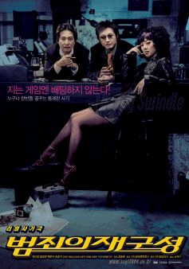
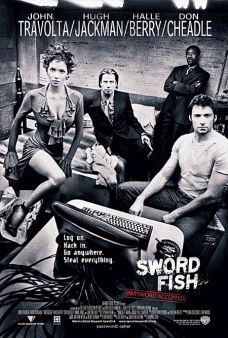
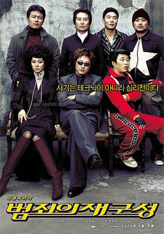

[226.jpg](./226.jpg)  
감독 : 최동훈  
배우 : 박신양, 백윤식, 염정아, 이문식, 천호진, 박원상, 김상호  

<!-- truncate -->

고등학교 3학년 어느날 기숙사에서 친구들하고 고스톱을 친 적이 있었어. 점당 10원. 각각 1,000 ~ 2,000원 가량씩 꺼내놓았고 인원은 5명이었던 걸로 기억해. 한명이 판을 완전히 쓸다시피 해야 간신히 동네 분식점표 철판볶음밥을 먹을 수 있는 금액이지.  
  
어찌어찌 하다보니 내가 판을 거의 다 쓸게 되었어. 애들이 마지막으로 세판만 더 치자고 하는 거야. 그래서, 속으로 '세판 정도 치면 다 쓸어버릴 수 있겠구나' 하는 마음도 들고 해서 그러자고 했지. 그런데, 마지막 세판에 그 때까지 딴 돈을 다 잃고 간신히 본전만 찾게 되었어. 거의 밤새도록 쳤는데 말야.  
  
사실 난 도박을 하면 돈을 잃는 편이야. 그냥 장난으로 - 돈을 안걸고 하면 꽤 잘 이기는 편인데, 막상 돈을 걸거나 진지하게 시작하면 성적이 안좋아. 장난으로 할 때랑 진짜로 할 때랑 다른 게 뭘까.  
  
최창혁 (박신양 분)과 김선생 (백윤식 분)은 사기가 심리전이라는 걸 알고 있어. 사기란 돈 있는 사람을 쫒아다니며 뒷통수를 쳐서 돈다발 뺏어내는 게 아니라 돈 있는 사람이 제발로 찾아와서 갖다 바치게 만드는 상황을 만들어 내는 거라는 거지.  
  
이런 류의 영화들을 보면서 얻은 교훈이 있다면 - 그리고 그게 영화 속에서도 고스란히 장르로써 재현되는데, 자존심, 욕심, 분노, 기쁨, 사랑 등 감정을 다스리지 못하면 '게임'에서는 지는 것 같아. 적어도 룰이 공정하고 실력에 아주 큰 차이가 있지 않다면 그 이후엔 '심리전'이거든.  
  
예전에 Six Senses나 Usual Suspect 같은 영화들을 홍보할 때면 기막힌 반전이 있다면서 그걸로 사람들 호기심을 자극했잖아. 그 때마다 느낀 건 다들 그 '반전'을 안 밝히고 홍보하기 힘들겠다 였는데, 이 영화도 그러고 보니 반전이라면 반전이 있긴 하네. 홍보사의 재치라고나 할까?  
  
이 영화 말야, 영화 잡지들마다 영화 사이트마다 띄워주더라구. 마치 예전에 '고양이를 부탁해'나 '와이키키 브라더스'를 띄워줄 때 처럼 말이지. 사실, 그래서 영화를 보기 전에 이 영화도 흥행성은 떨어지나 싶었어. 평론가들이 괜찮다고 이야기하는 작품 중에 대중들에게 거부감이 느껴지는 작품들이 왠만큼 많아야지. 그런데, 이 영화 잘 하면 뜰 것 같아.  
  
그런데 말야. '태극기 휘날리며'가 헐리우드를 따라하면 헐리우드에 대한 컴플렉스고, '범죄의 재구성'이 헐리우드 장르영화를 따라하면 장르의 재구성인가? 물론 한국적인 요소를 잘 가미시켜 괜찮은 장르영화 나왔다고 하지만, 그 논리는 '태극기 휘날리며'에도 비슷하게 적용되어야 하는 거 아니냐는 거지.  
  
솔직히 음악이 좀 깨긴 깨더라. 우리나라에 이런 류의 영화가 없었기 때문이었으리라 싶으면서도 감독이 심혈을 기울여 만들어낸 구로동 샤론스톤 (염정아 분), 얼매 (이문식 분), 휘발유 (김상호 분), 김선생 등 한국적(?) 캐릭터들과 한국적(?) 시추에이션들에 어울리지 않을 때가 많더라는 얘기.  
  
평점을 주자면 별 다섯개에 세개 반. 드디어 염정아도 자기에 맞는 캐릭터를 찾았다.  
  
20040415 Cine City with Coon  
  
(with nKino)  
  
 그리고 한가지.. 

흠흠.  
포스터가 왠지 Swordfish의 포스터를 재구성한 느낌이다.  
  

범죄의 재구성 포스터

Swordfish 포스터

범죄의 재구성 티저 포스터
