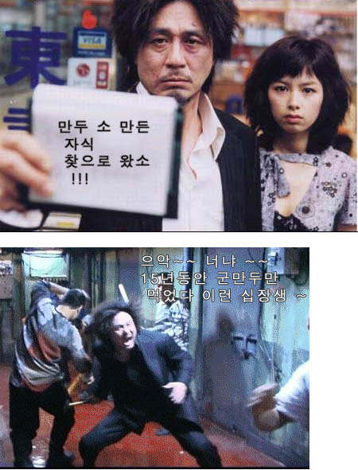

만두를 처음 만든 사람이 제갈량이랬던가? 어떤 강가의 귀신에게 사람을 바쳐야하는데, 대신 밀가루를 반죽해서 고기와 야채를 집어넣었다지. 우리나라에서는 몇년간 (도대체 몇 년 동안인지 누가 알 것인가.) 고기와 야채가 들어있어야 할 만두에 사실 쓰레기가 들어있었다고 한다.

<!-- truncate -->

이 만두를 만든 사람들 중 61살의 이씨라는 사람이 있는데, 만두업계에서는 아주 유명한 사람이란다. 전국의 식탁에 쓰레기를 밀가루로 싼 음식(?)을 식탁에 올려놓고 맛나게 꿀꺽꿀꺽 먹게 만든 사람의 나이가 61살이란다. 그런 일을 하려면 나이가 아무리 들어도 동작은 빨라야 하나보다. 도망가서 잠적했단다.

그 할아버지, 자기 자식들과 손자들에게는 절대로 만두를 못 먹게 했겠지. 쓰레기 몇천톤 남의 입 안에 밀어 넣어 번 돈으로 밀가루와 고기, 야채를 사서 지 손으로 열심이 빚어서 지 자식들, 손자들 먹였겠지.

올드보이에서 오대수를 연기한 최민식이 넘버3에 마동팔 검사로 출연했을 당시 이런 말을 한 적이 있다. "죄가 무슨 죄가 있냐, 죄를 저지른 놈이 나쁜 놈이지"

올드보이에서 오대수를 15년 동안 감금한 이우진씨, 당신이 필요할 때입니다. 61살 먹은 저 할아버지 아니 할아버지의 탈을 쓴 쓰레기, 우리나라에서는 잡히더라도 중국처럼 사형은 안당할 것 같으니 골방에 감금시켜 놓고 - 오대수에게 한 것처럼 만두만 15년 먹여주세요. 예?

(오대수씨, 당신도 열받죠? 당신이 15년 동안 먹은 만두, 그거 만두가 아니라 **쓰레기**였다고요!!!)

> **유통.식품업계 `쓰레기 만두' 비상(종합)**
>
> (서울=연합뉴스) 황윤정기자 = 쓰레기로 버려지는 단무지로 만든 만두가 시중에 유통되고 있다는 경찰청 발표가 나오자 유통.식품업계에 비상이 걸렸다.
>
> 백화점, 할인점 등 대형 유통업체들은 `쓰레기 단무지'를 사용한 것으로 의심되는 만두 제품을 매장에서 철수시키는 등 대책 마련에 골몰하고 있다.
>
> 7일 관련 업계에 따르면 롯데백화점은 이날 수도권 6개점에서 불량 만두소를 사용한 것으로 의심되는 만두 제품 전량을 매장에서 철수시킬 예정이다.
>
> 또 소비자의 불안감을 덜어주기 위해 `안전한 제품들이니 안심하고 드세요'라는 내용의 안내문을 내걸 예정이다.
>
> 현대백화점[069960]은 수도권 7개점에서 불량 만두소를 사용한 것으로 의심되는 만두 제품을 매장에서 빼는 한편 나머지 제품에 대해서도 추가 확인중이다.
>
> 신세계 이마트는 다양한 경로를 통해 불량 만두소를 사용한 제품을 확인 중이며, 롯데마트는 안전성이 검증될 때까지 단무지가 들어가는 만두 제품의 판매를 중단하기로 결정했다.
>
> 식품업체들도 이번 사건의 여파로 문제가 없는 제품의 매출까지 영향을 미치지 않을까 전전긍긍하고 있다.
>
> 고향만두로 유명한 해태제과는 광고 등을 통해 제품 안전성을 알리는 방안을 적극 검토 중이다.
>
> 대상[001680]은 이번 사건과 무관함을 알리는 공문을 유통업체에 보냈으며 풀무원[017810], 동원F&B[049770]는 시식행사 등을 통해 제품의 안전성을 소비자에게 직접 알릴 계획이다.
>
> 도투락도 이날 홈페이지를 통해 "문제의 업체와 거래를 중단한지 2년이 지났으며 현재 철저한 품질관리 기준에 맞는 제품을 납품받아 사용하고 있다"고 밝혔다.
>
> 경찰청이 문제의 단무지를 납품받아 사용한 식품업체의 실명을 밝히지 않고 있어 의혹만 증폭되고 있다는 지적도 나오고 있다.
>
> 할인점 관계자는 "여러 경로를 통해 의심업체를 확인중이지만 확실한 증거없이 제품을 빼달라고 할 수도 없어 난감한 입장"이라고 말했다.
>
> yunzhen@yna.co.kr
>
> 출처 : [연합뉴스](http://www3.yonhapnews.co.kr/cgi-bin/naver/getnews?032004060709500+20040607+1544)

또다른 관련기사 : [쓰레기 만두소 제조 및 만두업체 전격 공개](http://news.naver.com/news/read.php?mode=LSS2D&office_id=079&article_id=0000001698&section_id=102&section_id2=249&menu_id=102)
