결론부터 말하자면, John은 내가 내일부터 학교에 가는 줄 알았던 모양. 그래서인지 저번에 설명해주었던 길도 다시 알려주고, 버스 타는 곳, 지하철 내리는 곳 등을 다시 한번씩 짚어주었다. (분명히 전에 얘기했었는데 John이 잊어버린 모양이다. Tessie는 알고 있었는데.. 흠;; ) 게다가 옆집 사는 한국인 이웃인 Jeffrey (아주 친절한 분이다. 플러그 어디서 사면 싸냐고 물어봤더니 직접 하나 사서 갖다주시기까지. -o- 고맙습니다.)까지 불러서 이것저것 도움 받게 하고 말이지.   

<!-- truncate -->

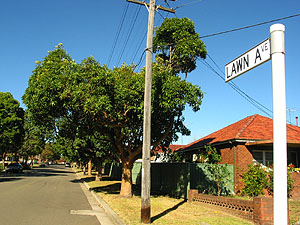

그러니까, 내가 살고 있는 곳 - Lawn 가(Avenue, 街).

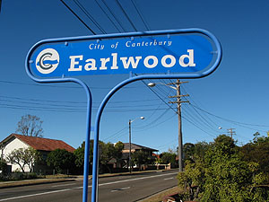

Earlwood에 위치. Syndey City 서북쪽.

   
이곳은 뭔가 할 일이 없으면, 관심있는 것이 없으면 무지 심심한 동네다. 허허벌판에 가정집들만 (간혹가다 가게들도 있지만) 옹기종기 모여있지, 도로들은 시원스럽게 뚫려있지... 뭔가 하려면 Sydney City까지 자가용이나 버스, 기차를 타고 올라가야 한다. 아침 일찍부터 개를 끌고 산책을 하거나 운동을 하는 사람들과 정원정리를 하는 사람들 말고는 정말 조~용하다. (새벽같이 일어나 잔디 깎는 소리에 잠을 못잔다는 이야기도 많이 들었는데, 여기는 그런 사람이 전혀 없다. 겨울이라서 그런가?) 위의 사진은 아침에 일어나 이어폰 귀에 꼽고 산책도 하고 주변도 알아놓을 겸 해서 돌아다니다가 찍은 사진.   
  
문득 생각이 나서 집안에 카메라를 들이 밀었다. 내 방과 Missy방, 그리고 John 부부의 방 사진은 없다. (그러고 보니, 밖에서 찍은 사진도 없네;; )   
  
  

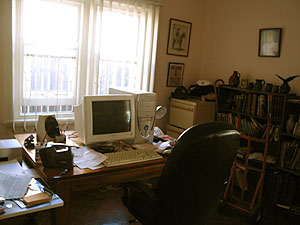

John의 컴퓨터실 및 서재 (^^)

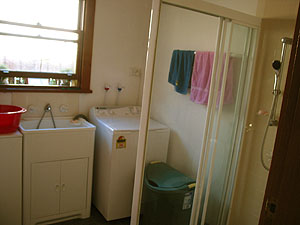

샤워실 & 화장실

  

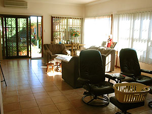

거실. 의자 앞쪽엔 당연히 TV가;;

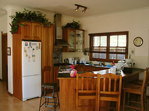

부엌. 거실 왼편.

  

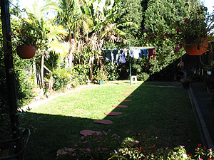

뒷마당(-\_-a) 오른쪽 끝에 Cindy의 집;;

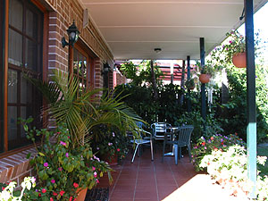

잘 이용하진 않지만 테이블

  

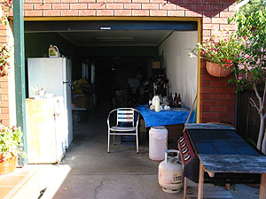

John의 창고. Donley Brew의 메카;;;

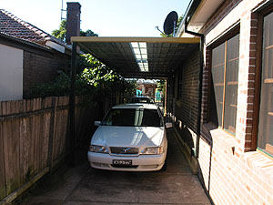

앞차는 Tessie의 차, 뒷차는 John의 차

  
슬슬 준비를 하고 나갔다. 휴일의 마지막 날이고, John은 내일부터 내가 등교를 하는 줄 알고 있으니 나가는 게 당연;;; Bondi Beach 쪽으로 드라이브를 하다가 맥도날드에서 점심을 먹었다. 참고로 Tessie는 휴일/주말엔 음식을 하지 않는다. John이 아침을 책임지고, 저녁은 가족, 친구들이 와서 하고, 점심은 보통 사먹는다고 한다. (...라고 Tessie가 말했지만, 솔직히 그렇지도 않다. 저녁은 그녀가 준비하던 걸, 뭘.)   
  
재밌는 건, Tessie는 John을 위해서 평일날 매일 식사준비를 한다며 살짝(^^) 투덜거리는 투로 이야기하고, John도 Tessie의 어머님과의 문제나 맥주를 먹는 걸 탐탁치 않게 생각하는 Tessie에게 살짝(^^) 투덜거리긴 하지만, 실제로 둘은 잘 어울리고, 서로에게 잘 한다. 어디가나 사랑하는 연인, 혹은 금술좋은 부부가 장난으로 툭탁거리는 건 마찬가지인 모양.   
  
아, 아래 사진은 햄버거를 먹은 지점이 열몇살 때부터 점원으로 일하다가 호주 맥도널드 CEO가 된 그 사람이 일했던 지점이란다. 나도 신문에서 슬쩍 본 기억이 난다. -o- (Guy Russo 던가?  
  
[20040614-11.jpg](./20040614-11.jpg)  
점심을 먹고 나서, Harbour Bridge 근처에 차를 대고, 빙- 둘러 구경을 했다. 젊었을 때부터 여행을 많이 다닌 John은 지리와 역사, 사건, 풍습, 기술 등 다방면에 관심이 많고, 아는 것도 많다. 이렇게 관광지를 보여줄 때는 훌륭한 가이드가 되기에 손색이 없을 정도.   
  
  

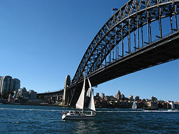

여기가 Harbour Bridge.

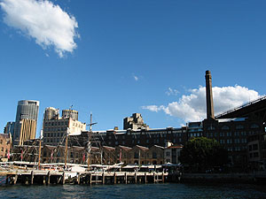

건물들 - 신구의 조화;;;

  
2차 대전 때, 일본군들이 여기를 습격하려 했던 이야기부터 (옆에 Messie가 있었는데 흠흠;;; ), 911 이후에 끊임없는 테러 시도까지, 그리고 어떻게 호주에 사람들이 오게 되었는지, 바다에 감옥을 만든 이야기, 자기는 6대째 호주에 살고 있는 오리지날 호주 토박이라는 자랑까지 섞어가며 재미있게 가이드 역할을 해주었다.   
  
  

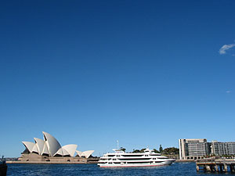

Opera House크기는 대략 이정도.

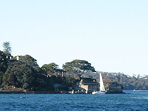

저기 보이는 집이 호주 수상 John's house.

  
John은 사실 호주 토박이라는 자부심이 대단하다. 앞에 적은 것처럼 젊었을 때부터 여러나라 (20여개국 이상)을 오랫동안 머물며 살았기 때문일 거라 추측해보는데, 생각이 깊은 듯 하다. 자기가 호주인이라고, 그것도 6대째 토박이라고 호주에 대해서 무조건 칭찬만 늘어놓지도 않고, 객관적으로 보는 편이라고 할까? (살짝 장점을 이야기하지만, 그거야 당연한 거고.) 예를 들어 시드니가 비교적 치안이 잘 되어 있는 곳 같다고 했더니, 사건들도 일어나니까 조심하라고 하기도 하고, 호주 사람들은 대체적으로 인종차별을 하지는 않으나 몇몇 사람들은 드러내놓고 하기도 하니까 알아두라고 충고하기도 하고, 젊은 호주 사람들이 쓰는 영어는 정통 영국식이 아니라고 하기도 하고 (이건 왠지 어르신들이 젊은 애들 바라보는 시선과 겹치기도;;; ^^)   
  
어쨌든, John이 아침부터 서둘러준 덕분에 (^^) 휴일날 이것저것 많이 알게 되었다. Thank you, John.
