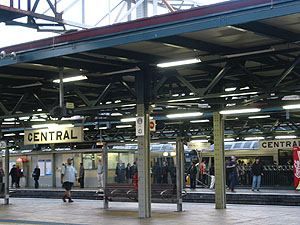
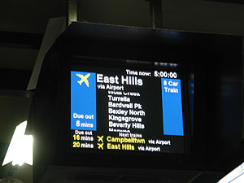
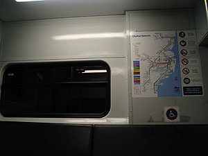
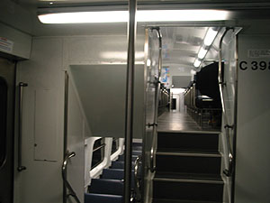

오늘은 혼자 움직이기 시작한 첫번째 날. John과 Tessie에게 여러번 들었기 때문에 역이나 정류장의 위치라거나 하는 것들에 대해서 크게 두려워-\_-하지 않았다. 그리고, 천하태평인 생각인지 모르겠지만, 사람 사는 곳이야 대체로 비슷하리라는 생각도 들었고 - 게다가 Syndey는 international city의 상징 중 하나 아닌가. -o-   

<!-- truncate -->

도착한 날 나를 픽업해준 분은 Koji라는 분인데, Kent 유학원의 자매유학원쯤 되는 위드 유학원의 원장이다. 나이가 많지 않은 분인데, 여기서 유학원을 운영한지 10년 정도된 재일동포. 이번주에 자기가 출장을 간다며 함께 근무하는 Kelly라는 분을 소개시켜 주고 갔었는데, 만나러 갔다.   
  
위드 유학원에 가려면 Town Hall Station에서 조금만 더 올라가면 된다. Pitt St.에 위치하고 있지. Kelly는 친절하신 분이었다. 한참을 이것저것 물어봤는데, 친절하게 대답해주시고 이것저것 물어보지 않은 것까지 알려줘서 편안하게 만들어줬다. (옆에서 함께 일하시는 Angela도 ^^) 거기를 통해 학교 수속을 하거나 하려는 학생들이 쓸 수 있는 컴퓨터들도 있었다. 오오- 물론 한국보다 인터넷 환경이 좋은 곳은 없다는 걸 알고 있기 때문에 별로 실망하거나 하지 않았다. 게다가 가난한 유학생(^^)들을 위해 무료로 운영하고 있다는 사실만으로도 커버된다. -o- (갑자기 유학원 안에 학생들이 불어나서 다음에 쓰기로 했지만.)   
  
한참 이야기를 듣고 나니 시간이 많이 지나서 해가 지기 전에 JMC에 찾아가봤다. 안에 들어가볼까 싶었는데, 이것저것 물어보고 하기에 늦은 시간일까 싶어서 그냥 길만 알아놓고 (길치는 이렇게 반복을 해야 길을 잃지 않는다. -\_-\*) 집으로 돌아갔다.   
  
  
[20040615-1.jpg](./20040615-1.jpg)  
[20040615-2.jpg](./20040615-2.jpg)   
기차역과 학교는 매우 가까워서 걸어서 10분도 채 걸리지 않는다. 그나저나... 자, 이제 운명의 시간이 돌아왔다. 자 어떻게 돌아가야 하나... 사실 city로 나가는 기차를 타는 건 매우 쉽다. 내가 기차를 타는 Bexley North라는 역은 매우 작은 역이어서 전혀 복잡할 게 없지만 Central역은 Syndey City에서 제일 복잡한 역 아닌가. 나 같은 길치에게는...;;;   
  
일단 표를 끊고 (자판기가 Bexley North역에 있는 것과 달라서 작동해봤는데 제대로 되지 않았다. 웁;;; 창구가서 다시 끊었지.) 플랫폼을 찾는 것도 처음이니 당연히 서툴지. 우리가 지하철에 대해 아는 것도 당연히 - 여러번 타봐서 익숙하기 때문이다. 1호선 파란색 국철구간과 연결, 2호선 녹색 시내 순환선, 3호선 주황색... 뭐 이렇게 대충 머리 속에 그림이 그려지지만 여기선 그러지 않으니. 어쨌든 내가 타는 건 Airport & East Hills Line (녹색)이다. 22/23번 플랫폼으로 가서 직원에게 '어느 방향에서 타야 하느냐;;'고 물었더니 아무 쪽에서나 타란다;;; TV에 각 기차마다 거치는 역이 나오니 그걸 보고 아무 쪽에서나 타면 된단다. 오홍-   
  
  

Central Station.

자세히 보면 보인다. 가운데쯤 Bexley North.

  
자, 성공. 이제 Bexley North에서 내리면 된다, 내리면 된다, 내리면... ... ... 깜빡 잠들어서 Narwee까지 갔다 -\_- (3정거장 초과;; ) 난 왜 차만 타면 잠이 드는가. 다시 돌아가는 기차를 타고 무사히 내렸다. 이제 왔던 길 돌아가기만 하면 되지, 뭐.   
  

기차 내부. 벌써 캄캄해진 바깥 - 오후 4시 45분.

시드니의 기차는 2층이다.

  
... 그런데, 길을 잃어버렸다. -O- 분명히 근처인 건 알겠는데 도무지 어딘지를 모르겠다. city라면 모를까 여긴 쭉쭉 뻗은 도로에 가정집들로 충만한 Earlwood 지역. 근처 지도도, 주소도 가지고 나오지 않아서 더욱 낭패 -o- 그나마 나오기 전에 Tessie에게 전화번호를 받아놓아서 다행이라면 다행이랄까? 공중전화를 찾다가 (가게조차 드물다, 근처에 공중전화는 아예 없고) 동물 병원이 눈에 띄어 들어가 냅다- 길을 잃어서 그러니 전화 좀 써도 되냐며 방긋방긋 -o- 웃었더니 써도 된단다. John이 전화를 받고 데리러 왔다;;; (알고보니 그 동물병원은 이 집 개 Cindy의 단골병원이었다.)   
  
  
[20040615-7.jpg](./20040615-7.jpg)  
John과 Tessie 모두 처음이니까 괜찮다고 말해줬다. ㅠ.ㅠ 아, 땀나;;; Missy는 여자애이기도 하고 (기차역은 걸어서 15-20분 정도 가야된다. 어두워지면 아무래도 좀 무섭겠지.), 버스 정류장이 집 바로 앞에 있어서 그걸 타고 다니니 길을 잃은 적은 없는 듯 하다.   
  
계산을 해봐도 실제로 기차를 Return으로 끊고 타는 게 버스를 타는 것보다 더 저렴하다. Bexley North ~ Central 까지 (과금을 하는 section이 있는 것 같긴 하다. 정확하진 않지만 사실은 Beverly Hills ~ Town Hall 까지가 아닐까 추측) 그냥 끊으면 $3, 왕복하면 $6인데, (day) Return - 그날 왕복으로 끊으면 $3.60 이니까 매우 싼거지. 이런 식의 것들이 호주에선 많다. 여러개 사면 할인율이 높아지는 것 등등 곳곳에서 볼 수 있다. 그래서인지 Tessie도 종종 나에게 먼저 계획부터 세우고 움직여야 Sydney에서 잘 살 수 있을 거라고 말하기도 하고. 또한 교통비가 싼 게 아니니 City 내부에서 움직일 때도 언제나 걸어다니는데, 아무리 City가 좁아서 끝에서 끝까지 가는데 30-40분이면 간다고 해도, 동선을 잘 세우지 않으면 고생하는 건 주인 잘못 만난 자기 자신의 다리와 허리니까.   
  
뭐, 사는 게 다 이런 거 아닌가. -o-
