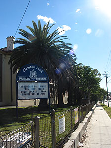
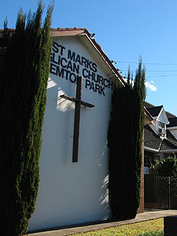
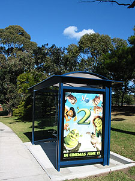
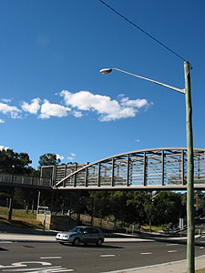
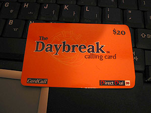
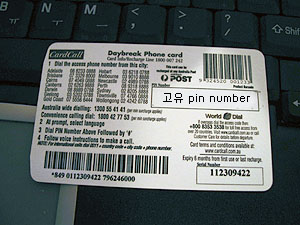

어제의 실수를 만회하기 위하여 ㅠ.ㅠ 집에서 나서면서부터 꼼꼼히 봤다-\_-. 실제로 City에 나가면 복잡하니까 거기만 신경써서 외웠던 게지. 내가 길치임을 깜빡;;하고.   

<!-- truncate -->

  

근처에 학교가 있고,

교회도 있다.

  

슈렉도 있고;;; (6월 17일 개봉)

다리-\_-도 있다.

  
겸사겸사 Kelly에게 다시 가서 이것저것 물어보고 전화카드를 샀다. 한국에서 사가지고 가라는 전화카드 - 그거 무지 비싼 거란 사실을 알았다. 뭐 그네들도 팔기 위한 거니까 뭐라 할 말은 없지만, 적어도 호주의 왠만한 도시로 가는 사람들은 도착해서 이 카드를 구입하면 비교적 저렴하게 통화할 수 있다. (물론 다른 카드도 있겠지.) $10, $20, $30 이렇게 3가지가 있고 색깔로 구분이 가능하다. 내가 산 건 $20짜리. 불편한 점이라면 접속번호, 내 pin 번호 (이를테면 카드 고유 비밀번호 같은 건데, 사고 난 후 동전으로 긁으면 가려져 있던 번호가 보인다.), 상대방 전화번호를 모두 눌러야 통화가 가능하다는 점이다. (그렇지만 이런 방식은 다른 카드도 마찬가지니까 단점이라 볼 수는 없고.) 번호 하나라도 실수하면... 으... (참고로 접속번호를 누른 후 ARS에 연결된 후 바로 4번을 누르면 한국어로 안내가 된다.) City를 돌아다니다 보면 이런 전화 카드를 파는 곳을 볼 수 있다. 들어가면 아무데서나 살 수 있겠지. (나야 위드 유학원에서 샀지만.)   
  
  

The Daybreak calling card $20

뒷면은 이렇게.

  
[20040616-7.jpg](./20040616-7.jpg)   
  
$20 짜리를 $18에 샀다고 Missy에게 자랑했더니 그녀는 $16에 샀단다. 우띠;;; 자기가 소개 받은 어느 일본 유학원에서는 목요일날 세일해서 $16에 살 수 있다나 뭐래나;;; 아, 한가지, 다른 카드도 그런지 모르겠지만 이 카드는 6개월이 지나면 자동으로 돈이 날아간다. 그 동안 무조건 통화를 해야 된다는 거지.   
  
...그리고, 오늘은 별 일 없이 무사히 왔다. God Helps Me. :)   
  
  
아, 맞다. 그리고 극장 옆에 있는 스타벅스에서 오늘의 커피 한잔. 아, 좋다.
