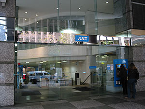
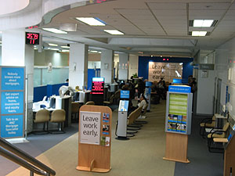
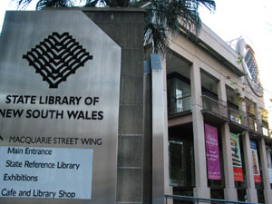
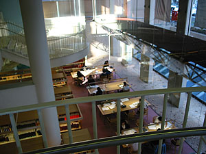
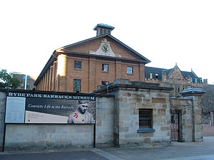
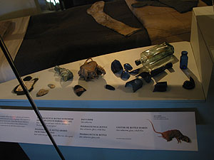
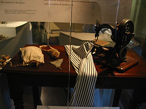
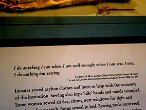

Central 역에 내려서 Railway Square로 가면 Bus Information이 있다. City를 경유하는 각종 버스들에 대한 안내 소책자가 비치되어 있는데, 버스표는 또 아무데서나 안판다고 하네; News Agent에 가야 한단다. 물어물어 가까운 News Agent에 가서 티켓을 두장 샀다. Blue Travel 10, Red Travel 10 각각 한장씩.   

<!-- truncate -->

시드니의 버스 요금제는 구간별로 나뉜다. 아직 돈을 내고 타보지 않아서 현찰박치기로는 얼마인지는 모르겠지만 (어쨌든 티켓을 사는 것보다는 비싸겠지). 어쨌든, 어쩌구 Travel 10 시리즈는 10번을 사용할 수 있다. 유효기간은 없고. 내가 사는 Bexley North 구역은 Blue Travel 10을 이용하면 한번 탈 때마다 3번을 찍는다 -o-. Red Travel 10은 1번만 찍고. Travel 10 시리즈는 5-6가지 종류가 있는 것 같다. (참고로 당연한 이야기지만 Blue Travel 10으로 한번 찍는 구간에서 Red Travel 10 티켓을 이용하면 당연히 손해다. 무조건 펀칭 한방은 펀칭 한방일 뿐이다.) 아직 버스를 이용하진 않지만 경험삼아 사봤다. 두 장 합쳐서 $36 정도 (정확하게 기억이 안난다;; ).   
  
출국하기 전에 한국에 ANZ Bank가 생겼다길래 (광화문 교보빌딩), 기왕이면 구좌를 만들어놓고 가는 게 좋을 것 같아서 미리 구좌를 트고, 입금을 하고 호주에 왔다. 지금 와서 생각해보니 나쁜 선택은 아니었지만, 그 한국에서 담당하는 여자분, 별로 친절한 분이 아니다. 분명 한국에서 ANZ Bank에 구좌를 여는 사람은 호주에 새로 가는 사람들이 많을테고, 그러면 보다 상세하게 설명을 해주는 게 좋을 듯 하지만, 왠지 처음부터 끝까지 자기는 아쉬울 게 없다는 태도였다. 설명도 상세하게 해주지 않고 말이지. 벌점 50점이다.   
  
그 여자분이 찾아가라고 한 곳은 Sydney City의 비교적 윗쪽 68 Pitt St.에 있는 ANZ Bank 지점. (이것도 말야, 분명히 처음 이야기할 때는 아무 지점이나 가면 구좌를 열 수 있다고 설명해놓고, 막상 가보니, 정해진 곳으로만 가야하잖아. 칫. 벌점 추가 50점) Market St.도 지나서 조금 더 올라가야 한다. Sydney Tower를 아래서 구경만 하고, 조금 더 올라가서 ANZ Bank에 도착, 구좌를 열었다. 몇일 있다가 카드를 보내준단다.   
  
  

68 Pitt St.에 있는 ANZ Bank

실내 모습 (직원들 매우 친절하다.)

  
바로 옆에 있는 Australia Square에서 도시락을 먹고 (오- 친절한 Tessie, 저녁을 넉넉하게 해서 도시락 쌀 걸 남겨두었다. Missy는 이미 그렇게 학교를 다니고 있었고.) 이것저것 구경을 했지만 - 역시나 비싸다. 흠.   
  
Hunter St.를 따라 우측으로 가면 State Library of NSW가 있다. 그래도 공부하러 왔으니 도서관을 보러 간건데, 공부하는 도서관이 아니라 자료를 찾는 도서관이었다. 이것저것 들고 들어가는 타입이 아니라 락커에 짐을 놓아두고 들어가서 자료를 찾는 형태 (호주에 관한 각종 학문적 자료를 얻을 수 있다.).   
  
  

반대쪽에는 간단한 전시장이 있다.

자료를 찾는 학생들;

  
슬쩍 둘러보고 Hyde Park에 있는 Barracks Museum에 갔다. 성인 입장료는 $10. 학생은 $3. 다음달부터 학기가 시작된다고 하니 $3만 받는다. 좋다. :) 호주의 역사는 영국에서 호송된 죄수들로부터 시작하는 건 아는 사실. 그 역사를 이것저것 남겨놓았다. 죄수들의 역사는 어디가나 서글프다. 그나저나 죄수들의 이름과 죄목, 특기 등을 일일이 보관하고 있었는데, 참 대단하다는 생각이 들었다. 자료가 자료로서 가치가 있으려면 사람들이 이용하기 쉬워야 한다는 새삼스러운 사실을 알게 되었다랄까. (검색조건 - 이를테면 죄수명, 죄목, 특기 등을 넣어서 컴퓨터로 돌리면 그 당시 죄수들 신상 정보가 결과로 주르륵 나온다. -o-) 전시되어 있는 것들 중 당시 바느질 거리를 보여주며 아래에 I do anything I can when I am well enough; when I can sew, I sew; I do nothing but sewing. 라고 기록한 누군가의 글을 적은 게 있는데 거참 ... 그랬다.   
  
  

Hyde Park Barracks Museum 입구

유물(?) 일부 - 가운데 저거, 말라죽은 쥐다;;;

  

여자들은 이렇게 바느질도 하고,

The Shawshank Redemption이 생각나는.

   
Hyde Park를 가로질러 돌아오는 길에 DVD title을 사볼까 싶어서 몇군데 둘러봤지만 마땅한 걸 찾을 수가 없었다. 그래도 영어 공부하기에 적합한, 싼 걸 찾았는데 고르다 보니 살 게 없었다. 영화 제목들도 생각이 나지 않고;;;   
  
그리고, 몇군데 internet cafe도 들러보았는데, 평균적으로 $2 / hr 정도 하나보다. 더 싼 곳이 있다면 생각해 봐야겠지만, 그게 아니라면 시설 좋은 곳에 가서 사용하면 될 듯 하다. Kelly 말로는 $1.50 / hr 하는 곳도 있다고 하던데, 오래전에 가본 거라 지금은 가격이 올랐는지도 모르지. 그리고, usb는 연결 가능한 컴퓨터가 적어도 1대씩은 있는 듯 하다.   
  
아휴, 다리야- 아휴, 허리야-
