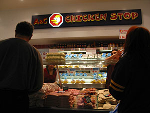
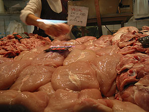

아침에 부비부비, 졸린 눈을 비비며 화장실에 들어갔는데, Missy가 샤워하면서 문을 잠그는 걸 잊었나보다. 본의 아니게 그만;;;   

<!-- truncate -->

... -o- ...   
  
아마 Missy도 일기를 쓰고 있다면, '이런 불한당 같은 놈, 노크도 없이 들어오다니... 뒤통수를 열대 맞아도 모자랄 자식;;;' 이라고 쓸지도. (그렇지만, 잠결이었고, 내가 들어갈 때 물소리도 안났고, 문도 안잠겨 있었다고;;; )   
  
정신을 차리고, 아침을 먹고, 미안하다고 사과했다. (그렇지만, 지금도 화가 안풀린 건지, 창피한 건지 분위기가 그리 좋진 않아 보인다-\_- )   
  
  
[20040620-1.jpg](./20040620-1.jpg)  
어쨌든, 휴일용 점심거리를 먹으러 맥도날드에 갔다. 그러고 보니, 여기서 받은 느낌은 맥도날드가 그리 싼 브랜드가 아니라는 것. 우리나라에서는 비교적 싼 취급 받지 않나? KFC, 파파이스, 버거킹 등이 그나마 더 낫다고 인식되지 않나? 나만 그런가? 왠지 오랫동안 - 맥도널드 하면, $1짜리 햄버거가 떠올라서...   
  
  
[20040620-2.jpg](./20040620-2.jpg)  
맥도날드에서 요즘 하는 프로모션이 '영화와 사실을 구분하세요- ' 뭐 대충 이런 건데, 역시 얘네(서양인)들의 스타일을 보여준다. 이를테면 이런 거지. '영화에서 보면, 치킨버거에 들어가는 닭은 아무거나 다 갈아넣었다는데요.' 라고 한 후, 그 옆에다 '맥노날드의 치킨버거에 들어가는 닭은 가슴살과 다리살을 이용합니다.' 라고 적는 식. (내용은 정확히 기억나지 않지만 - 치킨버거가 맞나?) John은 옆에서 이걸 보며, '맞아, 맥도날드에서는 가슴살과 다리살을 이용하는 거 맞지. 그런데, 다른 부분도 이용한다고 적는 걸 빼먹었구만.' 라고 문장 속에 숨어있는 1인치(^^)를 간파해낸다. 맞다, 그런 식. 그런 건 어찌되었건 거짓말은 아니니까. 굳이 이야기하자면 약은 거지, 매우.   
  
  

닭고기 가게 -\_-;

가슴살로 2kg 주세요.

  
어쨌든 그러고 나서 저녁에 먹을 닭고기를 사왔다. 아직까지 아침에 일어나서 저녁에 자는 게 익숙치가 않아서인지 피곤하다-\_-. 그래서, 낮잠 한숨 자고 났더니 모두 모여 있었다. 일요일은 가족, 친구들이 와서 저녁 시간을 보내는 날. Tessie는 사전 준비(^^)를 하고 있고, Grace, Viki, Virgie 등은 낮에 장을 본 닭으로 바베큐를 굽고 있다. John은 어느새 Bob과 맥주를 먹고 있네;;; 시끌벅적 요란스럽게 준비를 하고 맛나게 저녁을 먹고 또 수다 한마당. 그리고, See you later~.   
  
  
사실 호주에 오기 전에, 학교와 홈스테이 하는 곳이 조금 먼 것 같으니 바꿔줄 수 없냐고 몇차례 요청을 하긴 했다. 거리가 멀면 사람이 좋다는 보장이 있든지, 사람이 좋다는 보장이 없으면 거리가 가깝든지 해야 할 것 같아서. 지금 상황이 나에게 최선인지 어쩐지는 잘 모르겠다 - 그래봐야 나의 유일한 경험일 뿐이니. 토박이(?) 문화를 알려면 철저하게(^^) 호주식 가정에 들어가는 게 좋은 건지도 모르고, 여러 사람들이 섞여 있고 북적북적한 분위기가 종종 만들어지는 환경이 좋은지도 모르고. 어쨌든 다행은 다행이다. 좋은 사람들, 재밌는 경험이니까. 참, 내가 위드 유학원의 Kelly에게 좋은 학생들 있으면 추천할만한 집이라고 한 적이 있지. :)   
  
그리고, 인터넷을 통해 찾은 정보에는 호주 사람들의 좋지 않은 면들도 많이 적혀 있었지 (그래봐야 우리 관점에서 익숙치 않은 것들이 많다고 보지만.). 맨날 밤마다 맥주를 마시며 럭비를 보는 게 유일한 낙이라거나 (Tessie와 Viki의 말로는 실제로 그런 사람들이 많다고 한다.), 새벽부터 일어나 잔디를 깎는 통에 잠을 설친다거나, 별로 대화도 없이 오로지 돈 때문에 홈스테이 학생들을 받으며 일하느라 정신없고 학생들을 괄시하는 주인들이 있다거나 하는 이야기들. 심지어 한국사람들끼리도 서로 등치는;;; 일들이 비일비재하니 조심하라는 이야기까지 (아직 제대로 한국 사람들, 학생들을 만나보지 않아서 모르겠다. Jeffrey가 유일하지.). 호주에 10대에 이민와서 지금 두 아이의 아버지이고 연구소(?)에 근무하는 Jeffrey의 표현을 빌리자면 공부는 안하고 놀러오는 한국 학생들이 많기는 하단다. 사실 내가 봐도 어학연수로 호주에 오는 사람들 비율이 대다수를 차지하는 것 같긴 하다 - 유학원을 뒤져봐도 대부분의 프로그램(?)이 어학연수에 맞춰져 있으니.   
  
그렇지만 아무리 생각해봐도 그런 건 모두 사람 나름일 뿐이라고 생각한다.
