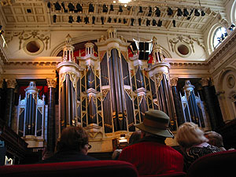
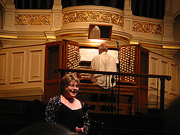
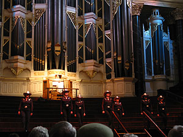
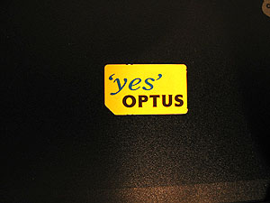
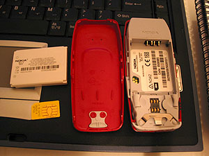
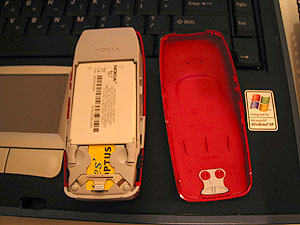
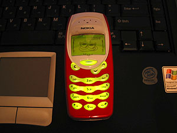
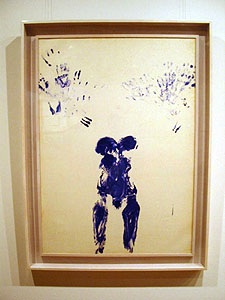
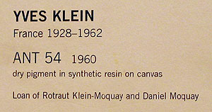

오늘도 역시 나갔다. 걷기 시작한 날과 다음날에는 엉덩이가 아프더니 (운동이 된다는 증거) 이젠 괜찮다. 이건 생활 속의 스포츠다. 길치의 속보 대행진;   

<!-- truncate -->

[20040621-1.jpg](./20040621-1.jpg)  
기차의 첫자리에 앉아 있다가 다리가 아파서 아무 생각없이 맞은편 자리에 다리를 턱- 올려놨다가 벌금 문다길래 얼른 내렸다-\_-.   
  
[20040621-2.jpg](./20040621-2.jpg)  
기차표를 보통 Central 역까지 간다고 해서 사는데, 이것저것 자판기를 눌러보니 Central이나 City나 똑같이 나와서, 끊은 기차표로 Town Hall 역까지 갔다. 역안을 조금 해매다-\_- 밖에 나오니 Town Hall (예전 고풍스런 건물)이 보인다. 오오- 나이 드신 어른들이 우르르 들어가길래 뭔일인가 따라 들어가봤더니 행사를 한단다. 무료 오르간 연주회 (Organ Recitals - free admission). 오호. 운이 좋았네. 오늘만 하는 거다 - 다른 날은 다른 장소에서.   
  
Robert Goode라는 파이프 오르간 연주자와 Jeannie Kelso라는 스코틀랜드 출신 소프라노. 그리고, In Line Boots라고 라인댄스팀 (여러명이 서서 간단하게 발동작, 손동작 안무를 하는)이 오늘의 출연진이라네. 그런데, 파이프 오르간 연주하다가 2번이나 소리가 안멈춰서 연주와 노래를 다시 했다 -o- (디지털 방식이라면 panic 혹은 reset 버튼 누르면 바로 될텐데;;; ).   
  

오오- 멋지다.

Robert 아저씨

  

Jeannie 아줌마

In Line Boots

  
나와서 Town Hall 아래에 있는 도서관을 찾았다. 공부를 한다면 여기가 제격인듯. 정식명칭은 City of Syndney Library. 여기 뿐만 아니라 4군데나 더 있네. 아, 지난 번에 Kelly가 그랬는데 여기서 책보거나 공부할 때 소지품을 정말 조심해야 한다고 한다. 아는 사람들도 단 몇초만에 소지품을 잃어버렸다고. 도서관 안에도 아예 경고 문구가 적혀있다. 단 몇초면 도둑이 훔쳐가기에 충분한 시간이라고;;;   
  
[20040621-12.jpg](./20040621-12.jpg)   
위드 유학원에 들러서 이것저것 물어본 뒤에, 바로 모바일 (핸드폰)을 사러 갔다. 한국에는 이것저것 잡다한 기능까지-\_- 많은 품질 좋은 핸드폰이 많지만, 여기는.... 여기도 있다. 비싸서 그렇지-\_-. 제일 싼 걸로 샀다 - $79. 기능은 같은데 색깔이 다른 게 있어서 (색깔만 다른데 비싸게 표시되어 있던데, 흠...) 그걸 사려고 했는데 안판단다. 그래서 그냥 샀다 - 빨간색. Grace가 핸드폰에 대해서는 빠삭하니깐 케이스 어디서 얼마면 바꿀 수 있는지 물어봐야지 -\_-.   
  
[20040621-7.jpg](./20040621-7.jpg)  
이제껏 내가 아는 바로는 크게 3가지으로 핸드폰을 이용할 수 있다.   
  
첫째, 핸드폰을 사고, 쓴만큼 청구서가 오면 돈을 낸다. 뭐 가장 평범한 방법.   
둘째, plan이라는 게 있는데, 우리나라의 할부제도와 비슷하다 - (핸드폰을 공짜로 사고, 매달 그 핸드폰 값을 분할 지불하면 되는 방식.) 보니까 거의 대부분 24개월짜리던데 우리나라와 차이는, 만약 plan $33 짜리라면, 공짜로 핸드폰을 사고, 매달 $33 만큼 핸드폰을 이용할 수 있다는 점. 즉, 전혀 쓰지 않아도 매달 $33씩 나가고, $33까지는 써도 $33만 내면 되고, $33 이상 쓰면 그 이상 낸다. 만약 핸드폰을 많이 사용해서 달마다 내는 비용이 많으면 24개월보다 쓴만큼 줄어든다. 우리나라의 할부 보다 훠얼씬 유리한 방식. 예전엔 유학생들은 못샀었는데, 지금은 가능하다고 한다.   
셋째, pre-paid인데, 한마디로 선불요금제다. 충전해서 쓴다. 청구서, 뭐 요런 거 없다. 아무래도 단기체류자 (몇달 ~ 몇년)가 많기 때문에 발달한 상품이 아닐까 싶다. (우리나라에도 비슷한 거 있긴 하지만, 거의 안쓰는 거에 비하면 여긴 많이 쓴다.) pre-paid 폰은 종류가 다르다 (우리 나라에서 SK와 KTF폰이 다르듯이). SIM 카드라는 걸 사서 핸드폰에 집어넣고, 해당 통신회사에 나 핸드폰 샀으니 개통해주시오- 라고 전화하면 사용이 가능하다.   
  

많은 사람들의 의견을 들어 Optus로 결정.

배터리, SIM 카드 그리고 핸드폰.

  

SIM 카드와 배터리를 핸드폰에 끼우면,

요렇게 작동한다. (아, 색깔 맘에 안든다-\_-)

  
가격이 싸서 그런건지, 우리나라 핸드폰에 비하면 좀 장난감스러운 면이 있다. 전체적인 디자인도 틀리고, 결정적으로 SIM 카드가 장난감스럽다. 칩이 종이에 달려있는 게 왠지 좀 어색;;; (물론 가벼워서 아이디어는 좋다고 보지만.) 그나저나 사와서 조립하고-\_- 등록하려고 고객센터에 전화했더니 통화량이 많단다. Tessie 말로는 고객센터로 전화해서 통화되기가 엄청 어렵단다. 모바일은 이미 샀으니 배째라 이건가-\_-. 내일 해야지, 뭐...  
  
그리고, 케이스는 꼭 교체하고야 만다 ! -\_-\*  
  
[20040621-15.jpg](./20040621-15.jpg)  
모바일을 사고, Art Gallery of NSW에 갔다. John의 말에 의하면 이곳는 전시된 작품들이 수시로 교체된다고 한다. 오오-. 여기도 호주 원주민(?)들의 작품 공간이 따로 있고, 연대기 순으로 예전 작품들을 전시해 놓은 공간이 있고, 그리고 현대 작가들의 작품들이 전시되어 있다 (아마도 현대 작가들의 작품이 교체되는 거겠지.). 한가할 때, 머리 식히러 오기 딱이다. 사진을 찍었으나 (한층만 빼고. Level 3는 호주 원주민(?)들의 작품이 전시되어 있던데, 못찍게 하더라.) 정리는 나중에;;;   
  

맛뵈기로 한장;;;

작품 설명

  
원래 오늘 internet cafe에 가서 이것저것 할 계획이었다. 그런데, 역시나 Art Gallery를 둘러보다가 시간을 놓쳤다. 그래도 한 30분이라도 시간을 내서 해볼까 싶어서 한 곳을 골라 들어갔는데, usb 연결을 카운터에서만 가능하단다. 그래서, 그러라고 하면서 내걸 내줬지. 내가 쓰고 있는 곳으로 전송해준다고 하더니 20여분이 지나도 할 생각을 안하는 점원 -\_-\*. 어이가 없어서 일어섰더니 20분 쓴 돈은 안받겠단다. (하긴 뭘 한 게 있어야지. 까딱 않고 기다렸는데;;; ) - 솔직히 어떻게 하는지 모르는 것 같았다. 불쌍해서 참았다.   
  
집에 오니, ANZ Bank에서 온 편지가 도착. 뜯어보니 카드가 들어있다.   
  
[20040621-16.jpg](./20040621-16.jpg)   
할 일이 또 생겼네. ATM에서 돈 찾는 법, 가게에서 카드로 결제하는 법;; -\_- (뭐 비슷하겠지, 다르겠어?) 왠지 영화 Shawshank Redemption의 Red가 된 듯 한 기분이다. 하나 하나 배우고 있네 -o- 내 모바일도 은행구좌만 있으면 ATM에서 충전해서 통신사로 전화하면 된다고 하니 그것도 나중에 해봐야지.
