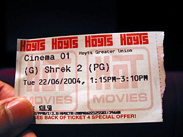
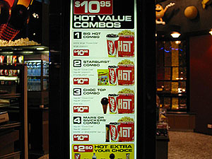
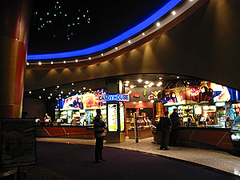
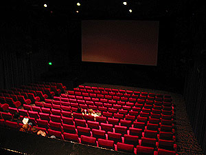
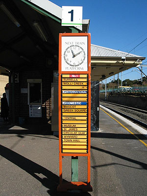
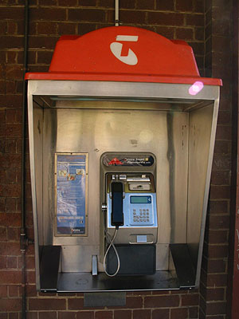

아침에 Optus에 전화하니 제깍 받는다. 오오- 이것저것 불러줄 거 열심히 불러주고 나니, 몇분 안에 개통이 된단다. 해봤더니 된다. 오오-. 참고로, Optus 서비스를 이용하는 나는- 내 pre-paid폰에 얼마 남았는지 조회할 때나 충전할 때 거는 전화가 555번이다. 그런데, 처음에 등록할 때 (activation) 거는 전화가 이 번호더라. 흠... '한번이라도 더 충전할 때 쓰는 번호를 이용하게 해서 익숙하게 하자 이거지?' 라는 생각을 잠시;;; (물론 555는 무료전화다. 고객 상담용으로 많이 쓰이는 1-800 번도 무료전화란다. 그리고, 응급상황시에 쓰는 번호는 000, 역시 무료전화)   

<!-- truncate -->

자, 오늘은 Super Tuesday. 영화를 보러 갔다. 선택된 영화는 Shrek 2.   
  
[20040622-0.jpg](./20040622-0.jpg)  
다른 곳에도 극장이 있지만, 그래도 시내 한복판에 있는 극장으로 갔다. George St.에 있는 Hoyts. Great Unions라는 건 이 극장이 속해있는 그룹인지, 배급으로 연결되어 있다는 건지 아직 모르겠다. -\_-; 관이 꽤 많다. 기억이 잘 안나지만 10개관 이상 있는 듯.   
  
[20040622-1.jpg](./20040622-1.jpg)  
요금은 평일날은 성인 $15.30, 학생 할인 등을 받으면 $11.70 - 화요일은 모두 $10.50이다. 단체로 가면 할인이 된다. 회원권 (상품권) 같은 것도 파나보다. 물어보지 않아서 얼마나 혜택이 있는지는 모르겠지만;   
  
[20040622-2.jpg](./20040622-2.jpg)  
이곳의 극장은 한국의 극장과 달라서 지정좌석제가 아니다. 그냥 마음에 드는 곳에 앉으면 된다. -o- Hoyts는 우리나라 멀티플렉스 극장들과 비슷한 수준. 의자가 뒤로 젖혀지지는 않고 (우리나라 멀티플렉스의 의자들은 살짝 쿠션이 있지;; ) 팔걸이도 올라가지 않는다. 극장 내에서 파는 음식은 한국과 비교하면 무지 비싸다. 미리 적당히 사들고 들어가거나 물이나 싸가는 게 나을 듯. 역시 각종 물건들에 대한 가격 기준이 다르기 때문이겠지만, 아이스크림 콘을 단돈 $3.50에 판다고 붙여놓는 게 재밌었다 (한국에서 그 가격에 팔면 아무도 안 사먹을 듯;; )   
  

티켓이 이렇게 생겼네;

팝콘 + 콜라 콤보가 $10.95 -o-

  

대략 극장 안 모습

여기가 1관

  
한국에서도 스크린 크기가 맞지 않아서 - 사실 그게 아니라 영화마다 스크린 가로 세로 비율이 다른 거겠지만, 필름을 스크린에 쏠 때 간혹 넘치곤 하는데 여기도 그렇더라-\_-. 그리고, 여기가 자유분방한 건지, 우리나라 관객들이 착한 건지 - 우리나라에서는 의자에 과자 부스러기 잘 안흘리고, 흘려도 대충 쓸어내고, 아줌마들이 열심히 치워주고 그러는데, 여기는- 의자는 대충대충 치우나보다. 관객들도 흘리든 말든 별 상관하지 않고.   
  
아, 정말 좋은 점!!! 영화 본편 끝나고 앤딩 크래딧 끝까지 올라갈 때까지 계속 쏴준다 - 마지막 로고 나올 때까지. 거의 끝나갈 때 쯤 되니까 (본편 끝나고 앤딩 크래딧 올라가기 시작한지 15여분 정도 지났을 때였나?) 청소하는 사람들이 헛기침 하면서 안나가냐고 무언의 압력(?)을 주기도 했지만, 끝까지 볼 수 있다. 이 얼마나 좋은가. 도대체 한국에서는 언제나 가능한 일일까. ㅜ.ㅜ   
  
  
참, 오늘은 Tessie가 역까지 태워다줬는데, Bexley North 역이 아니라, Bardwell Park 역으로. Sydney City 중심지로 가면 안 그렇지만, 외각지역에 있는 역들은 대충 이런가보다 (내가 내리는 근처 역들은 다 이렇다.). 우리나라 국철 구간처럼 역이 지상에 있고, 한가한 시골역 같은 풍경. 재밌는 건, 아래 사진처럼 기차가 도착하는 시간과 정차하는 역들을 표시하는 안내판이 세워져있는데, 시간을 표시하는 시계바늘을 역무원이 매번 직접 손으로 바꾼다. ^^ (정차하는 역은 매번 거의 비슷하기 때문에 바꿀 일이 거의 없고.)   
  

안내판

공중전화;;;

  
온지 얼마 안되서 분위기 파악이 잘 안되긴 하지만, Sydney의 공중전화는 Testra가 꽉 잡고 있는 듯 하다. 사람들이 Mobile도 Telstra와 Optus를 주로 추천하는 걸 보면, 정말 우리나라의 SK와 KTF (& KT)와 정말 비슷한 것 같기도;   
  
  
적어놓은 일기들을 업로드할 겸, 이메일도 확인할 겸, 소식도 볼 겸, 겸사겸사해서 internet cafe에 갔다. 우선 극장 건물 안에 있는 internet cafe에 갔다. 가격은 비싸지만 ($3/hr) usb cable 연결 가능하단다. 오오- 그래서 다운도 다 받아놓고, 브라우저를 열었는데 접속이 안되는 것이다. 그것도 우리나라 사이트들을 위주로 내 홈페이지를 포함하여. -\_-\* 시간 때우다 나와서 다른 곳에 갔다. 오오- 역시 usb cable 연결 가능하다네. 여기는 $2.50/hr. 그런데 마찬가지 현상. 내 것만 안들어가지면 그냥 호스팅 업체에서 점검 중인가보다 할텐데, 우리나라 포탈 사이트들도 안들어가지는 것이다. 엄한 엠게임, 코리아닷컴 요런 몇몇 곳만 들어가지고. 네임서버를 바꿔봐도 안들어가지는데, 호주 사이트와 기타 외국 사이트들은 잘 들어가진다. ㅡ.ㅡ 뭐냐;;; 감이 안잡힌다. 앞으로 internet cafe 이용하기 전에 물어봐야 할 게 usb cable 연결과 더불어 내 사이트 접속되는지도 함께 물어봐야 하나보다. ㅜ.ㅜ   
  
[20040622-9.jpg](./20040622-9.jpg)   
괜히 어떻게든 고쳐본다고 고집부리다 시간만 보내고, DVD title도 못사고 돌아왔다 - 터벅터벅.
