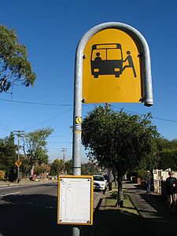
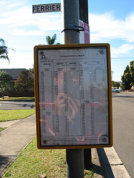
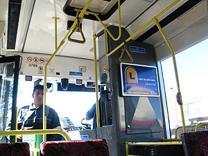
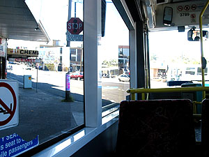
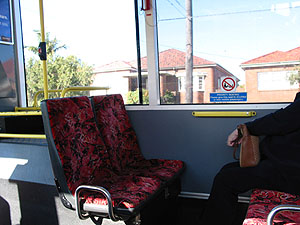
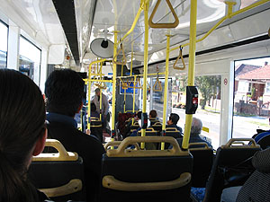
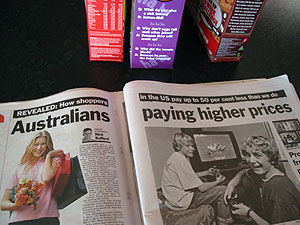
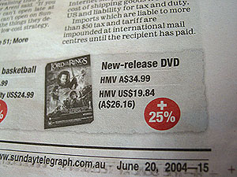

이제 Sydney City는 대부분 돌아다녀봤으니 (아직 Harbour Bridge 근처와 Kings Cross 근처 그리고, Central 역 아래쪽으로는 많이 안가보긴 했지만) 할 일을 좀 하기로 했다. - 홈페이지 업데이트 하는 일과 DVD title 구매, 간단한 아이쇼핑, 그리고 버스타기 -o-.   

<!-- truncate -->

[20040623-1.jpg](./20040623-1.jpg)  
자, 버스를 타고 City에 가기로 마음을 먹고 정류장에 갔다. John이 내가 처음 왔을 때 Sydney의 버스는 시간을 칼같이 지킨다는 말을 했었다. 그런데, 버스를 처음 타는 오늘, 늦게 왔다 -o-. 늦게 온 게 아니라 1대가 안왔다. 뭔 사정이 있었는지;;; 어쨌든, 정류장에는 깨알같은 글씨로 버스 시간표가 적혀있다. (그리고, 지난번에 적었듯이 Central Square에 있는 정류장 근처에 Bus Information 부스가 있다. 거기 가면 City를 경유하는 각종 버스들의 시간표가 나와있는 브로셔가 구비되어 있다. 물론 공짜; ) 한 정류장에 정차하는 버스 수가 그리 많지 않다. 내가 타려고 하는 정류장 (Earlwood, Homer) 에는 2대 - 423번과 L23번 (L23번은 423번 보다 정류장을 덜 거친다. 가는 길은 같은 듯; ).   
  

버스 정류장 표시

뒤로 비치는, 신중하게 사진찍는 모습-\_-;

  
교통수단은 물론이고, 슈퍼 영업시간, 술집 영업시간 등등 - 내가 보고 읽은 바에 의하면 대부분 월요일-금요일과 주말, 공휴일로 시간이 다르다. 주5일제 근무에 철저히 맞춰진 형태가 아닐까 짐작만 -\_-;   
  
어쨌든 버스를 타고 출발-. 버스가 우리나라 버스에 비하면 크다. 그리고, 튼튼하게 생겼다. (/-\_-)/ 그러나, 덩치가 큰 서양사람들이기 때문인지 좌석이 커서 (사실 그렇게 큰 것도 아닌데...) 막상 버스를 타면 넓게 느껴지지 않는다. 노약자석이 양옆에 마주보며 앉게 되어있고, 뒷문 근처에는 지하철처럼 옆으로 앉는 좌석이 있다. 그리고, 뒷쪽은 우리나라 버스랑 비슷; (타고 난 느낌도 역시 '안정감 있다'였다. 왠지 육중한 느낌. 굳이 비유를 들자면 에버랜드의 사파리 버스 탄 느낌 -\_-)   
  

버스 앞쪽 우측

버스 앞쪽 좌측

  

사진 찍다가 노약자석임을 발견;

얼른 뒤로 옮겼다. -\_-v

  
역시 ... 느렸다. 정류장이 바로 집 앞에 있으니 기차를 타기 위해 기차역까지 걷는 시간까지 합하면 기차를 타는 시간과 사실 비슷한데, 아무래도 버스는 시간대에 따라서 걸리는 시간이 크게 달라져서;;; 버스를 타고 City에 들어간 다음, 기차를 타고 집에 오면 좋을 것 같았지만, 그렇게 하면 교통비가 더 드니 그럴 수도 없고. 암튼 그렇다. 버스가 편할 때가 있겠지, 뭐.   
  
그리고, Tessie가 버스 티켓을 사서 탈 때 이용하면, 탈 때마다 punching을 한다길래, 티켓에 실제로 구멍이 나는 줄 알았더니, 그냥 뒤에 몇번 버스를 언제 몇시에 탔는지만 써졌다. -o- (우리나라 가게(?)들에서 종종 이용하는 마일리지용 카드처럼.)   
  
아, 재밌는 거 한가지. 집에 오는 길에 버스를 타려고 정류장에 갔다. 한참을 기다려 버스를 타려고 하는데, 글쎄, 버스 운전수 아저씨가 무표정한 얼굴로 '3명만 들어올 수 있어욧-' 하는 거다. 뭔 소리래... 하고 그냥 들어가려고 했더니 (내가 4번째로 타는 사람이었다) 오오- 단호하게 안된다며 나가란다. 집에와서 Tessie에게 이야기했더니 버스 안에 사람이 많으면 버스 운전수가 그렇게 인원 조절을 한단다. 오오-. 그것 참...   
  
  
어쨌든 버스에서 내려서, 일단 internet cafe를 찾았다. 위드 유학원에서 잠깐 만난 분이 George St.와 Hay St. 교차로 근처에 괜찮은 곳이 있었다고 한 기억이 나서 근처를 찾았는데, 오오- 있었다. 내 홈페이지도 접속 잘 되고, usb도 연결할 수 있다. 시간당 $2. (처음에 $1인줄 알고 앗싸- 했다가 다시 보니, $1/30min 이었다. -\_-) 인도쪽인지 아랍쪽인지 암튼 그쪽 계통 사람이 하는 곳이었는데, 조용하고 좋았다. 종종 이용하게 될 듯. - 그런데, 웃긴 건, 정작 호주쪽 홈페이지에 들어가니 제대로 연결이 안되는 것이 아닌가-\_-. mobile 산 것 기능 좀 알아볼까 싶어서, 무료 벨소리 쿠폰 한 번 이용해볼까 싶어서-\_- Optus 홈페이지에 들어갔는데, 몇번을 시도해봐도 이놈의 익스플로러 먹통이 되버린다. -\_-;; 역시 뭐든지 일장일단인건가.   
  
  
그리고 나서 DVD title을 사러 갔다. 싸게 파는 곳을 몇군데 봐뒀는데 더 싼 곳을 찾다가 더 싼 곳은 없는 듯 하여 일단 그리로 갔다. 원하는 게 없어서 한참을 망설이다가 Bridget Jone's Diary 발견. 샀다 - $20.50.   
  
그리고, Woolworths로 식료품과 기타 물건들 가격이 어떻게 되나 구경-\_-갔다. 전체적으로 보자면 공산품들은 일단 다 비싸다. 그리고, 먹거리들도 사람 손이 많이 간 것들은 비싸다. 그 밖에 몇몇 공산품과 농산품들은 비슷하거나 싼 편. 이를테면, 조그만 파이가 $2.50 ~ $3.50 정도 한다면, 닭다리 튀김 같은 건 그것보다 크지만 $2 정도 하더라. 통으로 튀긴 것들은 더 싼 듯. 그리고, 고기들도 정육점에서 대량(?)으로 살수록 더 싸다. 우유나 유제품들은 싼 것들도 있고, 비싼 것들도 있고. 암튼 뭐든지 대체로 한국보다 양이 많은 단위로 판다. 그리고, 크고 많을 수록 가격이 내려가니, 작은 걸 사면 손해 -\_-.   
  
  
아, 며칠전 신문 (Sunday Telegraph)에 이런 기사가 났었다. '호주인들은 물건값으로 더 많은 돈을 지불한다'. 그래, 이런 기사 많이 나와야 한다-\_-. 이슈화 좀 시켜라.   
  

호주 소비자들이여, 일어나라. (/-\_-)/

이렇게 차이가 난단 말이지;;

   
이것저것 구경하다가 DVD title 파는 곳이 있어서 둘러보다가 하나 더 샀다. High Fidelity (사랑도 리콜이 되나요) - $27.50. 집에 와서 DVD-rom에 넣으니 지역코드가 달라서 내 DVD-rom의 지역코드를 변경했다. 우리나라는 지역코드 3. 호주는 지역코드 4. 보통 DVD-rom들은 지역코드를 4-5회 이상 변경할 수 없다. 계속 변경하면 마지막 변경한 코드로 계속 봐야한다. 여기 있는 동안에는 이 상태로 보면 되겠지 - 물론 한글 자막은 없다. -o-   
  
  
참, 여기서는 카드로 사봤다. 어떤가 볼라고-\_-. 우리나라는 그냥 서명만 하면 되는데, 여기는 카드 이용할 때도 비밀번호를 누른다. 좋은 제도다. 불편한 게 아니라 당연한 거다. 사실 우리나라에서 서명해도 확인도 안하잖아. (아! 그래도, 고속버스 표를 예매하면 표 찾을 때 비밀번호 눌러서 결제하게 하지.) 특이(?)한 건, 여기 은행들의 구좌 (account)는 크게 3가지가 있는 듯 - cheque account, savings account 그리고, credit card account. 오호- 그렇군.   
  
그러고 보니, 오늘이 써머즈의 쇼핑데이. (/-\_-)/   
  
  
그리고,   
  
돌아다녀본 바에 의하면 City 내에는 크게 구경할 만한 것들이 없는 듯 하다 - 아, 정정하자면, 뭔가 컨셉을 가지고 돌아다니지 않는 이상 큰 재미를 기대하는 건 무리라고 생각한다. Sydney를 기점으로 해서 멀리멀리^^ 여행을 다닌다면 몰라도. 한국에서 Kent 유학원의 고실장님 왈, Kings Cross 지역에 가면 유흥가가 있으니 거기 가면 놀거리 (먹고 마시고 -o-)가 있다고는 하던데 별로 땡기지 않는다. 한국에서 노는 것과 크게 다르지 않을 것 같은 생각. 대도시(?)의 번화가란 사실 그게 그거 아닌가. 저녁 먹고나서 John이 때마침(^^) 여기에 어울리는 말을 했는데 - 내가 오늘 Woolworths (마트다. 이마트나 월마트 같은)를 갔다고 하며 Woolworths가 유명한 거냐고 물었더니, 내가 쇼핑하러 간 줄 알았던 모양인지 거기 말고 David Jones나 Queen Victoria Building에 가면 좋을 거란다. 거기가면 명품들이 깔려있다고 -o-. 그러면서 덧붙이길 어디가나 똑같은 가게(?)만 있다고 한다.   
  
맞다 - 갤러리아 백화점에 가나 현대 백화점에 가나 화장품은 다 거기서 거기고, 신사복도 다 거기서 거기고, 명품들도 다 거기서 거기다. 다 같은 브랜드의 샵들이 입점해있다는 거지. 뭐 다소 백화점의 전략에 따라 몇가지씩 더해지고 빼지겠지만 (그리고 그 동네의 부의 수준에 따라 조금씩 다르겠지만), 우리나라 사람들이 좋아하는 명품 브랜드는 크게 다르지 않고, 명품 뿐 아니라 보통 입는 옷들도 선호하는 브랜드는 크게 다르지 않다. (동대문 시장에 가면 모를까.) 게다가 다국적 브랜드의 득세는 차이를 더욱 없게 만들어버렸지 - 나이키, 아디다스, 맥도널드, KFC, 샤넬, 베네통, 루이비똥-\_- 등등. 그리고, 그런 곳은 분위기 자체도 크게 다르지는 않으니까.   
  
마치- 형이 예전에 이야기 했던 (그리고, John이 며칠 전에 다시 이야기 했던) 모든 이야기는 6가지 주제가 반복되는 것이고, 등장인물의 나이, 이야기의 시대, 이야기의 장소 등만 바뀌는 것뿐이라고 했던 것처럼.
