오늘은 게으름을 피우다 살짝 늦게 일어났다. 게으름을 피웠다기 보다는 어제 사온 High Fidelity를 보다가 좀 늦게 잤지 - 대단하다, 써머즈. 어느덧 2시경에 자는 게 늦게 자는 게 되어버렸다니, 놀라운 적응력이란. -\_-a (그래도 아직까지는 밤이 깊을 수록 의식이 점점 또렷해져가는 내 자신을 보며 예전의 야성-\_-이 남아있음을 느낀다.)   

<!-- truncate -->

아, CityRail (Sydney를 중심으로 운행되는 기차 서비스의 명칭)의 재밌는 아이디어 한가지. 호주의 다른 지역도 이러는지는 모르겠지만 - 우리나라 기차들, 좌석의 방향을 바꿀 수 있는 것처럼 여기도 방향을 바꿀 수 있다. 그러나, 방법이 굉장히 간단하다. (우리나라 기차의 좌석은 방향을 바꾸려면 솔직히 좀 번거롭지. 레버도 좌석 아래에 있고, 좌석 자체가 돌아가고.) 그냥 손으로 잡아 돌리면 등받침만 돌아간다.   
  

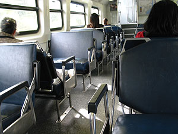

이런 식으로 되어있는데,

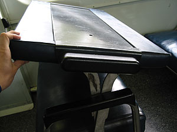

그냥 잡아 돌리면 바뀐다. -o-

" tt\_link2="" tt\_w2="250px" tt\_h2="300px" tt\_alt2="" />  
위드 유학원에 가서 Angela에게 시티 지도를 두장 다시 복사 받고 (고마워요.^^) 이것저것 물어보고 대답하고 하다가 그냥 그 자리에서 Kelly랑 점심을 먹었다 (Angela는 안싸왔다는;;; ). 나는 내 mobile 케이스를 바꿀 생각을 하고 있는데, Kelly는 내 mobile이 예쁘단다. 빨강색이라 그런가? -\_-;   
  
어쨌든 오늘은 겸사겸사 Opera House에 가보기로 했다 - 가까이서 구경하고 싶기도 하고, 마침 Sydney Film Festival이 열린다고 하길래. 지난번에 샀던 Blue Travel 10 티켓을 써볼 겸 해서, Town Hall 근처에서 버스를 타고 Circular Quay에서 내렸다. 지도상으로 볼 때는 Opera House와 좀 거리가 있어 보이던데, 걸으니 금방이다. (내가 걷는데 적응된 건지, 여기저기로 떠나는 Circular Quay의 Ferry들을 구경하느라 그런 건지, 아니면 멀리서부터 보이는 Opera House 때문이었는지)   
  
여기에 오니까 좀 관광지처럼 보인다. 그냥 city를 돌아다닐 때는 몰랐거든. 동양인들이 많이 있긴 하지만, 그냥 사는 사람들인지 아닌지 구분도 안되고. (그러고 보니, Market St.를 넘어서 올라가면 좀 관광객스러운 사람들이 더 보이는 듯 하다.) 유치원 (혹은 초등학교 저학년)에서 소풍을 왔는지 아이들 줄 서서 견학하는 것도 보이고, 카메라 든 사람들이 많다.   
  
[20040624-3.jpg](./20040624-3.jpg)  
그러나, 사실 오늘은 날씨가 별로 좋지 않았다. 춥지는 않았는데, 해가 구름에 계속 가려있어서 사진 찍기에 별로 좋은 날씨는 아니었다. 찍어놓은 사진들을 보니, 색감이 왠지 겨울스럽다. 흠... 겨울은 겨울인가 보네... 걷다보니 왜 여기에 카메라를 든 사람이 많은지 이내 알 수 있었다. Harbour Bridge와 Opera House가 한 눈에 들어오는 장소였던 것. 게다가 Ferry들도 왔다리 갔다리 하니, 구경하기 딱인 장소인 게지.   
  

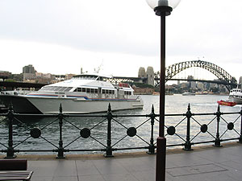

저 뒤로 Harbour Bridge

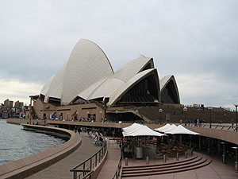

Opera House

  

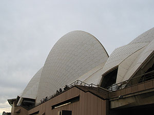

왜 낡은 조개라고 하는지 알겠다.

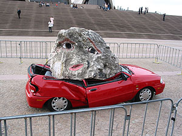

이런 전시물도 있네.

  
왠 돌덩이에 차가 찌그러졌다냐;;; 이게 뭐래;;; 이러고 있는데, 알고 보니 Biennale of Sydney 작품 중 하나였던 모양. Jimmie Durhan 作 - Still Life with Stone and Car, 2004. Art Gallery of NSW에 갔을 때도 저 깃발들 있던데, 자세히 안봤었는데 비엔날레 중이구나.   
  
[20040624-8.jpg](./20040624-8.jpg)  
Opera House 시공한 사람이 뭐라고 한마디 적었나보다. 전문을 옮겨보면,   
  

after three years of intensive search for a basic geometry for the shell complex arrived in october 1961 at the spherical solution shown here.   
  
I call this my "key to the shells" because it solves all the problems of construction by opening up for mass production, precision in manufacture and simple erection and with this geometrical system I attain full harmony between all the shapes in the fantastic complex.   
  
john utzon

  

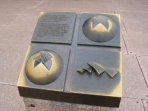

이런 걸 뭐라고 하더라?

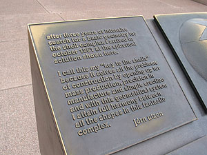

조금 더 가까이.

  
Opera House에서는 연중 계속해서 공연이 열린다. John 말로는 무슨 요일인가에는 앞마당-\_-에서 간단한 연주회 같은 것들도 열린다고 하네. 안에 가서, 여기 film festival 열리지 않냐고 물어보니, 옆에 있는 건물에 있는 Dendy Cinemas로 가란다. 으음;;; 여기가 아니었구나. 3군데 정도에서 나뉘어 열리는 작은 규모의 영화제인가보다. 가니까 하루에 상영하는 영화가 몇개 안된다. 흠... 그냥 한편이라도 보고 싶어서, 무슨 영화인지 확인도 안해보고 그냥 표 끊고 들어갔다 - 제목이 뭐더라? -\_-\* Clans of Intrigue. 그런데, 알고 보니 오래된 중국영화. -o- (원제목이라도 병기했으면 안들어갔을텐데-\_-) 그 무협 시리즈물 같은;;; 호주에서 중국영화를 영어 자막으로 보니 기분이 묘하다;;;   
  
내가 볼 때는 웃을 장면이 아닌데도 서양애들은 정서가 달라서인지 킥킥대며 웃는다. 하긴, 옛날 영화들을 지금 보면 좀 어설픈 거 있잖아. 그런 것 때문에 웃기도 하고 - 주인공이 자기 이름을 대기만 하면, 매번 상대하는 사람들이 으헉-하고 놀라면서 음악이 자자장- 하고 깔린다거나 하는 것들. 보다보니, 영화 한편에 별의별 요소가 다 들어있다. 무협, 스릴러, 호러, 맬로... 그야 말로 종합선물 세트 같은 영화. -o- (유명한 영화인가?)   
  
참, 그러고 보니, (이 극장의 혹은 Sydney Film Festival의) 이번 주간이 바람난 가족 주간인가 보다. A Good Lawyer's Wife.   
  

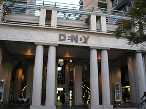

Dendy Cinemas

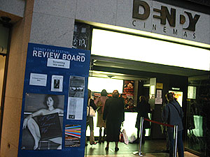

표사는 사람들

  

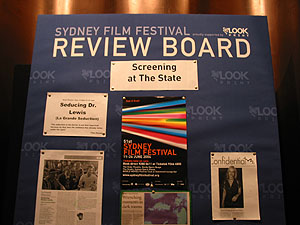

극장 안에 붙어있던.

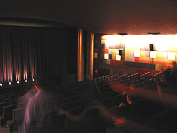

극장 안. (어두워서 노출을 줬더니;; )

  
영화를 보고 다시 Opera House로 가서 풍경들을 구경했지. 조금씩 어두워지니까 사람들이 점점 더 모이는 것 같기도 하다. 하나 둘씩 노천카페에 자리 잡고 앉아서, 커피나 맥주, 와인들을 먹기도 하고 - 나도 먹고 싶었지만;;;   
  

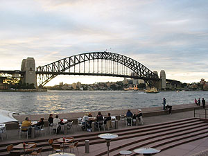

하늘색이 묘하네

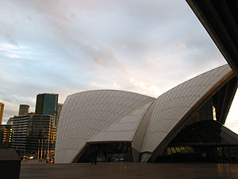

조개들 중 하나 ^^

  
공짜로 볼 수 있는 전시도 있는 듯 해서, 들어가보니 Playhouse라는 공간에서 d>Art.04 Web이라는 전시를 하고 있었다. 간단한(?) 인터렉티브 컴퓨터 아트들과 사운드 실험작들이 있었다. 공간 참 예쁘더라. 그리고, 밖에 나오니 작가 이름은 못봐서 모르겠지만, 아이들을 위한 전시(?)도 있던데, 그 프로그램은 오늘 끝나서 그냥 복도의 전시물들 구경만;;;   
  

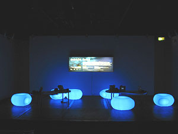

청음시설. 분위기 좋다.

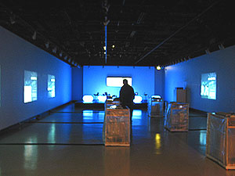

전시 공간.

  

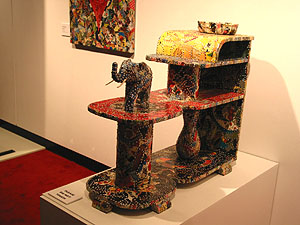

코끼리 -\_-

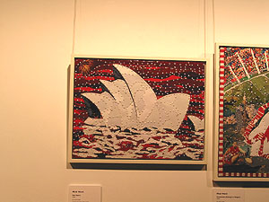

Opera House

  
어두워지니 확실히 멋있다, 오오-. 꾸물꾸물한 분위기를 자아냈던 구름들이 어두워지니 오히려 건물들의 불빛들과 대조가 되면서 더 극적이라고나 할까. 야경을 더 구경하고 싶었지만, 집에 돌아가서 저녁을 먹어야 하기 때문에 -\_-v. 게다가 혼자서 무슨 재미로 구경을 오래... ㅠ.ㅠ (그리고, 사실 내일이나 다음에 다시 가기로 마음을 먹었기 때문에...라고 스스로 위안-\_-)   
  
찍은 야경사진 몇장 서비스로;;; (야경에 정신이 팔려 정작 사진들이 다 초점이 나갔다 -\_-) 사진 수정은 resize & sharpen 몇방이 전부. (아, 2장은 brightness/contrast 수정;;; )   
  

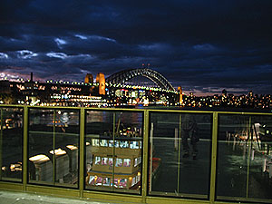

Circular Quay 역에서 한방.

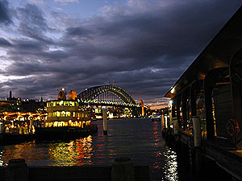

역에 들어가기 전에 한방.

  

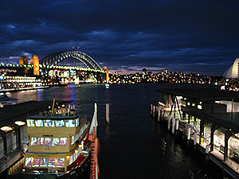

조금 다른 각도에서 한방.

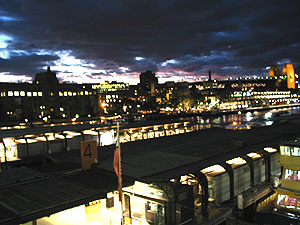

좌측 풍경.

  

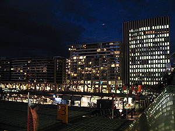

우측 풍경.

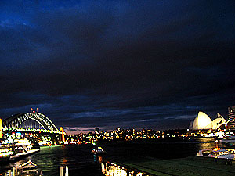

Harbour Bridge와 Opera House

  
[20040624-27.jpg](./20040624-27.jpg)
