다시 Harbour Bridge에 왔다. 알고 보니, Museum of Contemporary Art가 바로 여기 있던 걸 어제는 몰랐던 것. (하긴, 어제는 어차피 둘러볼 시간도 없었긴 했지. 중국영화 보느라... 합!합!합!)   

<!-- truncate -->

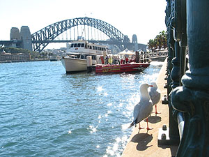

다시 Harbour Bridge.

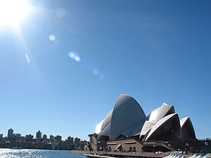

다시 Opera House.

  
(흠... 어제 날씨가 꾸물꾸물해서 색감이 그런가보다 했는데, 찍어놓은 걸 집에 와서 보니 밖에서 찍은 건 전체적으로 다 푸르게 나오네. 내 카메라에서 찍은 사진이 이렇게 푸르게 나오는 건 처음;;; -o-)   
  
아, Opera House 화장실, 손 씻는 곳이 재밌다 -\_- (별게 다 재밌;; ). 손 씻는 곳이 - 그러니깐 싱크대처럼 움푹 들어가고 둘 내려가는 구멍도 한가운데 뽕- 뚤려있는 게 보통이지. 그런데, 아래 사진을 보면 알겠지만, 처음보고 도대체 손을 어디서 씻으라는 거야... 했다-\_-. (솔직히 공사중인 줄 알았다 -\_-) 그런데, 알고보니 벽쪽으로 살짝 움푹 들어간 곳으로 물이 빠지는 것이다. 오오오-. 좌측의 버튼을 누르면 가운데 관으로 물이 나오는데, 절대 평평한 곳으로까지 물이 넘치지 않는 것. (우측의 레버는 액상비누 나오는 곳) 혹시 내가 있는 쪽 바닥으로 물이 떨어지나 싶어서 물 틀고 얼른 아래를 쳐다보기 까지 -\_-\*\*\* 손 닦는 종이는 거울 아래 삐죽 나온 곳에서 뽑아 쓰면 되고. 아... 몇십년 동안 투박한 디자인에 길들여진 내 자신을 한탄할 뿐;;;   
  

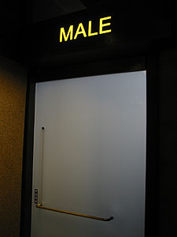

화장실 문;

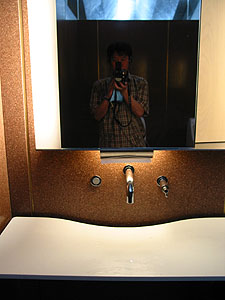

손 씻는 곳;

  
오늘은 날씨가 좋아서인지(?) 어제보다 훨씬 많은 학생들이 단체관람을 왔다. 유치원생으로 보이는 꼬마들부터 중학생 정도 되어보이는 아이들까지. 그리고, 단체관광객들도 종종 보이고. 어제 느낀 것처럼, 이 근처에 오면 관광지 같은 느낌이 든다;;;   
  

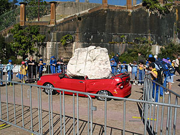

어제 봤던 돌과 차;;

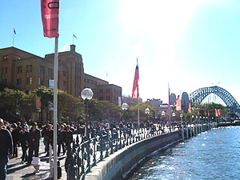

교복입은 학생들이 몰려온다;

  

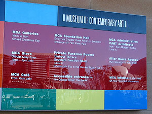

줄여서 MCA로 표시하더라.

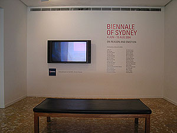

Telstra가 후원한다. 오호-

  
어제 안 것처럼, 여기가 Biennale of Sydney의 주 전시장(?) 중 하나이다. 현대 작가들의 작품이라 그런지 사진을 못찍게 한다. 예전같으면 어떻게든 몇장이라도 찍어보려고 머리속으로 궁리하기 시작했을텐데, 이젠 그냥 그런가보다 한다. 일이 복잡해지면 나만 낭패이기 때문; -o-. 설치작품들, 그림들이 있고, 생각보다 많은 영상작품들이 있었다.   
  
영상과 관련된 작품들은 대체로 실험적인 것들이던데, 12분짜리 영상 (호주의 어딘가를 찍은 것 같던데)을 느리게 재생하여 음악과 함께 12분간 보여준다거나 (무한 반복), 50여분간 조금씩 조금씩 화면이 바뀌는 걸 보여준다거나 (몇분 보다가 나왔다 -\_-). 구두 닦는 모습에서 영감을 얻은 모양인지, 구두 닦이가 손님의 구두를 닦는 손과 천, 손님의 구두만을 애니메이팅 시켜놓고 거기에 맞게 볼레로 리듬의 음악을 튼다던가 (음율도 좋고, 가사도 맘에 들었다.), 예술가가 나체로 방바닥을 뜯고 그 사이로 들어가는 걸 방의 4면에서 동시에 보여준다거나 하는 식. 공통적으로 발견한 특징은 거의 대부분 (전부던가?) 매체로 DVD를 썼다. 흠... 기술의 발전을 실감하는 대목.   
  
아, sound traveling이라고 했던가? 기억은 안나는데, 아뭏튼 출발지부터 도착지까지 차로 가면서 계속해서 이야기 하는 걸 녹음해서 들려주는 것도 있었다. (물론 간단한 브로셔와 지도 같은 건 표시해두고.) 아이디어가 맘에 들었다. (형식 자체는 그리 새로운 건 아닌가? -\_-a)   
  
호주 원주민을 Aborigine이라고 하는데, 며칠동안 미술관과 박물관들을 돌아다녀본 결과 느껴지는 한가지 공통점은 그들의 미술은 대체로 점에서 시작한다는 것이다. 점을 무수히 찍어서 이미지를 형상화 시킨다는 것. 호주 원주민이라는 걸 모르고 봤을 때부터 왠지 모르게 좀 더 '날 것' 같다는 느낌을 받았었는데, 그런 게 느껴졌다는 것이 스스로 신기하다.   
  

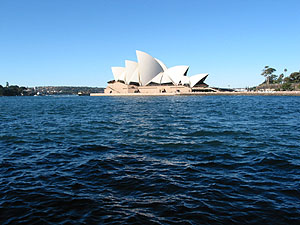

파도가 넘실넘실...

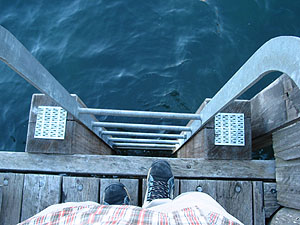

설정사진 (무섭다-\_-)

  

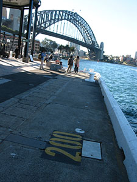

걷고 걷고 걷고...

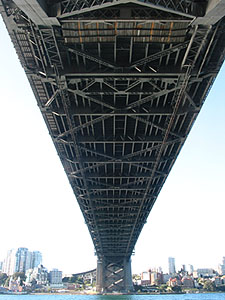

다리 아래서;;;

  
나와서 점심을 먹고, Habour Bridge 주변을 걸었다. John이 처음에 구경시켜 준 곳이 여기였는데, 그 때는 뭐가 뭔지 몰랐으니까;;; Habour Bridge 아래쪽으로 Rocks라고 하는 지역이 펼쳐져(?)있다. (John이 Rocks, Rocks 하길래 그냥 그런가보다 했는데, 실제로 와보니 알겠다 -\_-) 역시 그의 설명대로 호주의 역사가 시작된 곳이다. 오늘 여기 다녀왔다고 하니까, 자기 할아버지가 여기서 태어나서 자랐다고 이야기한다 (6대째 호주 토박이라는 자랑을 빼먹지 않고 덧붙이면서 ^^)   
  
George St.을 따라서 내려오는데, 꽤 많은 갤러리들이 있더라. 젊은 작가들 작품들을 전시해놓은 곳들도 있고, 유명한 사람의 갤러리도 있고, 넬슨 만델라 겔러리도 있었다. 그의 손도장(?) 하나가 몇백만원 한다. -o- 건물들 외형이 다 오래된 건물이어서, 그냥 그게 그건가 하면서 가는데, 아케이드가 있다 (이름은 Metcalfe Arcade). 식당도 있고, 관광상품을 살 수도 있고... 괜찮네... - 흐음, 이 지역을 Rocks라 하는구나;;; John이 이야기했던 연주회, 마켓도 여기서 열리는 거 였다 - 매주 일요일.   
  

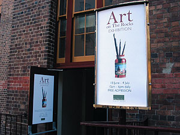

여기 이름이 뭐였더라?

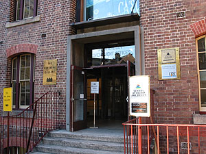

Ken Done Gallery

  

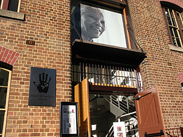

Touch of Mandela Gallery

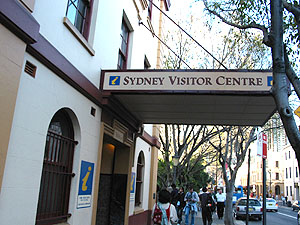

Sydney Visitor Centre

  
그리고, Sydney Visitor Centre가 바로 이 근처에 있다. 들어가면 각종 관광관련 팜플렛, 브로셔들을 무료로 얻을 수 있고, 관광관련 책자도 판매한다 - 간단한 기념품도 판매하고. 나도 들어가서 이것저것 주섬주섬 들고 나왔는데, 이를테면 - 시드니 시내 구경하는 법, Explorer Bus를 타고 관광하는 법, Ferry를 타고 어디에 가는 법, 겨울의 시드니에서는 뭘 하면 좋을까... 뭐 이런 식의 내용들. 1/3 ~ 1/2는 광고고, 나머지는 처음 알게되는 사실이라면, '흠... 그렇군.' 할만한 것들. 시드니에 처음 오는 여행객이라면 한번쯤 들러서 최근 소식을 확인하기 괜찮은 장소.   
  
거기서 나오다가 설문조사 하는 사람에게 잡혀서(?) 한 7-8분여간 설문조사 당했다-\_-. Sydney Visitor Centre에 어떻게 알고 왔느냐, 왜 들어갔느냐, Rocks에 처음 오느냐, 여기 물건값에 대해 어떻게 생각하느냐, 공기가 좋으냐, 여기와서 얼마 썼느냐 등등 시시콜콜 항목이 많기도 하다. 그런데, 설문지가 중국어, 일본어용은 있는데, 한글용은 없다, 우씨.   
  
Rocks에서 Central역까지 걸어내려오면서 (아유, 다리야-\_-) 책에서만 봤던 사실을 알게 되었다. 시드니에 가면 오팔 파는 곳이 많다고 하던데, 진짜더라. 호주의 보석 오팔을 사세요- 하는 가게들, 보석상들이 곳곳에 있더라. 신기한 건 간판에 적혀있는 보석 이름은 전부 오팔. ^^   
  
[20040625-17.jpg](./20040625-17.jpg)  
내려오다가 Hoyts 옆에 있는 스타벅스에서 오늘의 커피 한잔과 작은 초콜렛 2개. 아- 살 것 같다.   
  
  
참, 요즘(인지 계속 하는 중인지는 모르지만) ANZ Bank에서 진행하는 캠페인은 "Leave work early". 우리나라에서 비슷한 걸 찾으라면 "열심히 일한 당신, 떠나라.". 같은 업계에서 일하는 사람들의 사고 방식이 비슷한 것 같아 저걸 볼 때마다 재밌다. :)   
  
  
[20040625-18.jpg](./20040625-18.jpg)   
이건 오버센스인지도 모르지만 어렸을 때부터 궁금했던 건데 - 왜 그런 거 있잖아, 애기들이 태어나서 처음 부르는 이름, '엄마', '아빠'. 그런데, 영어로도 '마더, 마미', '파더, 파파' 라고 하는 게 항상 신기했다. 엄마는 ㅁ발음이, 아빠는 ㅃ(혹은 ㅍ)발음이 들어간다는 게 말이다. 다른 나라도 그런가?
