그러나, 역시 Tessie는 일어나지 않았다. -o- John은 예상했던 일이라며 별반 반응이 없다-\_-. Tessie가 아침을 다 먹은 걸 확인하고 대충 나갈 준비를 하고 나오니 10시 30분경. Tessie가 미안했던 모양인지 시치미 뚝 떼고 물어본다. "어, 써머즈. 오늘 어디 가?" -o- 그리하여 11시에 출발 - Bondi Beach.   

<!-- truncate -->

...인 줄 알았더니 정확하게 말하자면 아니었다-\_-. 실제로는 그 지역에 3개의 해변이 붙어있단다. Bronte Beach, Bondi Beach 그리고 또 하나는 들었는데 까먹었다. 실제로 오늘 가서 걸었던 곳의 대부분은 Bronte Beach.   
  
John, Tessie, Grace, Missy 그리고 나는 John의 차에 올라타고 한참을 달려 해변에 도착했다. 내려서는 각자 헤어졌다. (나중에 들은 말로는 - 절반쯤은 농담이지만 Grace가 수영하는 남자들 구경한다고 여자끼리만 있자고 했다는;;; ) John은 속도를 내며 해변가에 난 길로 사라졌고, 세 여인은 그냥 근처에 있을 거라 하고, 나는 사진을 찍으며, 바다 구경하며 슬슬 걸었다.   
  

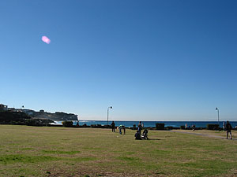

오오- 바다다.

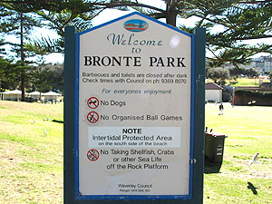

그래서 Bronte Park였구나.

  

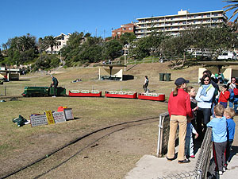

아이들을 위한 기차놀~이

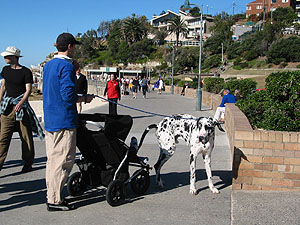

우와~~ -o-

  
버스가 정차하는 근처 (음식점들이 있는)에는 아이들을 동반한 가족들이 많이 있고, 해변을 따라 걸을수록 관광객들 그리고 운동하는 사람들이 많이 있었다. 운동 참 열심히들 하네... 하긴, 이런데서 운동하면 할 맛 나겠다. ㅠ.ㅠ 해변가인데 짠내가 거의 안난다. 하긴 Sydney도 바다냄새 같은 거 거의 안나지.   
  
어쨌든 슬슬 걸으며 사진도 찍고, 햇볕도 쬐고... 멀리서, 서핑하는 사람들이 보인다. 겨울(?)이지만 날씨가 좋으니 서핑하는 사람들이 많다. 여름이면 훨씬 많이 몰려들겠지. John이 젊었을 때 서핑을 했었단다. 호주의 젊은이들은 어렸을 때부터 - 10살도 안되서 서핑을 배우는 아이들이 많다면서 은근히 자랑 아닌 자랑을 한 적이 있었지. 실제로 연습하는 10대들도 많이 있고, 잘 타는 사람들이 하는 행동을 유심히 관찰하는 10들도 많이 있다. 오오- 나도 해보고 싶다. (물론 수영부터 배우고 -\_-\*) 왜 그... Point Break (폭풍 속으로) 보면 크- 진짜 멋진데 말야.   
  

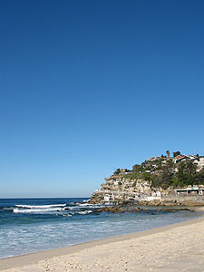

해변가에...

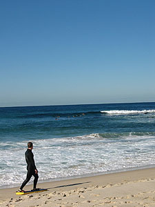

서핑하다 쉬는 사람,

  

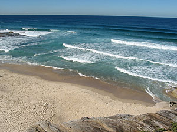

파도...

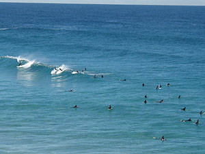

서퍼들이 많네;

  
내가 걷기 시작한 곳부터 길이 난 곳으로 한참 가다보면 서서히 오르막길이 되는데, 제일 위까지 올라가고 나면 대충 길이 마무리 되고, 급경사(정도는 아니고;;; )로 계단을 내려가는 길이 나 있는데, 거기가 원래 Bondi Beach라고 한단다. 오홍. 오늘은 너무 천천히 구경하다가 막판에 빨리 걷느라 잘 못봤는데 나중에 다시 와봐야지. Bondi Beach 까지도 가보고. 다시 와보려고 모래사장에서도 신발 안 벗었다. -\_-a   
  

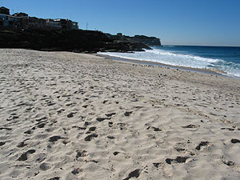

모래사장

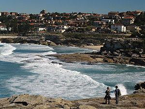

부럽다 ㅠ.ㅠ

  

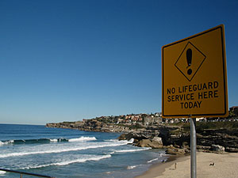

수영 못하면 흉내도 내지 말라는 푯말;;

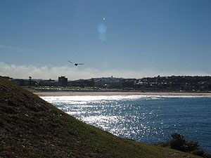

저 너머가 바로 Bondi Beach

  
(삼각대 같은 게 있으면 제대로 해볼텐데,) 아직 한번도 파노라마 사진을 찍어본 적이 없는데 삼각대 없이 한번 시도해 봤다. 물론 찍은 사진들 척척- 파노라마로 만들어주는 프로그램도 써 본 적이 없지;;; 아무리 카메라를 들이밀어도 카메라의 화각보다 풍경이 워낙 넓어서-\_- 한번 찍어봤다. 붙여보니 그래도 파노라마 같긴 하...나? 당연히 다른 사진들처럼 클릭하면 커진다. (좀 편집을 더 해보려 했지만, 어째 내 노트북에서는 Photoshop의 Stamp - source point가 안잡힌다. -\_-\* 이상하게 그 메뉴에서만 alt-click이 안된다;;;)   
  
[20040627-13.jpg](./20040627-13.jpg)  
해변에 갔다와서 점심을 먹고서는 나를 제외한 모든 사람들은 Tessie의 친구(라고 하기엔 그렇지만 어쨌든)네 집에 놀러갔다. 나는 그 사람을 잘 모르기도 하고, 그냥 별일 없을 것 같아서 혼자 집에 남아 영화를 봤지 - 오늘은 Bridget Jone's Diary. 영화 다 보고, 서플들도 다 보고 나니까 어느새 밖은 어둑어둑. 그리고, 딱 맞게 다들 돌아왔다.   
  
재밌었냐고 John에게 물어보니 "이건 일일연속극이 따로 없어. 정말로 웃겼어.' 라고 몇번이고 말한다. 재밌었다는 건지, 반어적인 표현인지 몰라서 Tessie에게 물어보니 그냥 덤덤하게 재밌었다고 한다. 어라; 뭐야;;; 저녁 먹고나서 자세히 이야기해줬는데, 간단하게 말하자면, 그 친구분의 남편이 이슬람교도인데, 현재 두바이에 있단다. 그런데, 그 친구분이 파티를 열어놓고 남자친구도 초대했다고 하네 -o-. 때마침 남편에게 전화가 왔는데, 남편이 수화기를 통해서 남자 목소리를 듣고... 그러니 순식간에 분위기가;;; 암튼 그랬단다. 뭐 그 친구분도 그렇고, 상황들도 그렇고 완전 연속극이 따로 없었다고 하네.   
  
내일부터는 좀 멀리 가볼까. 이제 학교 시작하기 전까지 딱 1주일 남았다. 호주 오기 며칠 전부터 슬슬 긴장이 되었는데, 다시 슬슬 긴장이 되려 한다.   
  
  
그리고, Sunday Telegraph의 활약;;;   
  
그들의 활약은 계속되었다. 지난주에 Sunday Telegraph가 '호주인들은 물건값으로 더 많은 돈을 지불한다'라는 기사로 문제제기한 사안에 대하여 The Australian Competition and Consumer Commision (우리나라로 따지면 공정거래위원회 정도 되려나?)에서 조사를 하기로 했다는 내용이다. 오오- 좋아, 좋아. Sunday Telegraph 화이팅 !   
  
[20040627-14.jpg](./20040627-14.jpg)
