이번주는 작정하고 관광객이 되어보기로 했다. 길치의 이동수칙 중 한가지는 '아는 길이 많아지기 전까지는 한순간도 방심하지 말 것'이기 때문에 이제까지 Sydney City를 중심으로 돌아다녔지만, 이제 지도가 있다면 왠만한 곳에서는 쉽게(?) 길을 잃을 것 같지 않기 때문에 학교가 시작하기 마지막 주인 이번주에는 조금 더 멀리 가보기로 했다. (물론 길치의 이동수칙 중 또 한가지는 '아는 길이 많아져도 한순간도 방심하지 말 것' 이다 -\_-)   

<!-- truncate -->

그래서, weekly ticket을 끊어보았다. 1주일 동안 티켓 한장으로 내가 이동하고 싶은 왠만한 곳을 갈 수 있다 - 가격은 $40.   
  
Sydney의 CityRail, bus, ferry는 서로 연계가 잘 되어있다. 그리고, 역시나 기본적으로 교통비가 비싸지만, 역시나 한꺼번에 무언가를 사면 할인이 된다. weekly ticket도 (bus) travel 10 ticket들 처럼 색깔로 나눠진다. red, green, yellow 등 여러가지가 있지만, 내가 끊은 건 green weekly ticket. 1주일 동안 (즉, 이번주 일요일까지) 내가 이용하는 Bexley North 역까지는 기차나 버스 모두 무한대로 이용할 수 있고 (물론 더 가도 된다. 자세한 건 무료로 배포되는 브로셔에 나와있지.) ferry도 1주일 동안 무제한 이용할 수 있다. (JetCat과 cruise, 그리고 기타 부가 서비스(?)는 이용할 수 없지만.) 작정하고 ferry를 타고 돌아다녀보기로 했기 때문에 - 좀 비싼 것 같긴 했지만 끊었다.   
  
ferry로 어딘가를 가려고 할 때 왕복으로 대충 $6 라고만 하더라도 (아직 정확하게 확인을 안해봤다-\_-), 만약 이번주에 주중 매일 간다고 할 때, (기차 왕복 $3.6 X 5일) + (ferry $6 X 5) = $21 + $30 = $51. 거기다가 다리 아플 때 버스타는 것까지 합하면 이득일 거라 생각했지. (나중에 확인해 본 결과 - ferry로 왕복 $9. Manly는 왕복 $11.6)   
  
참, 이제까지 나는 Bexley North에서 Sydney City 지역으로 갈 때 (day) return ticket을 끊으면 원래 할인율이 그렇게 높은 줄 알았는데 (sigle 즉 편도로 끊으면 장당 $3 니까 왕복하면 $6 vs. return ticket을 끊으면 $3.6) 오늘 weekly ticket을 끊느라 또다른 브로셔를 살펴보니 오전 9:00 이후에 return ticket을 끊을 경우에만 그렇게 할인율이 높은 거였다. 즉, 출근시간을 피해주면 할인해주겠다 이거지. 이른바 off-peak return ticket 제도. (9:00 이전에 끊으면 가격이 같은 듯;;; )   
  
그리고, 티켓을 끊고 나서야 알았는데, 오후 3:00 이후에 사면 7일이 아니라 8일간 이용할 수 있단다. 아유, 몰랐네;   
  
[20040628-1.jpg](./20040628-1.jpg)  
작정하고 ferry를 타기로 한 첫날인 오늘은 Manly에 가기로 했다. Bronte Beach에 다녀온 뒤 John에게 멋진 해변이라고 이야기하며 Manly와 Bronte 중에서는 어떤 곳이 더 멋지냐고 물었더니 둘 다 멋지지만 서로 다른 분위기라고 한다. (아, 이 얼마나 정치적인 발언이란 말인가. :p) 기분 좋게 속아주고 Manly를 가기로 했다. Circular Quay 역에 내려서 Circular Quay Wharf에 갔다. (station과 wharf는 거의 붙어있다.) 나는 weekly ticket을 샀기 때문에 안 기다려도 되지롱. 그냥 개찰구에 표 집어넣고 바로 들어갔다. (기차, 버스, 페리 연계상품들이 있기 때문에 이용하는 표가 모두 같은 형태이다.)   
  

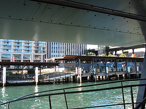

선창은 대략 이렇게 생겼고,

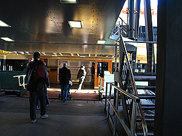

탑승하는 승객들

  

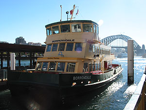

ferry는 이렇게 생겼고,

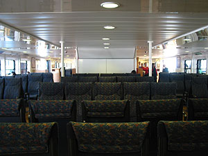

ferry 내부

  
Sydney의 교통편 안내 브로셔에도 적혀있다. '좋은 자리를 잡고 싶으면 빨리 입장하라' -\_-. 내부에 앉아있는 사람들도 있지만, 딱 보기에 나들이, 관광 등 놀러가는 분위기가 겉으로 보기에도 농후(^^)한 사람들과 젊은 사람들, 아이들을 동반한 가족들은 밖의 양 옆에 설치된 벤치나 뱃머리에 설치된 의자에 앉아있다. 어느새;;;   
  
Manly 까지 걸리는 시간은 30분. ferry는 30분마다 있고, Circular Quay에서는 매시 정각과 30분에 출발을 한다. (도착해서 보니 Manly에서는 15분, 45분 정도에 출발을 하네.)   
  

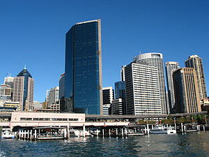

자, 출발-

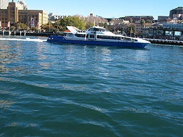

오호-

  

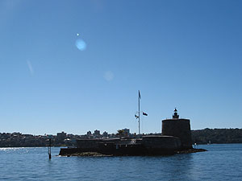

이게 수상감옥인가?

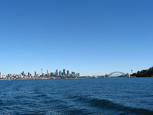

보일 건물은 다 보이네;

  
자, 드디어 도착. Manly Wharf 바로 옆에는 Ocean World라고 아쿠아리움 뭐 그런 게 있다. 가볼까 싶었지만, City 내에 있는 아쿠아리움을 가볼까 싶었기 때문에 패스-.   
  

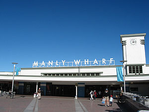

Manly Warf

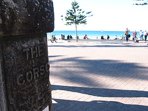

Corso 라고 하던데...

  

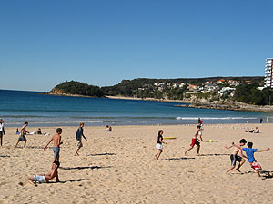

축구하는 사람들

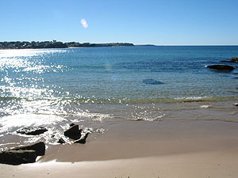

Manly

  
Manly Beach는 Manly Wharf에서 매우 가깝다. 걸어서 10여분 정도도 안걸릴 정도? 그 지역이 Corso라고 하던데 돌덩이에 뭐라 새겨놓았는데 사진만 찍고 안읽어봤다-\_-. 여기가 원래 그런 건지 오늘만 그런 건지 어제 갔던 Bronte에 비하면 파도가 굉장히 얌전했다. 그래서 인지 수영이나 서핑하는 사람들은 많지 않고, 대부분이 선탠을 하거나 벤치에 앉아서 이야기 혹은 식사.   
  
뭐랄까. 느낌이 정말 다르다. 내가 받은 느낌으로는 Bronte가 남성적이라면 Manly는 여성적이라고나 할까? (재밌다. Manly라는 지명은 그곳 원주민들이 용감해서 man스럽다-\_-의 Manly인데 말이지.) 역시 여기도 산책로가 있다. 돈 없고 혈기왕성한 사람들을 위한 배려라고나 할까. ㅜ.ㅜ   
  
하긴, ferry를 타고 돌아다니기로 한 이유 중의 하나가 무료 배포 브로셔 중에 Go Walkabout 이라는 걸 보았기 때문이지. Sydney 북쪽 (ferry 타고 가는 곳들)에서 걸으며 경치 구경, 자연 구경할 만한 곳을 소개한 책자. 점심은 간단하게 도시락 싸갔고, 물도 싸갔고 (물 싸들고 다니는 건 필수 !!!), 표도 weekly로 끊었기 때문에 결국 Manly 왔다 갔다하는 동안에는 한푼도 안 썼다. -\_-v (Go Walkabout은 Rocks에 갔을 때 Sydney Visitor Centre에서 가져왔다.)   
  
그런데, 그 책자에 Manly Beach를 주욱 걷고 나서, 아래쪽으로 열심히 열심히 걸으면 North Head라는 곳이 나오는데, 그 곳이 볼만하다고 해서 걸었지. 게다가 바로 근처에 North Fort Artillery Museum도 있다고 하고, 오래된 역을 관광지로 꾸며놓은 곳도 있다고 해서 갔다. 정말 열심히 걸었다. 열심히... 그런데, Artillery Museum은 월요일은 문을 닫는단다, 으흑. 그리고, 그 역을 꾸며놓은 곳은 예약을 하고 Manly Wharf 앞에서 버스를 타고 들어와야만 한다고 한다. 으흑. ㅠ.ㅠ (그 일대가 Sydney Harbour National Park란다.)   
  
그래서, North Head에서 바다 구경만 하고 왔다. 그렇게 멀지만 않았다면 괜찮다고 생각할텐데 쩝... 그 한장면 (물론 멋지긴 했지만) 구경할려고 그렇게 멀리 걸었다는 게 아까웠다. -\_-; 너무 피곤해서 잔디에 잠깐 누워서 낮잠까지;;;   
  
[20040628-14.jpg](./20040628-14.jpg)  
다시 그 길을 걸을 생각을 했더니 정말 막막했는데, 나오다가 버스를 만났다. 이 얼마나 반가운고. (책자를 보면 자주 없는 버스 같던데, 운이 좋았다. ㅠ.ㅠ) Manly Wharf까지 돌아온 후 다시 Circular Quay Wharf에 도착.   
  
잠깐 쉰 후 바로 Sydney Tower (Centrepoint Tower라고도 부른다.) 로 갔다. (이번주는 관광객 모드. 작정했다니깐.) 1, 2, 3층은 평범한 아케이드다. 2층에서는 Sydney Tower 꼭대기 즈음에 있는 레스토랑의 예약을 받는 곳이 있더라. 갈 돈도, 함께 갈 사람도 없으니 매몰차게 패스-. 3층에 가니 매표소가 있다.   
  
입장료가 어른은 $22. Tower에 올라가 구경하는 것과 Sky Tour라고 명명된 짧은 구경(?)을 할 수 있다고 한다. 입장료 치고는 좀 비싼가...싶긴 했지만, 뭐 경험 삼아 가봤다. 얼래? 여기는 한국어 브로셔가 있네? (한국인들이 여기 많이 오나보다 -\_-.)   
  
초고속 엘리베이터를 타고 (올라가는 동안 귀가 먹먹해져서 침을 꼴딱꼴딱 삼킴) 올라가니 때마침 노을이 진다. 오오- 작정하고 사진을 찍으려 했으나 카메라 베터리가 그만;;; 그래서, 액정 안열고 그냥 감으로 마구 찍었다 (이상하게 카메라를 직접 보고 찍으면 원하는대로 안나온단 말이지-\_-). 아쉽다, 작정하고 잘 찍어보려 했건만. 한 여성 가이드가 동서남북 - 4방향에서 시티 내 건물부터 멀리있는 건물들까지, 역사부터 특징까지 설명해주는데, 너무 웃겼다. 재치만점. 짝짝짝- 박수감.   
  

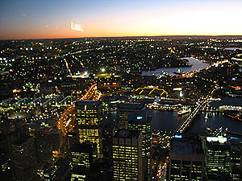

때마침 노을

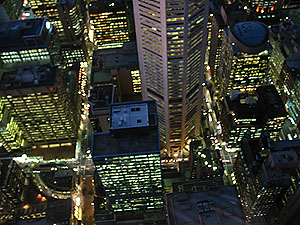

불켜지니 멋지다. 역시.

  

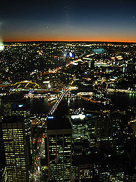

지구는 둥글다

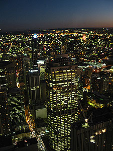

어두워져도 멋있다.

  
멋지다. 한번쯤 보라고 하는 이유가 다 있었구나... 여기 레스토랑에서 밥 먹는 사람 좋겠다. ㅠ.ㅠ 여기야 말로 정말 스카이 라운지네. -o- 그런데, 기대했던 것만큼 야경이 아주 휘황찬란하지는 않았다. (겨울이라 그런가?)   
  
한가지 재밌는 사실 - 여기는 회계년도가 6월에 마감된다. 즉, 연말 결산을 6월에 한다는 거지. 역시 겨울은 한 해를 마감하는 계절인가보다. -o- 그래서 그런지 요즘 여기저기서 세일! 세일! 세일이다. 내 핸드폰도 그래서 싸게 산게 아닐까 추측. 내가 만약 지금 자취를 하고 있다면 이것저것 사기 좋은 기회인데 말야.   
  
한참 구경하고 다시 3층으로 내려와서 tour를 했다. 아이디어가 좋았는데 - 스테이지(?)가 총 5개로 나뉜다. 스테이지가 바뀔 때마다 자리 이동. 모두 자리에 그냥 앉아서 듣거나 보기만 하면 되는 것들이다. 각 스테이지당 5~10분 정도 소요되나? (마지막은 조금 더 길고.)   
  

**1. The Orientation Campsite** : 말 그대로 오리엔테이션이다. 별거 없다. 가이드가 주의사항 같은 거 전달한다.   
  
**2. The Expedition Tent** : 자리에 앉아 눈을 감고-\_- 헤드폰을 쓴 뒤 호주 역사에 대해 설명하는 걸 들으면 된다. (4개국어 지원)   
  
**3. The Discovery Chambers** : 역시 자리에 앉아 헤드폰을 쓰면 된다. 미니어처를 만들어놓고 불을 끄고 그 위에 영상을 쏘는 방식으로 호주인들의 생활상을 소개한다. (역시 4개국어 지원)   
  
**4. Virtual Cave** : 스테이지 5로 가기 위해 지나가는 통로에 뭐 호주 원주민들이 동굴에 그렸던 그림들을 재현해놓았다. 뭐, 그냥 통로다 -\_-.   
  
**5. The Great Australian Expedition Ride** : 아이맥스 같은 방식으로 입체영화 보듯이 영상도 역동적으로 꾸몄고, 좌석이 움직인다. (스크린이 3면에 있지만 좌우를 두리번 거리며 보는 사람은 나밖에 없었다.-\_-) 서라운드 사운드라고 가이드가 무지 강조했다. -\_-;

  
가기 전에는 '꼭대기 올라가서 야경 구경 좀 하고 그러는 건데, 뭐 볼게 있다고...' 라고 하는 사람들의 말에 '하긴, 뭐...' 했었는데, 막상 보고, 듣고 나니까 가길 잘 한 것 같다. 하긴, 결정적 이유는 2가지가 있는데 - 첫째는 노을이 지는 시간에 대략 맞춰서 가서 건물들에 불이 하나씩 켜지는 것부터 보았기 때문이고 (360도를 볼 수 있으니까, 한쪽 방향에서부터 빙그르르 돌며 노을이 지는 걸 알 수 있다), 둘째는 Tower 꼭대기에서 그 재밌는 여자분의 설명도 듣고 내려와서 짧은 아이맥스 영화도 보았기 때문이다.   
  
개인적으로 - 기왕 장사하려고 마음 먹었으면 이렇게 하는 게 좋다고 생각한다. 별 느낌없을 수도 있는 아이템이 잘 가공되서 재미있게 느껴진다는 것. 역시 관광 도시답다 !   
  
그 야경을 보는 꼭대기에 (당연히) 망원경들이 설치되어 있다. 성능이 참 좋던데, 근처 빌딩에서 일하는 사람들까지 보인다. 그 사람들은 돈을 더 받나? 일하는 동안 프라이버시 침범당할 수 있는 환경이니까? - 컴퓨터 앞에 앉아서 오락이나 하면 모를까, 농땡이 치다가 상사에게 들키면 끝장일텐데... 힘들겠다. -\_-;   
  
한차례 늦게 들어간다고 문자를 보내고도 그거 보다 늦어서 더 늦는다고 문자를 한 번 더 보내고 집에 들어갔다. 집에 들어오니 20:00.
