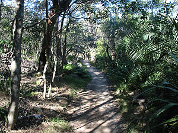
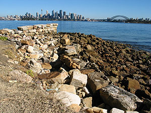
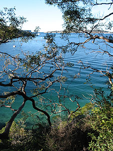
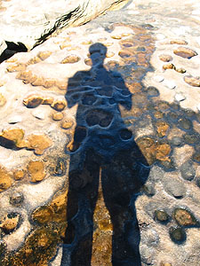
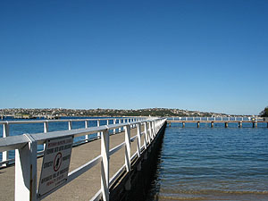
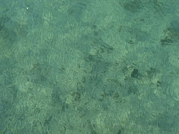
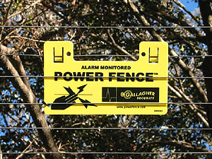
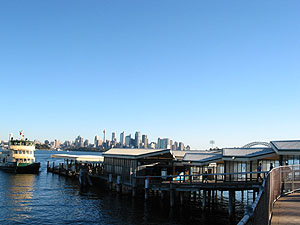

어제 하도 많이 걸었는데 아침에 일어나 나오는데도 잠이 덜깼다. 그래서, 커피 한잔.  

<!-- truncate -->

여기서는 아무 생각없이 뭘 사먹으면 안된다. "얼마죠? 아, 예..." 하고 돈을 내고 생각해보면 비싼 것들이 많기 때문이다. 그래도 이 커피는 싼 편이다 - $2.50. (흠... 생각해보니 스타벅스 오늘의 커피도 이 정도 하는데... 싼 게 아니구만 -\_-\*)   
  
[20040629-1.jpg](./20040629-1.jpg)  
오늘은 Taronga Zoo에 가기로 결정. 며칠 전에 Tessie에게 어디 갈 곳 없냐고 물어보니까 내가 홈스테이 시작하기 바로 전에 Taronga Zoo에 갔었단다. Grace에게 공짜표가 몇장 있었던 모양. 그런데, 볼만하다고 이야기하면서도 동물들이 별로 없다는 말을 잊지 않고 꼭 덧붙인다 -\_-. Grace에게 물어봤더니 역시 비슷한 이야기. 그래서 - 어제 Go Walkabout 믿고 갔다가 별 소득없이 고생을 좀 했지만, 한번 더 믿어보기로 하고 브로셔에 나온 것처럼 동물원에는 들어가지 않고 동물원 주변을 걷기로 했다.   
  
[20040629-2.jpg](./20040629-2.jpg)  
Circular Quay에서 15분 밖에 안걸린다. (그래서 그런가? ferry 구조가 어제 탄 거랑 아주 살짝- 다르다.) 도착하고 나니 사람들이 모두 동물원에 입장하려고 줄을 선다. Sky Safari라고 공중(?)으로 입장하는 라인이 따로 있고, 100여미터 가면 두발로-\_- 입장하는 곳이 있다. (거의 대부분 Sky Safari 줄에 서더구만.) 사람들을 보니 들어가보고 싶은 마음이 들어 두발 입장 매표소-\_-에 가보았더니 입장료가 $22. 쩝. 왠지 안싸게 느껴지네. 그래서 그냥 걷기로 했다.   
  
[20040629-3.jpg](./20040629-3.jpg)  
브로셔에 나와있는 Taronga Zoo쪽 걷는 포인트는 Bradleys Head와 Chowder Head, 그리고 Clifton Gardens. 그래서 역시나 무작정-\_- 걸었다.   
  
결론부터 말하자면, 여기는 Beach가 없는 대신 숲길을 많이 걷는다. 크게 오르막길은 없지만 숲속을 걸으니 - 오랜만에 등산하는 기분이 들기도 했지. 오히려 이제까지 주로 바다와 해변과 항구만 보다가 숲길을 걸으니 기분이 괜찮다. (걷는 게 힘들어서 그렇지-\_-.)   
  

해변가를 따라서 숲길을 걷는다.

Circular Quay와 가깝다.

  

물색깔 정말 죽인다. ㅠ.ㅠ

V자라도 할 걸-\_-;

  
중간중간 바다를 볼 수도 있고, 또 아래로 내려가서 구경할 수 있는 곳도 마련되어 있고, 아기자기한 맛이 들었다. 걸으며 생각했다 - 어릴 때 '초록빛 바닷물에 두 손을 담그면-' 하고 노래를 불렀을 때 왜 물이 초록색이냐고 많이 따졌었다. (나 말고도 무수한 아이들이 따졌을 듯; ) 그런데, TV에서만 보던 그 해변가 초록색 바다를 여기와서 종종 보니 '작사가가 외국에서 오래 살았나보다...' 하는 생각 -\_-.   
  
오히려 Bradleys Head와 Chowder Head, 그리고 Clifton Gardens는 크게 재밌지 않았는데, 산길을 걷는 게 재밌었다. 인구가 적어서인지, 자연보호를 철저하게 하는 나라여서 그런지 산길에 정말 휴지조각 하나 없다. 혹 버리고 싶은 마음이 들다가도 움찔할 정도.   
  
Clifton Gardens 근처에 오니 작은 공원이 있고, 낚시터가 있다. 재밌는 건 - 낚시하는 사람들에게 붙여놓은 안내판이 있는데 아래쪽에 이런말이 써있다. "You need a licence to fish in any public waters in NSW." 오늘 처음 알았다. 낚시하는데도 면허가 필요한 나라. 자연에 대한 관심이 얼마나 큰지 알 수 있는 대목.   
  

낚시터 (작은 부두인 줄 알았네; )

낚시터 바로 아래 물 색깔.

  
잠깐 쉬고 있는데, 버스가 선다. 왔던 길을 다시 그대로 되돌아서 wharf로 가는 건 너무 힘들어서-\_- 버스 기사 아저씨에게 어디로 가야 wharf로 제일 빨리 갈 수 있냐니까 모른단다. 그냥 되돌아가란다. 그래서, "너무 멀어요. 으음..." 하고 좀 망설였더니, 자기가 동물원 입구 근처까지 공짜로 태워주겠단다. 사실 weekly ticket을 끊었기 때문에 별 상관은 없지만, 어쨌든 고마운 아저씨. :)   
  

고압전류가 흐르는 거겠지? 아닌가?

Taronga Zoo Wharf의 모습

  
중간에서 내려서 15-20여분 걸어서 wharf에 도착. City로 돌아왔다.   
  
아, 위드 유학원이 이번주에 이사한다고 하길래, 이사했나 싶어서 찾아가보기로 했다. 혹시 몰라서 원래 있던 자리부터 가봤는데 이사가 미뤄졌단다 - 다음달 말. 새로 이사할 곳의 위치는 지금보다 Cetral역에서 더 가깝다. 갔더니 Kelly와 Angela가 여느 때처럼 미소로 반겨준다. 오늘은 일이 조금 많나 보다. 잠깐 이야기하고 계속 바쁘게 일을 한다.   
  
혹시나 싶어서 유학생들이 쓸 수 있는 곳에 가서 컴퓨터를 살펴보니, 오오- usb cable을 연결할 수 있다. 빙고 -O-. 여기 인터넷 카페보다는 느리지만, 어쨌든 때때로 유용하게 이용할 수 있을 듯 하다. 써둔 거 몇일분 올렸다. (인내심을 가지고 올리면 가능하다! ^^)   
  
집에 오니 분위기가 좀 이상하다. 왜 그런가 싶었더니 Cindy가 어제밤에 없어졌었다는 것. 그러게... 안그래도 어제 집에 들어와 밥을 먹은 후 뒷마당(?)에 나가서 Cindy를 불러도 대답이 없더라. 자는 줄 알았더니... 그래서, 아침에 여기저기 돌아다닌 끝에 찾았다는데 (찾아보니 없어서 그냥 포기하고 집에 돌아왔더니 먼저 와있었더라는) Tessie 말로는 - 아무래도 Cindy가 임신한 것 같다는 거다. (정확하게는 임신당한-\_-것 같다는;;; ) 요즘 안그래도 생리중이라 집안에 들여놓지 않았었는데, 아무래도 그런 것 같다는 것;;; Cindy를 불러도 전혀 반응도 없고, 심지어 Tessie가 음식을 줘도 거들떠 보지도 않고, 한 곳에 가만히 앉아있다. (John 말로는 한쪽 다리가 다치기 까지 했다고) 후유증이 큰가 보다;;;   
  
[20040629-12.jpg](./20040629-12.jpg)   
Missy가 밖에서 일본차를 사온 모양. 시식을 해보았는데, 으음... 맛이 오묘-\_-하다. 차 이름을 알려줬는데 까먹었다. Missy가 사전을 뒤져가면서 찾아준 단어는 Kelp. 사전 찾아보니 (커다란 갈색) 다시마류. 맛이 그래서 그랬구나. 이거하고 또 하나가 더 섞였다는데 그건 까먹었다. (일본어로는 ume 라고 했는데.) Missy가 이 차에 대해 설명하기를 술먹고 난 후 숙취에 좋다고 하니 Tessie가 "It's for John. Missy, YOU FOUND IT!" 을 연발한다. -o-
