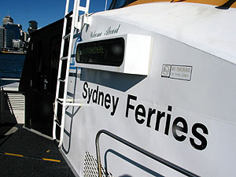
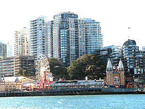
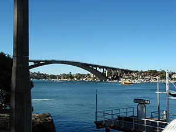
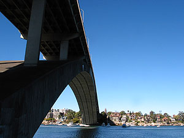
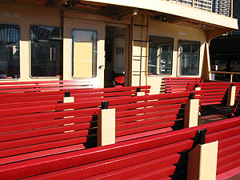
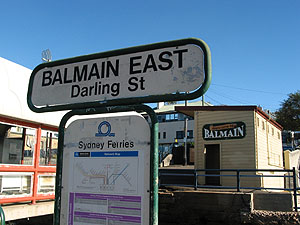
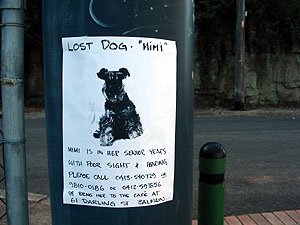
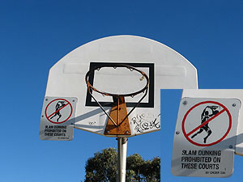

자, 오늘은 어디로 갈까. 오늘은 사람들이 많이 안 갈 것 같은 곳으로 가보자...해서 Balmain으로 결정. 책자에 나와있는 표현을 빌리자면, 골목마다 오래된 건물들을 볼 수 있다고 했기 때문이다.   

<!-- truncate -->

자, 오늘도 출발은 역시 Circular Quay Wharf에서.   
  

이것도 그냥 ferry 구나.

ry에서 바라본 Luna Park

  
흰색의 배는 cruise나 어쨌든 - 다른 형태의 배인 줄 알았더니 이것도 ferry였다. 행선지에 따라서 종류가 나뉘나보다. 어쨌든 타고 출발~. 멀리 Luna Park가 보이길래 줌으로 땡겨서 한방 찍었다. 그런데, 멀리서 봐서 그런지 몰라도 생각보다 작다. 'Luna Park에 오시면 놀거리가 많아요-' 하며 홍보하던 브로셔들이 많았는데 말이지. (예전에 영어학교에서 단체로 갔다온 적이 있는 Missy에게 물어봤었는데 그녀의 대답은 "Not good !" 이었다.)   
  
그런데, 알고보니 ferry를 잘못 탄 거였다;;; ferry의 맨 앞에 앉아서 두리번 거리고, 경치구경 하고, 얼래벌래 하다보니 엉뚱한 wharf에 서는 게 아닌가. -o- 그래서 내렸다. 내린 곳은 Gladesville Wharf. 내리고 나서 후회했다. 그냥 계속 타고 가다가 Sydney Olympic Park나 Parramatta로 가도 되는데... 우띠.   
  

Gladesville Wharf

이름도 모르는 다리;;;

  
내려서 다시 Circular Quay로 돌아가는 ferry를 기다리다가 혹시나 - 여기에 뭐가 있나 싶어서 조금 둘러봤는데, 지도도 없고 책자도 없으니 알 수가 있어야지-\_-. 지나가는 사람도 없다;;; 시내를 물어서 찾아가볼까 하다가 괜한 에너지 소비하게 될 것 같아서 그냥 돌아왔다.   
  
돌아와서 다시 탔다. 이번에는 타기 전에 물어보고 탔다 -\_-.   
  

ferry를 타면서 느낀 건데, 일단 어디발 ferry가 몇시에 떠나는지 일목요연하게 표시가 되어있다. 그렇지만 3일 동안 본 결과로는 항상 3-4분씩 늦게 출발한다(^^). 게다가, 만약 도착시간 (출발시간 - 도착해야 출발하니까)이 늦어지면 따로 방송을 하거나 시간이 변경되었다는 표시를 해주지 않고, 그냥 바로 시간만 바꿔서 표시가 된다. 예를 들면 - Parramatta행 ferry가 AM 11:00 출발이어서 기다리고 있는데, 그게 AM 11:15에 도착하고 그 사이에 Rydalmere행 Ferry가 AM 11:05에 도착해서 AM 11:10에 떠나면 충분히 착각하고 엉뚱한 ferry를 탈 수 있다는 뜻. 초행자들은 주의해야 할 듯.

  
  

역시 예상대로 한산-

Balmain East Wharf

  
Balmain East Wharf에서 내려서 걷다가 Balmain Wharf를 지나 Birchgrove Wharf까지 가서 거기서 Circular Quay로 돌아오는 코스였지. 여기에 오면 많은 카페와 레스토랑, 오래된 펍 등과 함께 오래된 건물들도 많이 볼 수 있다고 했는데 - 솔직히 봐도 모르겠더라;;; 오래된 건물이라는 게 서양사람들 (혹은 호주 사람들)이 보면 알지 모르겠지만 - 아니면 보는 눈이 있는 사람은 알지 모르겠지만, 나에겐 완전 돼지 목에 진주 목걸이-\_-. 이게 오래된 건물인지, 아닌지 도무지 알 수가 있나. (물론 책자에 몇몇 건물은 명시를 해놓긴 했지만 그 외에는 도통;;;)   
  
Balmain에 대한 재밌는 이야기가 전해 내려 온단다. 때는 바야흐로 서양인들이 호주에 처음 들어온지 12년 후인 1800년 4월 26일, NSW 주지사 Hunter가 Wiliam Balmain이라는 이름을 가진 외과의 대표 -\_- (principal surgeon)에게 550 에이커를 줬단다. 그런데, 바로 다음해에 이 Balmain이란 사람이 Calcutta의 John Gilchrist라는 사람에게 단돈 5실링 (지금 돈으로 50센트) 받고 팔았단다. 지금까지 아무도 그 이유를 모른다는 이야기. 왜 그랬을까?   
  
어쨌든 집들은 많았다-\_-. 집 모양들도 살짝 살짝 변화들이 있고. (음... 이런 걸 보라는 이야기인건가?) 그러다가 문득 번지수를 표기한 게 눈에 들어왔다. 여기 뿐만 아니라 내가 사는 곳도 비슷하긴 하지만 - 여기는 집들이 다 다르니 표기한 방식도 다 달라서 재밌었다. 순간 - 별 것 아닐지 모르지만, 이런 다양성이 부러웠다. 자기 집은 자기가 원하는대로 꾸미는 거지. 땅 넓고 인구 적은 곳에서 사는 복 중의 하나라고도 생각되고.   
  
[20040630-7.jpg](./20040630-7.jpg)  
그럭저럭 괜찮았다. 어제는 숲속을 걷는 느낌이었다면, 오늘은 한가로운 일요일날 동네를 걷는 느낌이랄까? 건물들이 오래된 듯 보이면서도 어딘지 모르게 다 깔끔하게 정돈되어 보였다. 외벽도 다 손질하고, 내부는 현대식으로 다 바꿨겠지. (호텔, 뷰티샵(?) 그런 것들의 외부가 살짝 - 많이 말고 살짝 옛스러워 보이니 분위기 괜찮더라.) 그나저나 Balmain East Wharf 근처에서부터 강아지 찾는 전단이 붙어있더라. 요즘이 강아지들 없어지는 시기인가?   
  

Mimi를 찾습니다.

덩크슛 금지

  
덩크슛 금지 딱지를 보고 실실 웃었다. 참 별의별 걸 다 금지한다 싶기도 하고, 뭐든 필요하면 그 때마다 필요한 것들을 만들어내는 게 재밌기도 하고. (어제 본 낚시 면허도 같은 맥락이겠지.)   
  
  
집에 돌아오는 길에 핸드폰 충전했다. pre-paid moblie, 요금(credit) 충전하는 걸 recharge라고 하네. 문득 내 모바일 처음 살 때, 첫 충전시에는 - 모바일 activation 시킨 후 1주일 이내에만 첫 충전을 하면 무조건 2배로 충전해 준다는 딱지를 본 게 생각나서 집에 와서 뒤져봤더니 오늘이 8일째 -\_-\*. 아... 분명 기억하고 있었는데... 오늘이 7일째인 줄 알았는데... 으흑. 공돈 $30가 날아갔다;;;   
  
아아. 오늘은 너무 피곤했다. 강행군이 따로 없다. 친구 하나 없이.
