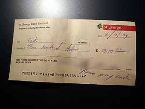

공사현장이 열려 있길래 빌더 아저씨가 왔나 싶어서 나가봤다. Jeffrey 아저씨와 배관공들은 와 있는데, 빌더 아저씨는 아직 안왔네. Jeffrey 아저씨가 또 혼자서 무언가를 하고 있길래, 도와줬다. 한참 도와주고 있으니 전기공들도 오고, 빌더 아저씨도 온다. 흠... 그런데, 먼저 일한 돈 준다는 이야기를 안하시네;;; 한참 Jeffrey 아저씨를 도와주다가 슬쩍 물어봤더니 내일 준단다-\_-. 그래서 그런가보다 하고 있는데, Jeffrey 아저씨에게 나를 가리키며 이 사람 몇일 일했냐고 물어보니, Jeffrey 아저씨 고맙게도 일 열심히 했다고 한마디 덧붙여준다. 그 이야기를 듣더니 쓱쓱 개인수표(cheque)에 서명하고서는 주면서 St. George Bank에 가서 현금으로 찾으면 된다고 한다. 오오-   

<!-- truncate -->

좀 더 일하다가 Jeffrey 아저씨가 등(light) 살게 있다며 함께 가자고 한다. 가기 전에 Campsie에 있는 St. George Bank에 들러서 돈을 찾았다. 오- 나의 첫 아르바이트 수당이네. :) 기쁘다. 앞으로도 정기적으로 일을 찾아서 해야 할 생각을 하니 조금 걱정스럽기도 했지만, 해보는 거지, 뭐. (적은 돈은 아니지만 그래봐야 1주일 하숙값보다 조금 많은 정도니...-\_-)   
  

오오-

오오오-

  
우리나라에도 개인수표가 있는지 없는지 모르겠지만, 어쨌든 난 한번도 본 적은 없지; - 영화에서나 보고. 수표를 들고 바꿔달라고 했더니 신분증을 달라고 한다. 잠깐 도와주러 나간거기 때문에 여권을 안들고 가서, Jeffrey 아저씨가 찾는 걸로 했다. 그런데, 직원 이리저리 수표를 보더니 자기네 은행에 기록된 서명과 수표의 서명이 다르다며 빌더 아저씨에게 전화까지 하고 나서야 돈을 내준다. -\_-;   
  
재밌는(?) 이야기 하나. 기다리면서 아저씨에게 여기도 입금 가능한 ATM이 있냐고 물었더니 있다고 한다. 그런데, 우리나라처럼 기계에 돈을 바로 넣고 기계가 돈을 세어서 바로 통장에 입금되는 게 아니라, 봉투에 돈을 넣고 기계에 넣으면 다음날 직원이 그걸 찾아다가 입금시켜주는 형식이라고 한다. -o- John이 핸드폰에 대해 이야기할 때마다 말하던 게 생각났다 - "최신 테크놀로지 너무 좋아하지마. 여러가지 기능이 있는 게 더 잘 고장난다니깐. 게다가 모든 게 자동화되면 사람들 일자리가 줄어들잖아. 사람들도 먹고 살아야지." -o-   
  
어쨌든 조금 더 Jeffrey 아저씨를 도와주고, 잠깐 잘려고 누웠다가 1시간 더 자버려서-\_- 부리나케 준비하고 밥 먹고 (Tessie가 아침, 점심을 다 준비해놓았던데, 아침은 빌더 아저씨 찾으러 나갔다가 일 도와주는 바람에 못 먹고, 점심은 Jeffrey 아저씨네 집에서 먹는 바람에 못봤네;; 그거 전자렌지에 돌려서 먹었다.) 나갔다.   
  
Handbook에 나와있기로는 오후 5시까지만 문을 열어놓으니 그 이후에 들어갈 때는 뒷쪽에 있는 쪽문(?)을 이용하라고 했지만 어제는 열려있었길래 한번 가봤다. 역시나 닫혀있어서 뒷쪽의 쪽문(?)으로 들어갔다. (어제는 첫날이어서 열어놓았는 듯; ) (문에 있는 초인종(?)을 누르고 이름을 말하면 들여보내준다.-\_-)   
  
오늘도 5분여 정도 먼저 갔는데, 또 뭔가 이야기를 시작하고 있는 Gerry. (수업하다가 중간에 잠깐 쉬는 시간을 주는데, 그 때도 쉬는 시간 끝나기 전에 이미 무언가를 나눠주거나 설명하거나 한다. -o-) 오늘도 또 수업 도중에 들어오는 Campus Manager;;; prac (실습 위주의 수업)에 대한 자료를 나눠주고 간다. (한번에 하면 좋을 걸, 꼭 그렇게 틈틈이(-\_-) 한다. 흠.)   
  
내일 모레 시험을 본다고 한다. 한국사람들이 대체로 잘 못알아 들으니 (핑계였는지 모르겠지만) 수업 자료를 내일 나눠주고 모레 시험을 본다고 한다. openbook. -o- 어제 이야기할 때 이건 exam이 아니라 test라고 강조하더니, 문제들도 상식적인 것만 낼테니, 자료 보면서 짧게 핵심만 적으면 된다고 강조한다. 아무래도 (굳이 이야기하자면) 기초 과목이니까 그러겠지.   
  
오늘 화요일이라 영화보려고 했는데 자다가 놓쳤다. Spider Man 2 봐야되는데... (Harry Porter도; ) 아, 내일은 Tax File Number 신청하러 가야겠다. 좀 일찍 움직여야지.
