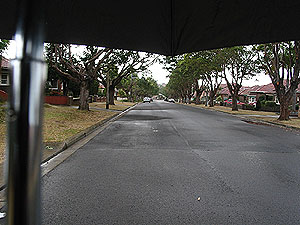
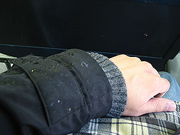
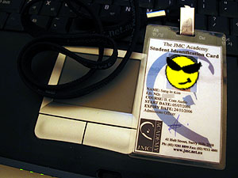
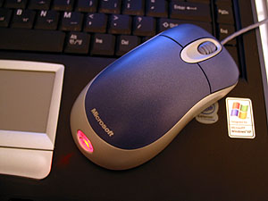

어제에 이어 오늘도 비가 온다. 비가 오니까 기온이 내려가고 제법 겨울 냄새가 난다. 한달여 동안 쨍쨍하던 날에 돌아다니다 보니 비가 오는 날 돌아다니는 게 그리 좋지만은 않게 느껴진다.   

<!-- truncate -->

비가 와서 우산을 들고.

우리나라 장마에 비하면 껌;

  
TFN 신청 하려고 - 분명히 일찍 나갔다. 학생증 찾고 (trainer에게 맡겨놓을테니 수업시간에 받으면 된다고 하길래, '오늘 수업 없는데요;' 했더니 꺼내준다.) 잠깐 뭣 좀 확인하느라 internet cafe에 갔다가 TFN 신청하러 Centre Point 건물에 갔는데 아아- Central Square에 있는 이민성에서 신청을 먼저 해야하는 거라고 한다. 시간이 늦어 이미 문을 닫았을 터이니 월요일날 신청하라고;;; 도대체 오늘 뭘 했길래 시간이 이렇게 빨리 갔지? 알쏭달쏭이다;;;   
  
위치를 몰라서 Kelly에게 전화. 갔는데 Sydney Tower 구경했던 Centre Point 건물에 있는 그 곳은 Tax Office (정식 명칭은 까먹었고; ) Central Square에 있는 건 Immigration Offce (역시 정식 명칭은 모르고; )라고 한다. 그러니깐, Immigration Office에 가서 수속을 밟은 후 Tax Office로 가야하는 것. 분명 Angela가 한국말로-\_-\* 설명해줬는데도 내가 이해를 잘못 한 것이다. 으음;;; 그러니깐 나에게 영어 듣는 게 문제가 있는 게 아니라 '듣기'에 문제가 있었구만. -\_-\*   
  

학생증

파란색 마우스

  
결국은 허탕치고 돌아오다가 마우스를 사러 갔다. 이 놈의 마우스, 한국에 있을 때부터 문제가 많았는데 - 연결해도 작동이 안되다가 선을 이리 꼬고 저리 꼬고 하다보면 정신이 돌아왔는데, 이제 아예 안된다. 정들어서 오래 쓰고, 문제가 있어도 그냥 쓸 수 있을까 싶어서 가지고 왔는데 안되서 결국엔 새걸 샀다. 딱 보니까 파랑색이 있어서 샀지 - 노트북과 세트 같다. -o-   
  
[20040709-5.jpg](./20040709-5.jpg)   
사실 어제 Tessie가 내일이 무슨 요일이냐고 하다가 '어, 금요일이네? 와-' 그러는 거다. 그래서 왜 그러냐고 했더니 금요일은 요리 안하는 날이라고 좋아한다. 그걸 세고 있었다니... 귀엽기도 하고, 거참;;;   
  
보통 금요일 저녁에 피자를 시켜 먹는데 집에 가니 - 왠 걸? 스프를 끓였네? 그냥 끓였단다. 물론 피자도 시키고. 맛을 보니까 삼계탕이랑 맛이 비슷하다. 닭을 통째로 넣지는 않지만 들어가고 쌀도 넣고 해서 푹 삶은 스프. 필리핀식 스프라는데, 이름이 뭐랬더라? 암튼 스페인어라고 하네 - 필리핀어는 스페인어의 영향도 조금 받는다고. 스페인어로 '쌀 + 스프' 라는 뜻이라고 한다.   
  
스페인어 이야기 하다가 예전에 John이 Tessie 만나기 전의 여자친구 이야기가 나와서 (스페인계였는지 어쨌는지 올라올라- 뭐 이렇게 불렀다면서) Tessie가 막 공격하고, John은 '응? 나 기억이 하나도 안나는 걸?' 이러고 시치미 떼고. John이 계속 기억 안난다고 하다가, Tessie가 '어, 그 여자에게 온 편지 아직도 내가 갖고 있는데?' 라고 펀치를 먹인다. -o- 종종 그렇게 Tessie가 John을 공격한다. (물론 진짜로 화내거나 하는 게 아니라, 왜 그 유쾌한 분위기의 공방;; 그런 거) 이번에도 John을 도와주면 또 남자들끼리 한편이라고 할까봐 가만히 있었다. :p
