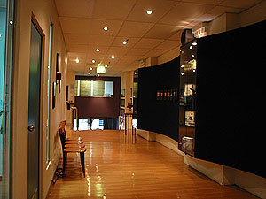
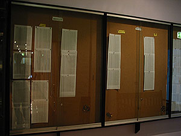
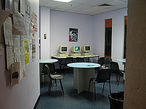
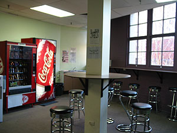

자자, 오전에 학교에 갔다. 이러쿵 저러쿵 이야기했더니 electronically가 무슨 뜻인지 모르겠단다.   

<!-- truncate -->

Advise your education provider that you intend to lodge an application on the Internet. They will then advise DIMIA **electronically** that you have commenced your course.

  
어제 이민성에서 받아온 (새로 바뀐 form에 대해 적혀있는) 문서를 보여줬더니 electronically가 메일인지, 홈페이지인지도 모르겠거니와 이제껏 그런 적이 없었다고 한다. 그러면서 등록한 거 말했느냐, 혹시 학기가 시작한 걸 몰라서 그러는 게 아니냐고 물어보더니 enrollment에 대한 확인서를 작성해주며 이걸로 되지 않겠느냐고 한다. 나야 이 절차가 처음이니까 추측만 할 뿐이니... 이민성에 또 가봐야 안될 걸 알았지만, 그 electronically가 뭔지 물어볼 겸 해서 다시 이민성에 갔다.   
  
[20040713-1.jpg](./20040713-1.jpg)  
이민성에 가서 번호표를 뽑고 기다리다 차례가 되서 가서 이야기했더니, 그거야 내 education provider가 더 잘 알 거라고 한다-\_-. 흠... enrollment 확인서 같은 거 보여줘도 쳐다도 안보고 (예상했지만^^) 학교측에서 시스템에 뭔가 입력을 해줘야 한다고 한다. 눈이 반짝. 오호라, 시스템. 그래서, 그 시스템이 뭐냐고 물어봤다 - 그거 홈페이지에 접속하는 거냐, 아니면 뭐냐... 했더니 이민성 홈페이지에서 하는 건 아니고, 암튼 시스템이 있단다. 매우 간단하다고만 설명하고 더 이상 설명은 안해준다 (못해준 거 아닐까?). 답답해서, 학교측과 전화 한통화 해볼거냐고 물었더니, 자기가 왜 학교랑 전화하냐고 안한다고 한다. 우띠; 누가 공무원 아니랄까봐;;;   
  
다시 학교로 가서, 그게 - 시스템이라는 게 있는 거라고 이야기해줬더니 한번도 그런 적이 없어서 모른단다 -\_-. 그러더니 administrator 중 한 명이 내일 이민성으로 전화해서 물어보겠단다.   
  
내 추측으로는, form이 바뀌기 전에는 사람이 직접 확인하던 절차가 form이 바뀐 이후로는 전산처리 되면서 생기는 게 아닐까 싶다 - 즉, 이민성으로 course commencement 정보를 보냈던 학교도 있고, 안 보냈던 학교도 있었을 것 같다는 느낌. JMC는 안 보냈던 학교가 아닐까 하는; (한번도 그런 적 없었다고 하는 걸로 보아하니.) 아니면, 이제까지 JMC에 입학한 학생들 중 work permmision을 처음 받으려고 하는 학생이 없었던가. (보통 외국인 학생들은 어학코스도 밟고 하니까 거기서 이미 신청했겠지?)   
  
[20040713-2.jpg](./20040713-2.jpg)  
시간이 어정쩡하게 남아서 그냥 학교 안에 있었다. 이것저것 읽고 보고 하다보니 졸리기 시작;;; 한국학생들에게 work permission 어떻게 받았냐고 물어봐도 그들은 이미 받은지도 오래되었고, 그냥 쉽게 받았다고 한다. 뭐냐고;;;   
  

저~ 끝 아래쪽이 정문

성적표 붙는 곳;

  

학생 휴게실 #1

학생 휴게실 #2

  
집에 돌아와 저녁 먹고 나니 Tessie가 물어본다, 어떻게 되었냐고. 자초지종을 이야기했더니, 말이 안된다며 - 당연히 학교에 다니기로 했으니까 학생비자를 준 거고, 어차피 학교들은 나라에서 통제를 하니까 당연히 알 거 아니냐고 말한다. Tessie가 이유를 모르겠다며 고개를 흔들고, 나도 이유를 모르겠다고 고개만 흔들 뿐... -\_-;
