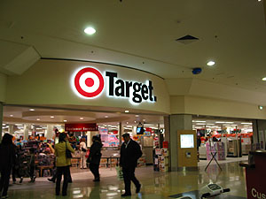
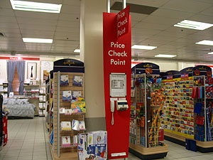
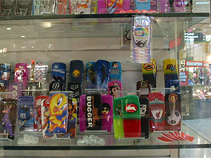
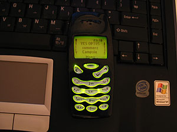

매니저가 찾으러 오라고 했기 때문에, 갔다. 집에서 조금 나오면 400번 버스를 타고 Eastgardens에 내리면 된단다. 나오면서 아차 - 거기 전화번호라도 적어가지고 나올 걸 싶었지만, 이미 나온 걸 뭐;;;   

<!-- truncate -->

[20040719-1.jpg](./20040719-1.jpg)  
여기 택시 중에는 종종 이런 뒷꽁무니를 한 택시들이 있다. 택시는 광고할 곳이 마땅치 않기 때문에 저렇게 만든 듯. 뭐든지 익숙해지면 광고효과가 별로 없겠지만, 나처럼 익숙치 않은 사람들은 분명히 한번 더 쳐다보게 된다.   
  
Westfield Eastgardens에 도착해서 바로 Hoyts로 직행. 직원에게 모바일 찾으러 왔다고 하니 색깔 기종 등을 물어보고 사람 시켜서 가져오게 한다. 그런데, 건내줄 때 본인 확인을 한번 더 할려고 했는지 모바일 첫 화면에 있는 것에 대해 물어봤는데 무슨 소린지 못알아들어서-o- 다시 설명해달라고 해서 들었지만, 결국 무슨 소린지 못알아들었다. -\_-\* 뭘 이야기해달라는 건지는 모르겠는데 내꺼 맞다고 하니깐, 서비스 회사 물어보고 대답하니까 ('Optus요-') 준다. 흐흐; 찾았다.   
  
Hoyts에 오면서 옆에 있는 매장 ezydvd에서 정리세일을 한다는 걸 봐서 그리로 갔다. Four Weddings & A Funeral이 단돈 $4.95. 아싸. 그거랑 The Full Monty랑 샀다. 어째 점점 씀씀이가 헤퍼지는 것 같긴 하지만, DVD하고 책 사는 것, 그리고 교통비를 제외하고는 거의 쓰지 않으니... 앞으로 조심해야지 싶었다. -o-   
  
안에 여러 매장이 함께 있기 때문에 여기저기 둘러봤다 - 어차피 오늘 시험에 계산기를 준비해오라고 했기 때문에 그것 살 겸 해서. 품질은 모르겠지만 굉장히 싼 매장이 있더라. 이름하여 The Reject Shop. 반품된 거 모아다가 파는 듯 하다. 아, 한국에도 1000원 매장 뭐 이런 거 있는데, (Jeffrey 아저씨 말로는 일본에도 100엔샵이 있다고) Campsie에 갔을 때 보니 1, 2, 3 Dollar Shop이 있었다. 신기하게 기준이 다 (우리나라 돈으로) 거의 1,000원이네.   
  
[20040719-2.jpg](./20040719-2.jpg)  
Target이 있어서 가봤는데, 뭐 별거 없다 - 다른 마트들이랑 역시나 비슷하다. 미리 살 품목을 정하지 않고 매장에 가는 건 '나 시간 많아서 주체할 수가 없어요-' 라고 말하는 것과 같은 것. 둘러볼려다가 그냥 나왔다. 첫째, 계산기를 다른 매장에서 샀는데, 여기서 살짝 더 좋은 걸 더 싸게 판다. 으흑. 싼 거라 줄 서서 시간 걸려서 바꾸는 게 오히려 더 낭비-\_-. 둘째, 물건 가격이 적혀있지 않은 (혹은 가격표가 떨어진) 물건의 가격을 알아보는 코너가 있다. 가격표는 없어도 바코드는 다 붙어 있으니깐. 실용적인 아이디어라고 생각 - 박수 짝짝짝.   
  

Target

Price Check Point

  
시티로 가려다가 케이스 파는 곳이 보여 한번 들여다 봤지만 역시나 호화찬란한 만화그림이 프린트된 것들이 대세;;; 앗- 그러나 깔끔한 케이스 발견. 샀다. (사진은 검게 나왔지만, 사실은 어두운 파랑색. - 그런데 어째 버튼 위치가 잘 안 맞는듯;;; )   
  

The Reject Shop

케이스 바꿨다

   
위드 유학원에 가서 밥을 먹고, 좀 있다가 Kelly에게 work permission 문제를 이야기하며 실제로 보는 앞에서 시도를 해봤지만 역시나 안된다. 다시 Angela와 함께 시도를 해봤는데 역시나 안된다. Angela가 자기가 담당하는 학생이 내일 work permission 때문에 오기로 했다면서 그 사람 정보로 테스트 겸 입력을 해봤는데 역시나 안된다. (나만의 문제가 아니었던 것-\_-) 내일 알아봐서 알려주겠단다. 고마워요, Angela.   
  
  
학교가서 시험 봤다. 생각보다 쉽네. (물론 -\_-a 몇문제 틀렸지만.) 공대 나온 게 이럴 때 도움이 되다니. -o- 그러나 의외로 잘 못 본 사람들이 많은 듯. 하긴 이과 나와서 공대 졸업한 사람들은 쉽겠지만, 그렇지 않은 사람들은 익숙하지 않을 수 있으니깐. 게다가 예전에 어디선가 주워 듣기로도 일반적인 서양애들이 (전공하는 사람들 말고) 수학(?)에 약하단다. (그러게... 일단 우리에겐 막강한 기본 무기 구구단이 있지... -o-)   
  
대략 가채점을 끝내고 바로 끝나서, 평상시보다 30분 정도 일찍 끝나서 진영씨와 유리씨와 맥주 한잔 마셨다. 둘 다 시험을 잘 보지 못한 듯 - 비까지 주적주적 내리니 분위기는 완전 gloomy monday;;; 와서 처음 밖에서 먹어보는 (그리고, Pub에서 먹어보는) 맥주. 생맥주, 300-400ml 되는 잔 하나에 $3.5 - 흠... 우리나라보다 비싸군. (마트에서 세일해서 파는 30캔들이, 24캔들이는 우리나라보다 싸더구만.)   
  
참, 혜슁-. 있잖아, 유리씨라는 사람, 너랑 되게 많이 닮았다. 키/체구는 너보다 작은데, 말 하는 거라든지 행동하는 거라든지 신기하게 많이 닮았더라. 게다가 말 할 때 속도라든가, 농담하는 뉘앙스라든지, 특히 목소리 톤. 목소리 톤이 되게 비슷해. (그러고 보니, 얼굴 뽀얀한 것도 비슷하고) 신기하더구만. (나이는 우리보다 많이 어려.) 혹시 네 친척 중에 여기 공부하고 있는 사람 없냐? -\_-;
