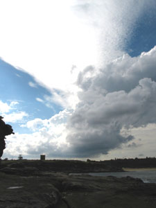
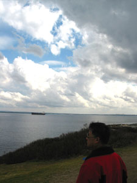

오늘은 Geoffrey 아저씨에게 음악 파일 주기로 해서 아침 먹고 댁으로 갔다. 내 mp3 player를 아저씨 컴퓨터에 걸어놨는데 3시간 가량 걸린다고 표시. -o- 커피 한잔 마시고, 드라이브 가기로 결정.   

<!-- truncate -->

[20040801-1.jpg](./20040801-1.jpg)  
집에서 카메라를 챙겨들고 La Perouse에 갔다 - Geoffrey 아저씨, William, Vivien 그리고 나 (Catherine 아주머니는 일하시느라 함께 못가시고.). (Mission Impossible 2 찍은 곳이라고; ) 그러니까 Botany Bay의 일부라고 생각하면 된다. 어제 지도책 사서 잠깐 보면서 Botany Bay가 가깝구나 싶었는데, 아저씨 덕분에 바로 현장학습을 오게 됐다. ^^   
  
갔다와서야 알았는데, John이 처음 여기 와서 나 데리고 다닐 때 여기도 왔었다. -\_-; 설명해주고 그랬는데, 전혀 기억이 안나다가 John이 이야기를 꺼내니까 어렴풋이 기억이 났다. 여기 유래에 대한 이야기도 해줬던 게 기억이 났는데, 해줬다는 것만 기억나고 내용은 기억이 안난다. -o- 프랑스와 영국, Captain Cook에 관련된 이야기였는데;;;   
  
[20040801-2.jpg](./20040801-2.jpg)  
조그만 다리에 폭발물 터진 흔적들 (그냥 까맣게 탄 자국들)도 조금씩 남아있다.   
  
[20040801-3.jpg](./20040801-3.jpg)  
날씨가 흐리다 개다를 반복했는데, 오히려 그러니 지난번 Harbour Bridge 갔을 때처럼 구름이 역동적-\_-이다. 아저씨 말대로 정말 차 있으면 - 여름에 종종 오면 시원하게 바람도 쐬고 좋을 듯. 여기는 특이한 게 바닷가에 가도 짠내가 별로 안난다. 아저씨와 아이들 사진도 찍어주고, 아이들이 강아지들 데리고 노는 것도 찍고... 나중에 이메일로 보내주기로 했다.   
  

경치 #1

Geoffrey 아저씨

   
사실 아저씨가 아저씨라고 부르지 말라고 했다. -o- 나이 많이 든 것 같이 느껴진다고. 그냥 '형'이라고 부르는 게 어떻냐고 잠깐 이야기했었는데, '형'이든 '형님'이든 '삼촌(^^)'이든 암튼 괜찮은 호칭을 생각해 봐야겠다. 그 때까지는 아저씨다 -\_-. 그나저나 허락없이 사진 올렸다고 화내시면 안되는데;;; -o-   
  
La Perouse에 왔다갔다 하며 Geoffrey 아저씨가 해준 여러가지 이야기들 - 전부 기억은 안나고, 기억나는 것들만 -\_-.   
  

**1** 종종 뒤에 P 라고 써진 스티커를 붙인 자동차들을 볼 수 있는데, 그게 초보운전이라는 뜻이라고 한다. 빨간 P는 면허 따고 1년째, 녹색 P는 그 다음 1년째. 우리나라처럼 '운전은 초보, 건들면 람보' 같은 표시를 일일이 하지 않아도 되니 효율적인 것 같기도 하다.   
  
**2** 우리나라처럼 교통법규를 어기면 포인트를 까고, 일정 포인트 이상 까이면 면허 취소 등 강력한 제재가 들어간다고 한다. 재밌는 건, 모범운전자(?)라든가 교통 법규 위반으로 처음 걸린 운전자들은 사정을 잘 설명하면 (딱한 사정 잘 설명해서 편지로 보낸다거나 하면) 그냥 넘어간다고 한다. -o- 모든 게 철저하게 규격화 되어있을 것만 같은 서방(^^)에 대한 이미지가 바뀌는 순간.   
  
**3** 게다가 - 출발하기 전에 이야기했던 건데, Bing Lee를 포함한 몇몇 전자제품 파는 곳에서는 흥정 잘 하면 물건값을 깎을 수도 있단다. -o- 오오오- 어느 정도의 마진은 세일즈맨에게 떨어지기 때문에 이리저리 잘 흥정하면 가능하다고 한다. 재밌다.   
  
**4** La Perouse 가는 길에 컨테이너 운반하는 큰~ 크레인이 있는 곳을 지나갔는데 (공항 근처), 아저씨가 대학생 시절 그 크레인 만드는 현장에서 일 했었다고 한다. 오오오- 꽤 높아 보이던데, 특별한 안전장치도 없이 오르락 내리락 하면서 일 하셨다고. 게다가 호주 애들은 큰 철근 들고 난간도 없는 외나무 다리 같은 곳을 지나다니며 일 했다고. -o-   
  
**5** 그러면서 곁들이시는 한마디 - 그 일 했을 때만 하더라도 근처에 아무 것도 없던 황무지였다고 한다. 사실 호주가 개발된지 얼마 안되었다는 이야기지. 콕- 꼬집어 이야기할 수는 없지만, 여기 온지 얼마 안 된 나도 종종 그런 느낌을 받는다. 말로만 듣던 '한국은 재밌는 지옥, 서양은 심심한 천국' 이야기가 조금씩 느껴진다는 뜻.   
  
**6** 개인적으로 여기의 앨뷸런스 제도가 맘에 들었다. (000이 긴급할 때 누르는 번호라는 건 알고 있었다.) 000을 누르면 경찰이 필요한지, 앰뷸런스가 필요한지, 소방차가 필요한지 물어본다고 한다. 필요한 거 말하고 주소 대면 바로 출동한다고. 앰뷸런스의 경우는 출동해서 일단 응급조치를 해주고 원하면 병원으로 데려간다고 한다. 병원으로 데려가면 앰뷸런스 출동한 비용이 들고, 그냥 응급조치만 받고 병원에는 안가고 돌려보내면 무료라고 한다. 멋지다 - 짝짝짝. 이건 복합적인 문제라고 생각되는데 - 우리나라에서는 급한 일 있어도 병원마다 전화해서 앰뷸런스 있는지 확인해야 하거나 아니면 알아서 택시 잡아타고 가야하지 않나. 길도 차들로 가득 차서 앰뷸런스가 빨리 가고 싶어도 갈 수 없을 때도 있고. 여기서는 앰뷸런스를 불렀는데 늦게 도착할 동안 환자가 잘못 되면 조사 들어간다고 한다 - 왜 늦게 도착했는지, 누구 때문에 무엇 때문에 늦은 건지.

  
아저씨 집에 가니 Catherine 아주머니도 와 계셔서 함께 점심을 먹었다. 점심은 떡국 - 국물이, 끝내줘요. :) 아저씨 부모님이 Lakemba에서 동방식품이라는 식품점을 하신다고 한다. (장사 잘 되시길 !!) Catherine 아주머니가 주말에 거기서 일 도와 드리신다는데, 오늘 일이 좀 많았다고 - 추석이 가까워져서 그런 것 같다고 하신다. 여기서도 추석을 크게 지내는데, 오히려 설날보다 더 크게 지낸다고 한다. 점심 다 먹고 나니 전송 완료. 아저씨 가족들은 어디 갈데가 있어서 가고, 난 집에 들어왔다.   
  
집에 오니 또 아무도 없다. ^^ 피곤해서 한숨 자고 나니 어둑어둑. 일어나서 저녁 먹고 도시락 챙기고 방에 들어왔지. 오늘은 바람도 쐬고 정말 휴일처럼 보냈네.
