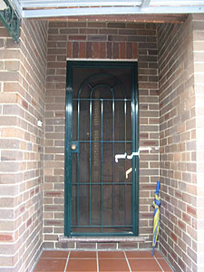
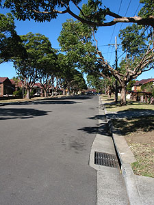
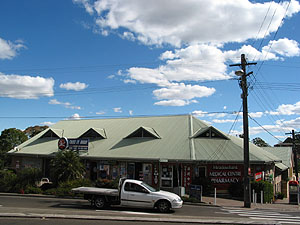

**19/72-78 Constitution Rd. Meadowbank NSW Australia 2114**  

<!-- truncate -->

**1**  
오늘은 진영씨의 방으로 들어가는 날. 원래 평일 아침은 Tessie나 John이 특별히 식사를 차려주지 않는데, 오늘은 일어나보니 Tessie가 아침을 해놨네. 어제 저녁에 Tessie가 말하길, 오늘 할 일이 많다고 아침부터 일찍 일어나야겠다고 하더니... 오오오- 감동. 아침을 먹고 있는데 Cindy가 Tessie와 내 사이에서 떠나질 않고 있다. Tessie 말로는 사람들이 어디 가는지 아는 것 같다고 한다 (예전에도 다른 사람들에게도 그랬다고; )   
  
[20040806-1.jpg](./20040806-1.jpg)  
진영씨와 유리씨가 짐 옮기는 거 도와준다고 집까지 오기로 했는데, Tessie가 Bexley North 역까지는 태워주겠단다. 다시 한번 감동. 그러면서 이제 도와줄 사람 없으니 잘 살라고 이것저것 이야기를 해 준다. 있는 동안 가족처럼 정말 잘 해줘서 고맙다고 하니, 실제로 막내 동생처럼 생각하고 대해줬다고 한다.   
  
[20040806-2.jpg](./20040806-2.jpg)  
짐 싸고 잠깐 시간을 보내고 있는데 Geoffrey 아저씨에게 전화가 왔다. Tessie네 있는 동안 참 잘해주셨는데, 가기 전에 전화도 해주시니 너무나 고마울 뿐. 다음번에 만날 때, 혹은 연락드릴 때는 호칭을 바꾸기로 했다. 형님으로. :)   
  
**2**  

한동안 안녕.

Lawn Ave.

  
진영씨, 유리씨와 만나기로 한 시간이 되서 Tessie 차에 짐을 싣고 역으로 가서 조금 기다리니 둘 다 도착. 짐을 기차에 싣고 Meadowbank로 출발. Central 역에서 한 30여분 걸린다고 한다. 그리고, 진영씨가 살고 있는 집은 역에서 5분 거리 (라고 했는데 5분도 안 걸린다.).   
  

Meadowbank Station

역 앞

  
자 이제 또 새로 시작. 사실 누군가 같은 방을 쓰는 게 사실 좀 두려웠는데, 마음을 고쳐먹고 즐겁게 생각하기로 했다. 오히려 피해주지 않고, 불편함 끼치지 않도록 잘 지내야지. 진영씨가 점심을 차려줘서 셋이 점심을 먹고, 근처 산책을 했다. 바로 뒤에 Meadowbank Park이 있고, 조금 걸으니 (진영씨 표현을 빌리자면) '강 같은 바다'가 나온다. 바다와 연결되어 있긴 하지만, 수로의 폭이 아주 좁아서 강이나 호수처럼 느껴지는 곳.   
  
[20040806-7.jpg](./20040806-7.jpg)  
다녀오니 함께 사는 남자분이 와 있다. (그러니까, 내가 살게 될 곳에는 침실 2개, 욕실 2개, 주방, 응접실, 베란다, 발코니가 있고, 방 하나는 커플 한쌍이 쓰고, 다른 방 하나는 나와 진영씨가 쓰게 되는 것.) 남자분, 잘 생겼다. :)   
  
잠시 있으니 여자분도 들어오고 해서 저녁을 먹고, 산책 나갔다 오는 길에 처음 방에 들어온 기념으로 Guinness 4캔을 사왔는데 (4캔에 $16. 큰 잔 하나 무료 증정), TV 보면서 먹었다.   
  
(남자분 이름은 Charles (수창씨), 여자분은 미애씨.)  
  
[20040806-8.jpg](./20040806-8.jpg)   
자, 잘 살아보자.   
  

여기 주소는   
  
**19/72-78 Constitution Rd. Meadowbank NSW Australia 2114**

  
(19/72-78은 이 건물이 72번지에서부터 78번지까지 걸쳐 있다는 뜻이고, 19호실이라는 뜻이다. 2114는 우편번호.)   
  
**소포와 우편, 가리지 않고 모두 받습니다. :D**
