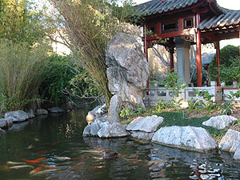
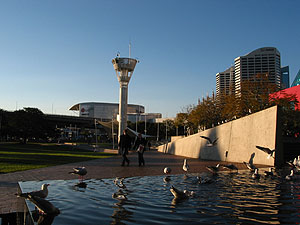
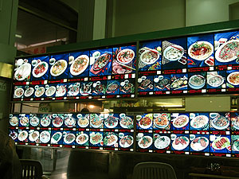
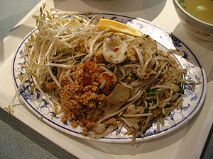

오늘은 self pace가 있는 날. 그리고, 몇일 전에 미애씨와 수창씨, 그리고 진영씨와 함께 저녁 먹고, 영화 보기로 했었지. 오늘 보기로 한 영화는 Hellboy.  

<!-- truncate -->

주로 City의 George St.에 있는 Hoyts에서 보는데, 인터넷 사이트도 있다. 시간 확인하려 한번 들어가봤는데, 오오- 의외로(-\_-) 예매도 가능하네. 신용카드가 없지만 한번 어떻게 나오나 볼려고 시도해 봤는데, booking 비용 $1가 추가된다. 헉;;; -o-  
  
학교에 가서 DAT를 받으면서 Tom에게 time code 찍힌 DAT 있냐고 물었더니 아직 준비되지 않았단다. 흠... automation 한번 해보고 싶었는데... 다음주에 한번 더 이야기해주란다. ok.  
  
뚝딱뚝딱 self pace를 끝내고, China Town에 있는 빵집에서 간식으로 빵을 사먹고 (진영씨가 알려준 집인데 빵도 꽤 크고, 먹을만 하고, 무엇보다 가격대 크기로 볼 때 참 싸다. -\_-v) 잠깐 Darling Horbour에 가서 쉬다가 미애씨와 수창씨에게 연락이 와서 극장으로 갔다.  
  

Chinese Garden 앞

Darling Harbour 근처

  
  
Hellboy 표를 미리 끊어놓고 저녁을 먹으러 갔다. 원래 잘 가는 타이국수집이 있다고 했는데, 오늘은 처음 가보는 곳을 가봤다.  
  
여기 있는 아시안계 (뿐만 아니라 몇몇 다른 곳들도) 식당들의 대체적인 특징은 음식 사진을 주루룩 나열하고, 번호를 붙여놓는다. 아무래도 서양애들이 음식 이름을 부르기 힘들기 때문이겠지. 그래서, 보통 16번 주세요, 7번 주세요- 라고 주문한다.  
  

메뉴판

Pad Thai

  
Pad Thai라는 걸 먹었는데, 뭘 먹었는지 기억이 안난다.-\_- 그냥 맹숭맹숭한 맛. 소스가 들어가다 만 듯한 느낌;;;  
  
저녁 먹고 나오는데 진영씨가 갑자기 생활의 활력소- 가위바위보를 하자고 한다. 스타벅스 커피 내기. 으하하하하- 이겼다. 진영씨가 걸렸지.  
  
커피 먹고, 영화 보고, 다시 Darling Harbour에 가서 조금 산책하고 집에 돌아왔다. 사실 많이 돌아다니지는 않았지만 오랜만에 여기저기 돌아다닌 느낌. 간만의 휴일 느낌.
