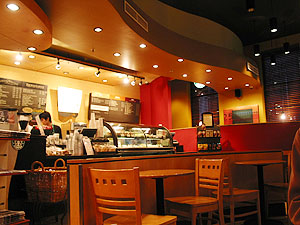
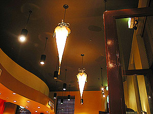

오늘은 prac이 있는 날.  

<!-- truncate -->

점점 prac 시간을 보내는 게 능숙(?)해지는 느낌이다. 이론 시간에 배웠던 것들이 어우러지기도 하고, 설명을 들으면서 이제까지 귀찮은 방법으로 작동해왔던 것들을 쉬운 방법으로 할 수 있다는 걸 알게 되니, 뭐랄까 - 궁금했던 것들이 풀린다고나 할까.  
  
prac을 끝내고 여느 때처럼 늦은 점심을 먹으러 갔다. 오늘은 Market City (라는 쇼핑몰(?)같은 게 있다)에 있는 푸드코드에 갔다. 진영씨는 밥(^^), 나는 케밥. -o- 원래 케밥을 그리 자주 먹어보지 않아서 그런데, 원래 이렇게 큰가? -\_-  
  
[20040825-1.jpg](./20040825-1.jpg)  
식사를 하고, 이번주 토요일이 생일인 수창씨 선물을 볼 겸해서 안을 돌았는데, 마땅한 게 없었다 - 허탕.  
  
[20040825-2.jpg](./20040825-2.jpg)  
그리고는 왠지 피곤해서 스타벅스에 가서 커피 한잔. 아, 다국적 기업의 위력이란.  
  

차이나타운 근처의 스타벅스

다른 곳과 살짝 다른 인테리어

  
참, 오늘 수업 끝날 때 물어볼 게 있어서 Konrad를 몇번이나 불렀는데, 못들었는지 대꾸가 없다. -o- 이런;;; 발음이 문제인건가. -\_-;
