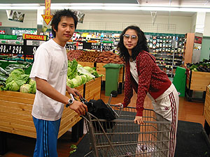
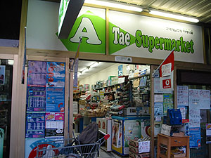
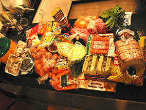
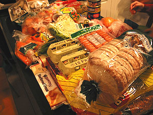

오늘은 self pace를 하는 날.  

<!-- truncate -->

보통은 Tom이 실습관련 기자재(?)를 담당하는데 (기자재 뿐만 아니라 스튜디오 전반에 대한 걸 관리한다.), self pace 때마다 (내가 보기엔) 집히는 대로 DAT를 준다. 그래서, 괜찮은 곡들이 녹음된 DAT를 받을 때도 있고, prac 시간에 질리게 들은 곡이 녹음된 DAT를 받을 때도 있고 - 복걸복;;;  
  
오늘 받은 DAT에는 딱 한 곡만 녹음되어 있었다. 노래는 Tell Him. 최근에 들은 기억으로는 Ally McBeal에서 Vonda Shepard가 부른 버전. 그걸 조물딱 조물딱 만지고 나서 시간이 남아서 진영씨가 받아온 DAT에 있는 걸 만졌다. 진영씨 DAT로 한 건 Stand By Me.  
  
진영씨는 잠깐 약속이 있다면서 먼저 나가고, 나는 시간이 다 되서 나왔다. 아, 오늘은 장보기로 한 날. 진영씨와 함께 Strathfield 역으로 가서 수창씨와 미애씨를 만나서 장을 봤다.  
  

정말 깜찍하지 않습니까! -o-

아태슈퍼;;;

  
보통 Strathfield에 있는 Woolworths + 근처 정육점 + 근처 한인 슈퍼에서 장을 본다. 산 게 많아서 trolley를 집까지 가져가려고 했는데, 기차역의 역무원이 저지한다.-\_- 그래서 할 수 없이 다 들고 갔다;;;  
  

1주일 동안 먹을 식량-\_-

우리는 돼지인가 보다;;;

  
집에 와서 내려 놓고 사진 한 방. 사진에는 쌀 한가마니가 빠졌네; 찍어놓고 보니 많네... -o-
