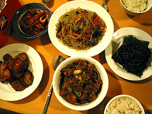
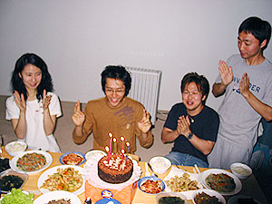

오늘은 수창씨 생일.  

<!-- truncate -->

나는 낮부터 밍기적 거리면서 책 좀 보고, 좀 졸고-\_-, 미애씨랑 수창씨는 어제 '파리의 연인' 비디오를 빌려왔다고 하더니 방에서 열심히 본다. (생방송으로 매일 매일 보면 적어도 두세달은 봐야하지만, 완결된 걸 작정하고 보면 2-3일이면 충분하지.)  
  
어느덧 저녁 시간이 가까워져 오고, 미애씨는 저녁 준비 중. 오늘 저녁 음식을 하겠다고 공언한 터 - 특별 메뉴는 잡채와 탕수육. (그리고, 물론 미역국)  
  

하나는 수창씨에게

하나는 미애씨에게

  
준비 전에 한국의 통장에 있는 돈으로 도토리 선물을 했다. 아- 싸이월드의 광풍은 시드니도 비껴가지 않는다. 수창씨에게 50개, 미애씨에게 50개.  
  
준비를 한참 하고 있는데 미애씨 친구 조앤 도착. 잠시 후 윗층으로부터 유리씨 도착. 조금 더 후 진영씨랑 수창씨 커플이 알고 있는 형 - 피터씨 도착.  
  
[20040828-1.jpg](./20040828-1.jpg)  
어쩌다보니 - 조앤씨와 유리씨는 미애씨를 도와 열심히 요리를 만들고, 남자들은 이런저런 이야기를 하고 있었는데 - 그게 참 거시기 했다. 왜, 무슨 날이면 여자들은 주방에, 남자들은 안방에 있는 구도와 비슷하게 느껴져서. 쩝. (이런 구도 별로 좋아하지 않는다;;; )  
  

오오-

오오오-

  
상다리가 부러지게 차려놓고 잔치 준비. (아, 케익은 유리씨가 사 왔다.)  
  
[20040828-4.jpg](./20040828-4.jpg)  
모두 함께 이것저것 세팅하고, 자리에 앉아 생일초도 불고, 축하 노래도 부르고, 맛나게 먹었다. 다시 한번 느끼는 거지만, 미애씨~ 요리 참 잘 해요. :)  
  

생일 케익

생일축하 노래도 부르고.

  
한참 이야기도 하고, 소식들도 묻고, 잠깐 TV도 보면서 즐거운 시간. 손님들이 모두 돌아가고 난 후 미애씨와 수창씨는 보다 만 파리의 연인을 다시 보기 시작. 나도 옆에 껴서 두 편 정도 봤다.  
  
아, 저런 스타일이구나. 그런데, 김정은은 왜 입을 모으고 말하지? 이동건은 '네멋'과 '상두'에 이어 또 비슷한 역할이네? 박신양은 여전하구나.  
  
생일 축하해요. 수창씨. :)
