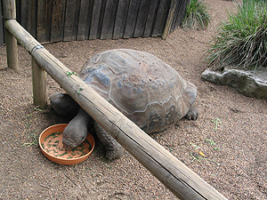
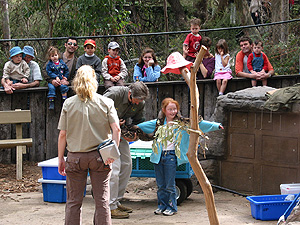
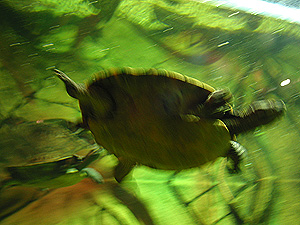
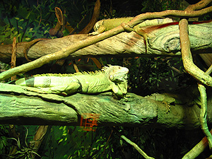
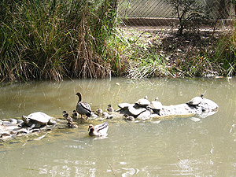
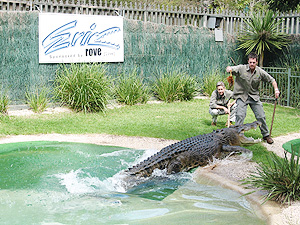

미애씨는 지지난주부터 방학이었는데, 쉬는 동안 제대로 놀러가지 못했다. 다음주부터 또 학교에 나가야 하는 미애씨를 위해 놀러가기로 했다. 가기로 결정한 곳은 [Australian Reptile Park](http://www.reptilepark.com.au/). Gosford 역에서 택시타고 한 10-15분 정도는 더 들어가야 하는 곳이라고 한다. (수창씨가 찾아봤는데, 버스도 없고, 좀 외진 곳에 위치해 있다고.) (진영씨는 아르바이트를 하느라 함께 가지 못했다;;; )  

<!-- truncate -->

[20040911-1.jpg](./20040911-1.jpg)  
좀 급하게 출발하여 Gosford 역에 도착해서 그래도 혹시나 하는 마음에 information center에 가서 물어봤더니 역시 차가 없으면 별다른 방도가 없다고 한다. 답변해주는 사람이 할아버지였는데, 근처에 꽃 전지회 같은 게 있으니, 젊은 사람들이니, 거기까지 가는 버스를 타고 걸어가도 괜찮겠다고 한다. 그러나 우리는 그냥 택시를 탔다. -o-  
  
[20040911-2.jpg](./20040911-2.jpg)  
택시를 처음 타봤는데, 택시비가 참 비쌌다. 기본료가 $2.65, 1km당 $1.53, 그리고 저녁 10시부터 할증이 붙는데-\_- 20% 인상. 콜택시로 이용하면 $1.10 추가, 무거운 짐을 실어도 할증-\_-. 무서운 나라다. -o- 아, 그리고 잔돈이 없으면 탈 때, 미리 이야기하라는 말도 적혀있네.  
  
[20040911-3.jpg](./20040911-3.jpg)  
어찌되었건 Reptile Park에 도착. (택시요금은 $20정도 나왔다.) 들어가니 역시나 Reptile들이 있네 -\_-a. 중앙쪽에 Show Pit이라고 만들어놓고, 시간이 되면 한 아저씨가 이것저것 설명해준다. 우리가 갔을 때는 도마뱀과 뱀에 대한 설명을 하고 있었다. 아이들, 어른들 할 것 없이 모두 흥미진진하게 구경.  
  

밥 먹는 거북이;

아이들이 많다.

  
재밌는 사실을 알았는데, 캥거루들이 앉아있는 포즈는 참 다소곳했다. 아니, 요염하다고 해야하나? 허리를 한껏 비틀고 앉아있는 걸 보고 있으려니 디스크 걱정이 되었다. -\_-  
  
[20040911-6.jpg](./20040911-6.jpg)  
공원은 그리 크지 않은데, 조그만 부스(?) 같은 걸 만들어놓고, 보여주는 공간도 있다. 도롱룡, 도마뱀. 거북이, 뱀, 거미 등 이것저것 많이 있네;  
  

헤엄치는 거북이

포즈잡는 이구아나(?)

  
악어들은 피곤한지 다들 퍼져 있고,  
  
[20040911-10.jpg](./20040911-10.jpg)  
코알라들도 나무에 붙어서 잠만 자고,  
  
[20040911-11.jpg](./20040911-11.jpg)  
박쥐들도 철망에 붙어서 잠을 잔다. -\_-  
  
[20040911-12.jpg](./20040911-12.jpg)  
한쪽에서 모형악어인지, 진짜악어인지 구분이 안가는 악어 위에 거북이와 새들이 모여있는 걸 보고 있다가, 진짜 악어 먹이주는 시간이 있어서 그걸 구경갔다. 악어 이름까지 지어놓고 - 이름은 Eric, 소리를 질러 악어를 물위로 올라오게 한 뒤 털도 뽑지 않은 닭을 던져준다. 쇼맨쉽인지 진짜인지 먹이주는 사람 벌벌 떨더라. -o-  
  

저 아래 진짜야 가짜야

쉭쉭- 물어~

  
이 곳은 버스도 다니지 않고, 택시도 다니지 않기에 (관광객들이 단체로 타고온 버스는 제외) 어떻게 할까 싶다가 information center의 할아버지가 한 말이 생각나 근처 꽃 전시장까지 걷기로 했다.   
  
[20040911-15.jpg](./20040911-15.jpg)  
그런데... 2km 정도면 도착한다는 할아버지 말씀과는 달리 약 1시간 정도를 걸었다. -o- 아유, 힘들어. 뭐 덕분에 풍경 구경은 잘 했다.  
  
[20040911-16.jpg](./20040911-16.jpg)  
1시간 정도 걸은 끝에 버스 정류장에 도착해서, Gosford 역까지 버스를 타고 간 뒤, 다시 city로 나갔다. 그래도, 미애씨 방학의 마지막인데, 그냥 가기 뭐해서 영화를 보러 갔다 - The Bourne Supremacy. 영화는 진영씨와 함께 봤다.  
  
 아;;; 오늘 Australian Reptile Park에서 본 재치스러운 문구 하나. 

도마뱀인가가 있었던 자리였는데, 자리가 비워져 있었다. 그리고는 이렇게 적어놓았네. ^^  
  
[20040911-9.jpg](./20040911-9.jpg)
