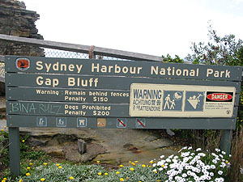
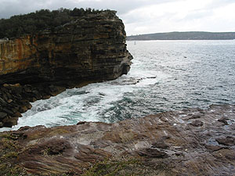

지지난주에 내가 늦잠 자서 못가고, 지난주는 Geoffrey 형님에게 일이 생겨서 못가서 이번주에 만나뵙기로 했다. Strathfield에서 만나서 Gap Park에 가기로 했다. 내가 살던 방에 용준 아버지 (이름이 맞는지 모르겠다;; )라는 분이 1달 동안 지내시고 있다고 함께 왔다. (물론 William과 Vivien도 함께.) 용준 아버지는 관광차 오신 거라고. (회사에서 보내준 거라 한다.)  

<!-- truncate -->

[20040919-1.jpg](./20040919-1.jpg)  
Mrs. Macquarie's Chair라는 곳을 먼저 갔는데, 솔직히 가기 전까지 어딘지 몰랐다. 알고 보니, 내가 처음 여기 왔을 때, John이 나를 데리고 왔던 곳. (^^) 그러고 보니, 친절한 John이 처음 나를 데리고 여기저기 보여줬었는데, 지금 생각 해보면 잘 모르겠다. (간 것들은 분명히 기억이 나는데, 그게 어디쯤에 있는지지, 지명이 뭐였는지 같은 것들이 기억이 안난다.) 아마도 처음 와서 긴장되었기 때문이겠지.  
  
슬쩍 둘러보고 Gap Park로 갔다. John이 여기와 살짝 비슷하게 생긴 곳을 데려갔던 기억이 나는데, 그 이름은 기억이 나지 않는다. -\_- 왜 Gap Park라고 부르냐고 Geoffrey 형님에게 여쭤보니 손가락으로 풍경을 가리키며 보라고 한다.  
  
[20040919-2.jpg](./20040919-2.jpg)  
정식 명칭은 Sydney Harbour National Park의 Gap Bluff. 해변가 바위들이 꼭 사람이 자른 것처럼 직각으로 홈이 패여 였다. (그런 홈들 때문에 Gap Park가 아닐까 하는 생각도.)  
  

Gap Bluff

날씨가 변덕스러웠다.

  
여기저기 둘러보고 바람도 쐬고 하다가 용준 아버지를 위해 La Perouse에 갔다. 오늘 지나가는 비도 오다가 개이는 등 날씨가 변화 무쌍하였다. 그래서 그런지 지난번에 왔을 때보다 파도가 좀 쎄더라. 바람 쐬기는 참 좋았지.  
  
[20040919-5.jpg](./20040919-5.jpg)  
파도치는 걸 구경하다가 시선을 돌리니 여기저기 낚시하는 사람들이 있다. Gap Park에서도 조그만한 배에서 낚시하는 사람들이 있던데... 오히려 바람 불고 파도치는 날 낚시하는 걸 좋아하는 걸까?  
  
[20040919-6.jpg](./20040919-6.jpg)  
살짝 늦은 점심으로 지난번에 형님이 데려간 쌀국수 파는 집에 다시 갔다. (그 때는 거기가 어딘지 정확하게 몰랐는데 오늘은 알았다. Flemington 역 바로 근처.) 역시 맛나다. 사실 먹으러 오는 길에 차 안에서 졸았더니 형님에게 미안했다. 차만 타면 자는 거... 고쳐야 한다. -\_-;
