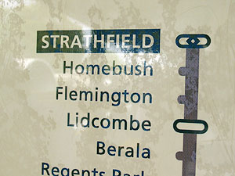
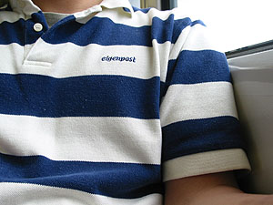
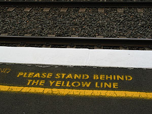
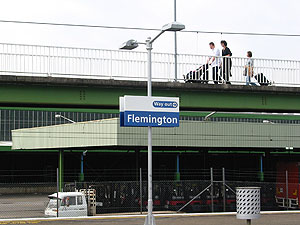
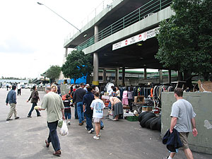
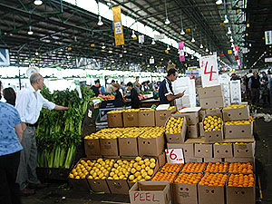

Flemington에서는 주말마다 야채와 채소를 파는 장이 열린다-는 이야기를 들어서 알고 있었는데, 한번도 가보지는 않았다. 지난주에 어쩌다 이야기가 나와서 이번주 야채는 Flemington에서 사기로 전격 결정. 수창씨와 나만 가기로 했다.  

<!-- truncate -->

Strathfield에서 갈아타고;

반팔을 입고 갔다.

  

안전선 안으로 들어오세요;

도착!

  
Flemington에 도착해서 시장(?)으로 갔다. 투박하게 생긴 건물들에 사람들이 가득하다. 온갖 잡동사니(?)를 파는 곳이 먼저 나오고, 야채와 과일, 생선을 파는 곳이 그 다음에 있다.  
  
처음 왔으니 탐색차 주욱- 둘러봤다. 정말 싸네. 한참 구경하다가 트롤리(trolly - 카트)를 찾았는데 없다. 사람들이 어디서 트롤리를 가져오나 봤더니, 돈을 주고 빌린다. $8 내고 나중에 $5 돌려받는 형태. 그냥 우리가 가져온 가방에 담아가기로 결정.  
  

여기는 잡동사니(?) 파는 곳

여기는 야채, 과일, 생선들...

  
이것저것 샀는데 - 오늘의 소득이라면 소득이랄까? 오렌지 한 박스를 $5에, 토마토 한 박스를 $8에 샀다. 아싸-  
  
그러나 너무 무거워서 고생 좀 했다;;; -\_-;
