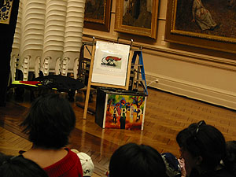
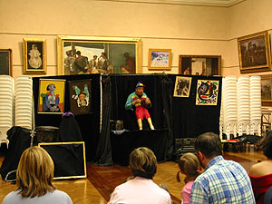

미애씨는 전공이 의상쪽이다. 이번에 받은 과제를 위해 옷을 만드는데, 그 옷을 입고 검사(?)를 받아야 하는 모델이 필요하단다. city에서 몇몇 학교와 회사가 후원하는 패션쇼가 있다고 해서 모델을 구하러 city에 가는데, 나와 수창씨도 바람도 쐴 겸 해서 따라갔다.  

<!-- truncate -->

Center Point에 가니 천막을 쳐놓고 패션쇼를 하고 있다. 정확하게 말하면 패션쇼가 아니라 아마추어들 중에서 모델을 뽑는 행사.  
  
[20040926-1.jpg](./20040926-1.jpg)  
미애씨 학교 친구도 만나서 함께 구경하다가 근처에서 점심을 먹고 난 후에 다시 보러 갔는데, 그 사이 미애씨는 모델을 구했단다. 다행이네, 빨리 구해서.  
  
[20040926-2.jpg](./20040926-2.jpg)  
어디선가 음악 소리가 들려서 찾아가봤더니 근처 한 레코드점에서 어떤 밴드가 열정적으로 연주를 하고 있다. 간단한 쇼케이스인가? 신선하고 좋네. 음악도 괜찮고. (기타는 좀 약했지만)  
  
[20040926-3.jpg](./20040926-3.jpg)  
수창씨는 좀 피곤해 했지만 나온김에, 오랜만에 Art Gallery of NSW에 가기로 했다.  
  
[20040926-4.jpg](./20040926-4.jpg)  
[20040926-5.jpg](./20040926-5.jpg)  
이것저것 구경하고 있는데, 한쪽에서 뭔가를 하고 있다. 알고보니 Mic Conway라는 사람이 진행하는 쇼- 쇼의 제목은 'Artbeat' 였다. 아이들의 열렬한 반응! ^^  
  
아이들 대상의 쇼였는데, 참 인상적이었다. 주제는 물론 'art'. Art Gallery에서 하는 쇼라는 것도 그러했고, 대상이 아이들이라는 점도 그랬다. 노래도 부르고, 마술도 하고, 저글링도 하고, 간단한 인형극도 하면서 아이들에게 아트란 무엇인지에 대해 설명해주는 교육적인(^^) 쇼였다. 부럽다, 이런 것. 주제는 대략 이런 것이었다 - '모든 건 art가 될 수 있어!'  
  

Art란 무엇인가.

인형극까지.

  
보면서 여러 짧은 생각들이 스쳐갔다.  
  

그 사람은 예술가인가?  
엉터리 예술가라고 감히 말할 수는 없겠지?  
돈을 많이 주니까 하는 건 아닌 것 같아.  
그 사람도 더 나은(?!) 상황을 모색하고 있을까?  
어렸을 때부터 이런 걸 보며 자라는 아이들... 부러운 환경이네.

  
미애씨와 수창씨는 먼저 들어가고, 나는 한참 더 구경을 한 다음에 영화 한편 보고 집에 도착!
