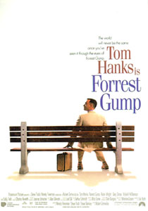
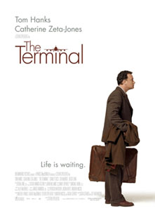
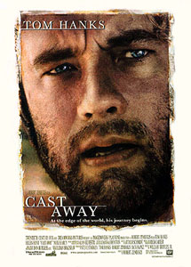

[the\_terminal.jpg](./the_terminal.jpg)  
감독 : Steven Spielberg  
배우 : Tom Hanks, Catherine Zeta-Jones, Stanley Tucci, Diego Luna, Zoe Saldana, Eddie Jones  

<!-- truncate -->

Viktor Navorski (Tom Hanks 분)는 자신의 조국 Krakozhia가 쿠테타 상황에 빠져들면서 뉴욕의 한 공항에 머물 게 되지. 머무는 게 아니라 다시 조국으로 돌아갈 수도 없고, 그렇다고 뉴욕 시내로 나갈 수도 없고, 한마디로 감금이지.   
  
영어도 잘 못하는 Viktor가 차근차근 영어도 배워나가고, 살아남는 법도 체득하고, 친구도 사귀고, 아슬아슬(?)한 로맨스도 경험하게 되는 그런 내용이지. 일종의 서바이벌 게임처럼.  
  
그런데, 실화를 바탕으로 했다는데, 왜 이리 영화는 처음부터 끝까지 조작된 느낌을 줄까. 말도 안되는 설정이 너무 많고 개연성이 허술한 부분도 너무 많아서 좀 맥이 빠졌어. 아, 하나하나 설명하기엔 너무나 많을 정도라구.  
  
게다가 영어를 거의 못하던 Viktor는 영화가 진행되면서 말만 조금 버벅거리지 아주 잘 알아듣게 되지. 아, 공감은 가. 긴장할 때 배우는 게 크니까. 그런데, '주인공은 이방인'이라는 느낌이 영화가 진행되어 가면서 '미국인이 되어가는 이방인' 아니, '사실 주인공은 처음부터 미국인'이라는 느낌이 들더라고. 혹시 의도된 건가?  
  
그리고, 이 영화는 2가지 영화를 동시에 떠올리게 했는데 바로 'Forrest Gump'와 'Cast Away'지. 둘 다 Spielberg 사단이라 불리는 Robert Zemeckis 감독이 만든 영화지. 웃기지 않아? 마치, 김동률이 이적과 함께 카니발이라는 앨범을 통해 '거위의 꿈'이라는 노래를 만들자, 전람회 시절 김동률을 도와줬던 신해철이 뒤이어 '민물장어의 꿈'이라는 노래를 만들었을 때와 비슷한 느낌이야.  
  

Forrest Gump

The Terminal

Cast Away

  
평점을 주자면 별 다섯개에 두개 반. 현실을 철저히 외면한 스필버그식 미국 만만세는 전혀 흥미롭지 않아.  
  
20040919 Greater Union (Burwood) with James, Charles, Miae
