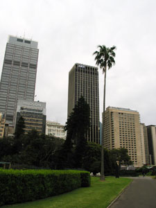
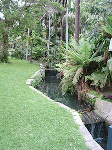
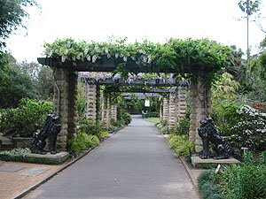
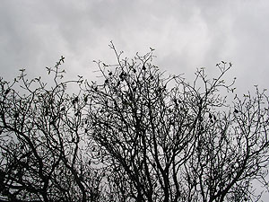

미애씨는 요즘 학교 과제로 옷을 만들고 있는데 주제가 '미스테리 가든 (mystery garden)' 이다. 그래서 이것저것 조사도 해야하고 준비도 하는데, 학교에서 선생님이 Botanic Garden을 보고 오라고 했단다. 수창씨와 나도 바람 쐴 겸 함께 나갔다.  

<!-- truncate -->

이 정도면 시내 한복판

괜찮네;

  
한참 겨울이었기 때문에 꽃들은 화사하지 않지만, 게다가 오늘 날씨도 그리 화창하지 않았지만 그래도 말끔한 녹색 식물들을 보니 편안하다.  
  
여기저기 섹션들이 구분되어 있는데, 아직 봄이 되지 않아서 그런건지 언뜻 봐도 다 비슷비슷했다. 꽃이 제대로 피기 시작하면 훨씬 나아지겠지.  
  

깨끗하다.

굵은 점들은 단체로 매달린 박쥐들;

  
Opera House를 끼고 Harbour Bridge가 있는 방향으로 산책을 좀 하다가 나는 학교로 갔는데, Habour Bridge 근처에 가장 비싼 숙박시설이 어딘지에 대해 수창씨와 이야기하며 가다가 앞을 보지 못하고 그만 깃발 등을 달려고 세워놓은 폴대에 정통으로 부딪혔다. ㅠ.ㅠ  
  
[20041007-5.jpg](./20041007-5.jpg)  
무슨 만화도 아니고, 정말 정확하게(!) 가운데로 부딪혔다. 지나가는 사람들 피식피식 웃고, 저절로 눈물이 나오고 -\_-, 학교에는 늦을 것 같아서 정신은 없고. 으으으. 수창씨와 미애씨의 표현을 빌리자면 너무 순식간에 벌어진 일이라 말릴 틈이 없었다고. -o-
