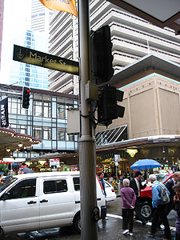
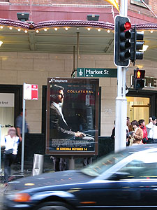

어제 모여서 영화를 보러 가기로 결정했었다.미애씨는 [Open Water](http://openwatermovie.com/), 나머지 사람들은 [Collateral](http://collateral-themovie.com/)을 원했던 상황. 미애씨가 워낙 오래 전부터 Open Water를 원했기 때문에 Open Water를 보기로 했으나 결국은 미애씨가 다른 사람들의 의견에 따르기로 결정. 사실은 친구들이 재미없다고 했기 때문이라고. -o-  

<!-- truncate -->

Market St.

오늘 볼 영화는 Collateral

  
이번주에는 계속해서 비가 내린다. 워낙 하루에도 날씨가 변화무쌍한 동네라 비가 오다가도 금새 개이기도 해서 그리 꿀꿀한 분위기는 아니지만 그래도 비가 오면 아무래도 불편하지.  
  
집에서 쓰던 칼이 부러져서 칼을 사러 갔다. 칼 전문으로 파는 곳에 갔는데 많이 비싸네 우움. 그냥 Woolworths에 가서 샀다. $5 짜리.  
  
[20041019-3.jpg](./20041019-3.jpg)  

환경 쓰레기가 많아지니 가게에서 물건 살 때 비닐봉투를 50원 받고 담아주거나 그냥 무시하고 (특히 구멍가게들) 그냥 계속 비닐봉투에 물건 담아주는 것.  
  
VS.  
  
마트에서 직접 천봉투를 갖다놓고 적당한 가격을 받고 팔고, 사람들도 기꺼이 천봉투를 들고 다니기 시작하는 것.

  
물론 여러가지 상황의 차이가 있을 수 있겠지... 어쨌든 당연히 난 후자가 더 좋다.  
  
수창씨가 아는 분이 밥을 수창씨에게 밥을 살 일이 있었는데, 미애씨와 나도 따라가서 먹었다. -\_-v 오오- 여기와서 처음으로 소주를 먹었다 - 2잔. 이해가 안되는 게 소주가 $10 이 넘는다는 것. 맥주보다 비싸다니. 흠...  
  
진영씨가 합세하여 영화를 보고 나와서 잠깐 pub에 갔다. 진영씨는 가끔 pokie를 하는데, 곧잘 딴다. (우리나라 성인 오락실에 있는 빠찡꼬-\_-를 '포키'라고 한다. 대부분의 Bar에는 pokie가 있다.) 오늘도 잠깐 하러 들어가더니 따가지고 나왔다. 오오- 오늘도 꽤 많이 딴 모양. 역쉬 god of pokie !  
  
원래 한국 사람은 일행에게 생긴 공돈을 가만 두지 않는 법일까 -\_-. 다른 사람들의 성화에 노래방에 갔다. 2가지에 놀랬다. 우와- 비싸다 (한국의 3배 정도). 우와- 장사 잘 된다 (한국 노래방 기계던데, 노래방 안이 사람들로 그득그득 차 있다.).  
  
그나저나 오늘 여기와서 처음으로 해 본 게 2가지나 있네. 소주 먹은 것, 노래방 간 것.  
  
기차를 타려고 시간표를 보다가 재밌는 걸 발견했다. 아아- M$는 그 손길이 미치지 않는 곳이 없구나-.  
[20041019-4.jpg](./20041019-4.jpg)  
[20041019-5.jpg](./20041019-5.jpg)
