오늘 Tim이 빵꾸를 냈기 때문에-\_-, 그냥 유리씨와 영화를 보기로 하고 나갔다. 방학 내내 비가 오더니 오늘은 화창하다. 오늘은 날씨도 화창한데 Tim은 왜 그러냐고오오오-  

<!-- truncate -->

여기는 기차 서비스(?)가 작업을 많이 한다. track work이라고 하는데, 보수 공사를 하거나, 기타 정비 등을 하는 듯. ([예전](http://www.summerz.pe.kr/blog/index.php?pl=165)에 적었던 것 처럼.)  
  

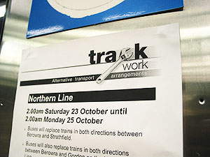

오늘은 track work 중-

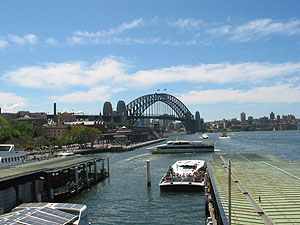

Circular Quay에 내려서-

  
별 것 아니라고 볼 수 있는데, 난 이런 게 참 좋다. 여기는 이런 작업을 그냥 낮에 한다. 대신 track work 때문에 운행하지 않는 구간은 버스로 대체하고, 사람들은 (속으로는 모르겠지만) 큰 불평 없이 그냥 버스로 갈아탄다. (그리고, 원래 표를 끊어야 하지만, 버스로 이동하는 구간은 표 검사를 하지 않는다. ^^) 뭐가 좋느냐 하면, '인간 중심'이라는 것이다 - 여기서는 이런 거 종종 발견한다. 사람이 중요하다는 것.  
  
우리나라는 지하철 운행 시간 다 끝나고 난 후 밤새도록 어두운 곳에서 위험하게 후다닥 일을 처리하는데, 일하는 사람들은 그런 열악한 환경에 대해 불만이 있어도 해야 한다. 그리고, 지하철을 이용하는 사람들 역시 만약 낮에 정비 및 공사를 하느라 시간이 조금만 늦어지기만 해도 짜증내고 화를 낸다. 무엇이 이렇게 만든 것일까. 분명 단순한 이유는 아니리라.  
  
날씨가 좋아서 Circular Quay에 내려서 좀 둘러보다가 바로 MCA (Museum of Contemporary Art)에 갔다. 뭔가 새로운 게 또 나왔나 하고 별 생각없이 갔는데, 아주 좋았다. William Kentridge라는 작가가 있는데, 그 사람 특별전이 하고 있었던 것. 간단하게 받은 느낌으로는, 그는 시간과 자연, 생명 등에 대한 이야기를 하는 사람.  
  
보고 나와서 Rocks에 토요일날 장이 열리는 걸 기억하고 그리로 갔다. 그런데, 둘 다 아침을 부실하게 먹고 나와서 배가 너무나 고팠기 때문에 무언가를 먹어야만 했다. -\_-; 미애씨가 자랑(^^)했던 팬케익집이 생각나서 유리씨에게 물어봤더니 자기가 아는 곳이 있단다 (나중에 알고 봤더니 같은 집). 그리로 갔다.  
  

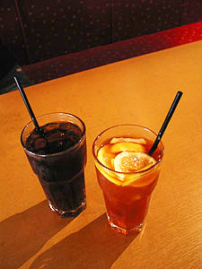

아이스 티를 시키고-

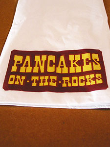

아, 음식점은 Pancakes on the Rocks

  

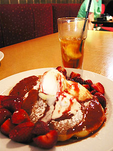

내가 시킨 것 - 스트로베리 팬케익

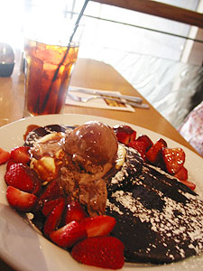

유리씨 - 초콜렛 어쩌구 팬케익 -\_-

  
먹고 나서 장 구경을 했다 - The Rocks Market. 재밌는 것도 있고, 우리나라랑 비슷한 것들도 있고. 장사하는 건 사실 어디가나 비슷하지 않을까 싶다.  
  

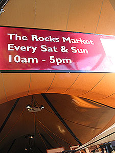

이 날 열어요.

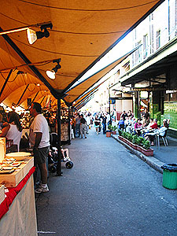

이런 식으로 천막들이 있다.

  
 <b>[The Rocks Market 사진들 (보려면 클릭)]</b>

[The Rocks Market 사진들 (보려면 클릭)]" tt\_lesstext=" **[닫기]** " tt\_id="1">   

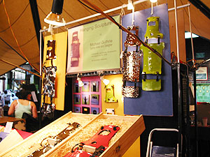

장식용 갑옷도 팔고

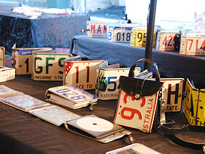

번호판으로 만든 씨디케이스, 지갑 등

  

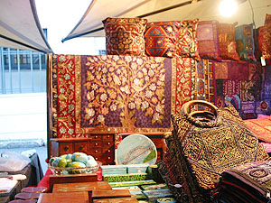

이런 것들도 팔고

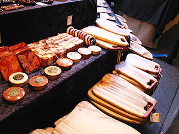

도마 예쁘네-

  

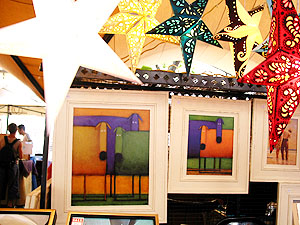

그림 재밌다

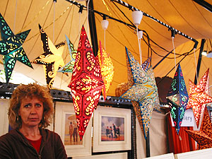

같은 곳에서 팔던 등. 오오-

  

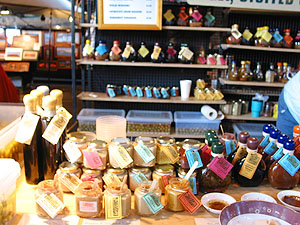

각종 소스들

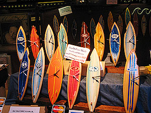

서핑보드 모형들

  

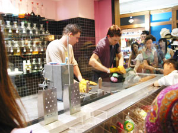

사탕 만드는 사람들

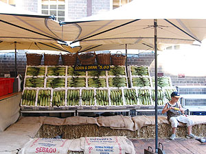

옥수수를 삶아서 판다. 재밌다.

  
열심히 구경하고 오늘의 목적- 영화를 보러 갔다. 뭘 볼까 고민하다가 Shaun of the Dead를 보기로 결정. 물론 마케팅의 일환이겠지만 Peter Jackson씨도 재밌다고 하길래. 시간이 남아서 커피 한잔 마시고.  
  
[20041024-19.jpg](./20041024-19.jpg)  
뭐 원한 대로 beach에 가지는 못했지만 그래도 재밌게 보냈다. 월요일날 학교가면 Tim 해드락 좀 해줘야겠다. -o-  
  
[20041024-20.jpg](./20041024-20.jpg)
