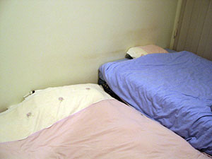
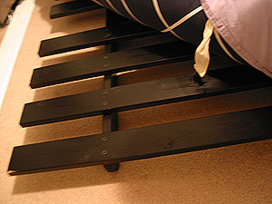

진영씨가 아는 사람에게 부탁해서 쇼파와 후통 침대를 가져 왔다. 사실 이제까지 - 진영씨가 조금 예민하기도 하고 (난 코를 골고-\_-), 남자 둘이 더블 침대에서 자는 것도 좀 불편하기도 하고 해서 둘 중 한명은 거실에 요 깔고 잤었다.  

<!-- truncate -->

거실에 항상 이불이 깔려 있으니 좀 좁아보이기도 하고, 미관상으로도 별로 안좋고 했는데, 새로 가져 온 침대를 방안으로 들이고 거실의 이불들을 치웠다.  
  
난 후통 침대라는 걸 처음 들어봤는데, (찾아보니 futon, futons 라고 한다고. 굳이 이야기하자면 일본식 침대?) 여러가지 형태가 있나보다. 쇼파처럼 생긴 것도 있고, 발이 매우 짧은 침대같은 것도 있고... 진영씨가 가져온 건 발이 없는 앉은뱅이 의자 같은 형태. 주물딱 주물딱 접으면 쇼파처럼 되기도 한다. 수창씨가 보더니, '이거 풀에서 선탠용으로 쓰면 딱이네-'라고 한다. 매트리스를 빼고 보니 정말 그렇다.  
  

침대로 방이 꽉-찼다.

이런 나무가 침대의 뼈대

  
피터씨와 피터씨와 함께 사는 후배분이 운반을 도와줬는데, 그렇다면 오늘도 당연히(^^) 메뉴는 월남쌈이다;;; - 유리씨도 함께.  
  
늦은 점심을 그렇게 먹고 나서 농구공과 줄넘기 줄을 들고 수창씨 학교 운동장으로 갔다. 아- 줄넘기를 30개 했더니 숨이 턱까지 찬다. 내기 끝에 저녁은 진영씨가 만들기로 당첨.
