어제 유리씨가 [Japan Foundation](http://www.jpf.org.au/)에서 Production I.G.의 작품들을 전시하는데 거기 가자고 했다. 장소는 Chifley Plaza.   

<!-- truncate -->

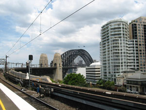

기차길

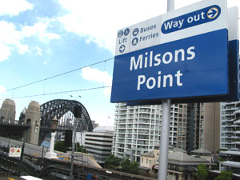

여기는 Milsons Point

  
그러나, 기차를 잘못 타서 시드니 위쪽(북쪽)으로 올라가는 게 아닌가. Milsons Point에서 내려서 다시 돌아갔다. -\_-;  
  

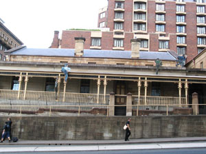

Justice & Police Museum

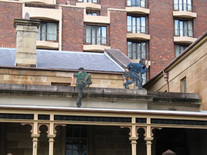

가까이서 보면;

  

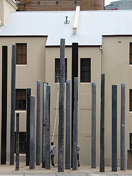

오- 저 긴 창문닦이라니.

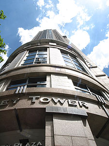

Chifley Plaza

  
Circular Quay에서 내려서 걸어갔다. 그러고 보니 Philip St.는 처음 걸어보았네; Police & Museum을 지나서 조금 걸어가니 Chifley Plaza에 도착.  
  

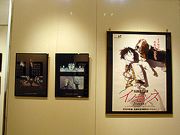

이노센스 포스터와 스틸컷

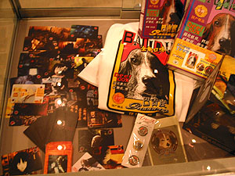

오시이 마모루의 강아지 사랑

  
그런데, 생각했던 것보다 그리 크지도 않고, 전시되어 있는 것들도 많지 않았다. 단, 오시이 마모루가 며칠전에 직접 와서 관객들을 만났다고 하네. 오오-.그러나, 어차피 그건 이 곳 회원들에게만 공개된 행사였다고 한다.  
  

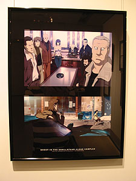

SAC 스틸컷

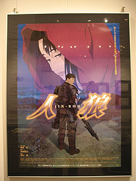

인랑 포스터

  
저녁엔 Rocks에 갔다. 이번달은 금요일 저녁에 The Rocks Market by Moonlight 라고 콘서트를 한다. 야외 콘서트이고 당연히(?) 무료. 아무래도 Rocks의 야외 마켓 행사를 보다 활발하게 하려는 - 관광상품으로 육성하려는 목적이 아닐까 싶다. (현재는 토,일에만 마켓이 열린다.)   
  
[20041119-11.jpg](./20041119-11.jpg)  
한참 공연을 보고 있는데 비가 온다 -\_-. 이런이런; 잠깐 비를 피할까 싶었는데, 얼마 내리지 않아서 그냥 계속 봤다. Mark Seymour가 공연하는 것도 찍고 싶었는데 비가 와서 카메라를 끝내지 못했다.   
  

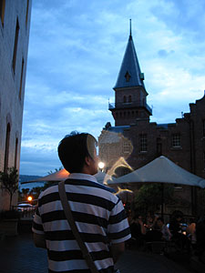

유리씨가 찍어준 뒷모습

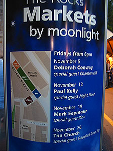

오늘의 밴드 Mark Seymour

  
Zinc라는 밴드의 노래는 처음 들어봤는데 (언젠가 언뜻 들어봤을지도) 세명의 하모니가 꽤 괜찮았다. 리드보컬쯤 되어 보이는 사람은 전형적인 팝 팔라드 가수같은 목소리였고, 나머지 둘은 기타와 피아노를 모두 연주한다. 오오- (게다가 기타 솔로도 번갈아 가며 둘 다 하고.)  
  

앉아서 잠깐 쉬고,

어두워진 하늘

  
[Mark Seymour](http://www.markseymour.com.au/)의 공연은 뭐랄까 나이 든 가수의 노련한(^^) 솜씨가 엿보인다고나 할까. 포크와 컨트리, 락앤롤이 곡마다 잘 어울렸다. 옛날 락앤롤 밴드들의 영향이 느껴지는 곡들도 종종 있고. 함 찾아서 들어봐야지.  
  
더 구경하고 싶었는데 빗줄기가 굵어져서 어쩔 수 없이 그들의 노래 소리를 뒤로 하고 집으로 향했다. 오랜만에 하루 종일 빨빨거리며 잘 돌아다닌 하루.
