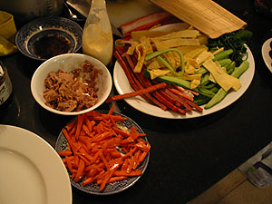
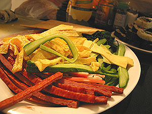
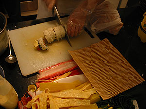
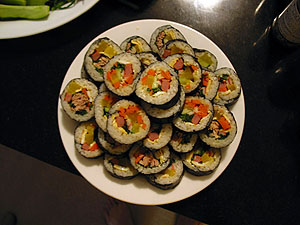
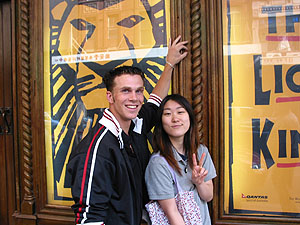
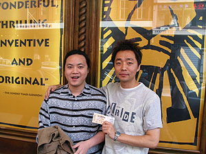
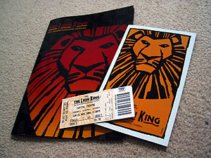
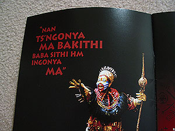
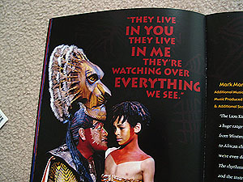
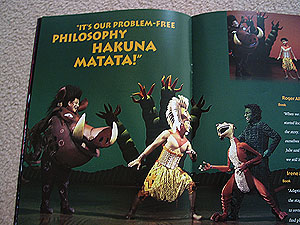

**1** 어제 미애씨가 김밥 재료를 샀는데, 바로 오늘 해먹자고 한다. 뚝딱뚝딱 재료를 준비하더니 어느새 김밥을 말고 있다.   

<!-- truncate -->

재료들

오오-

  

김밥을 말면

김밥이 된다.

  
아아. 나는 안다. 미애씨와 함께 사는 사람들은 누구라도 행복할 것이다. :)  
  
**2** 그동안 티를 안냈지만, 사실 이번주에 [뮤지컬 Lion King](http://www.disney.com.au/lionking/index.shtml)을 예매했다. 당장 돈 걱정 하며 살아야할 놈이 그런 걱정 안하고 비싼 돈 주고 뮤지컬을 보고 싶어한다는 게 창피해서 이야기를 하지 않았다.  
  
그래도, 오리지날 캐스팅은 아니더라도 예전부터 보고 싶어했던 뮤지컬이 바로 눈 앞에서 하는데 (하는 곳 Capitol Theater가 학교에서 매우 가깝다.) 그냥 지나칠 수 없어서 눈 꾹- 감고 예매했다.  
  
오늘 함께 보는 사람은 Michael, 유리씨, Tim, 진영씨. 어; 사진 찍다보니 내 사진은 안 찍었네;;; (다음에 앞에 가서 찍지 뭐. -\_-)  
  

Michael과 유리씨

Tim과 진영씨

  
사실 극장 내부도 찍고 싶었는데, 안에서 철저히 통제했기 때문에 찍지 못했다. 그리고, 사실 여기와서 내 스스로 달라진 거라면 찍지 말라고 할 때 기를 쓰고 찍는 일이 없다는 것이다.  
  
공연은? 3시간짜리, 중간에 인터미션 1번. 내용은 94년 디즈니의 애니메이션 Lion King과 같다. 음악도 거의 같고, 몇 곡 더 추가되었고, 편곡들이 달라졌고.  
  
그래서? 말로 해서 무엇하리오. 무대도, 의상도, 노래도 모두 좋았다. (다만 오케스트라 음향이 생각보다는 살짝 작게 느껴질 때가 있어서 조금 아쉬웠긴 했다.) 약간 뒷쪽에서 봤는데, 무대가 한 눈에 들어오는 좋은 곳이었다. 한번 더 보고 싶었다. 그 때는 앞 쪽에서 세부적인 것들에 신경쓰며 보면 좋을 듯.  
  
  

티켓과 브로셔

가장 파워풀했던 보컬리스트

  

무파사와 심바

품바, 심바, 티몬

  
**3** 끝나고 '밀리오레'라는 한국 식당에서 밥을 먹었다. Michael은 한번도 동양 음식을 먹어본 적이 없다고 한다. 젓가락은 물론 숫가락에도 능숙하지 못하다. Tim은 그럭저럭 잘 먹고. 하긴, 우리는 서양음식을 당연히(?) 음식문화의 일부로 생각할 정도로 익숙하지만, 서양애들은 그렇지 않은 애들이 훨씬 더 많지. 그걸 생각해 보면 정말 익숙하지 않을텐데 잘 먹네. :)
