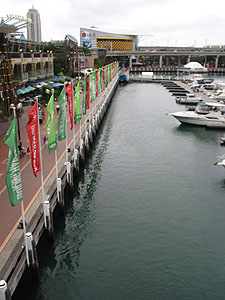
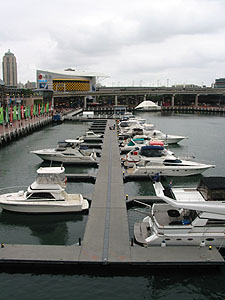

날씨도 꿀꿀하고 마땅히 할만 한 것도 없었지만, 그래도 간단하게라도 크리스마스를 즐겨보고자 시내에 나왔다. 겸사겸사 이것저것 구경할 거리라도 있으면 할까 싶었는데, 이런; 왠만한 가게들은 모두 문을 닫은 것이 아닌가. -o-  

<!-- truncate -->

수창씨와 미애씨 말로도 원래 크리스마스에는 문을 다 닫는다고는 했지만 예상보다 심했다. 2가지 인상적이었던 건- 첫째, 거의 모든 술집은 문을 닫았다는 점과 둘째, 문을 연 가게들 중 아시아계 가게들이 많았다는 점.  
  
그렇다. 크리스마스는 가족과 함께 하는 날이기 때문에 가게 문을 열어도 장사가 되지 않으니 열지 않을 뿐더러, 장사를 하는 사람들도 가족과 함께 보내기 위해 문을 닫는다. 연말이 되면 부어라 마셔라 밤새도록 거리가 번쩍거리는 우리나라와는 정말 대조적인 모습이 아닐 수 없다.  
  
[20041225-1.jpg](./20041225-1.jpg)  
사실 $5 스테이크집에 가서 저렴하게 저녁을 먹으려 했지만, 그곳도 문을 닫아서 잠시 고민하다가 Darling Harbour에 갔다. 아무래도 Darling Harbour와 Harbour Bridge 쪽은 관광객들이 찾아오는 곳이니 여는 곳이 많겠지.  
  

Darling Harbour

오오- 배들.

  
한참 마땅한 집을 둘러보다가 카페테리아 중 한군데를 골라서 들어갔다.   
  
[20041225-4.jpg](./20041225-4.jpg)  
다들 하나씩 골라서 시켰다. 나는 무슨 해물 어쩌구와 맥주 한잔. (메뉴명이 뭐였더라? Seafood Marinara Boat 였던가?)  
  
[20041225-5.jpg](./20041225-5.jpg)  
$5 스테이크집에 가서 먹으면 1인당 $10 정도 나온다고 하던데, 여기서는 그것의 몇배가 나왔다. 크리스마스라 좀 무리했다. 그래도 음식은 참 맛있었다.  
  
진영씨도 함께 했으면 좋았을텐데, 다른 사람들이랑 시간을 보낸다고 해서 수창씨, 미애씨하고만 지냈다. 크리스마스는 이렇게 지나간다.  
  
[20041225-6.jpg](./20041225-6.jpg)
