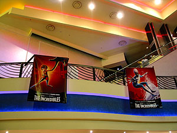
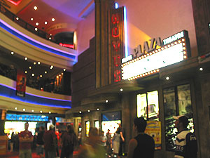
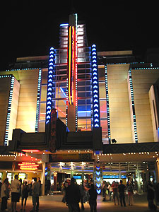
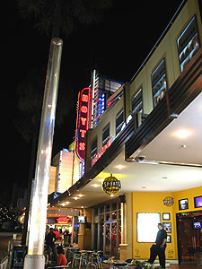

크리스마스 다음날, 즉 12월 26일은 박싱 데이 (Boxing Day)다. 권투와는 전혀 관계가 없고, 선물을 포장해서 서로 전달하는 그런 의미의 박싱 데이다.  

<!-- truncate -->

그래서, 이 날부터 월초까지 해서 곳곳에서 세일을 한다. 반값까지 세일을 하기도 하고, 70~80% 까지 세일을 하는 곳도 있다. 세일의 폭이 장난 아니다. 어설프게 1년 12달 세일을 하는 우리나라와는 사뭇 다른 분위기. (물론 여기도 평상시에도 세일을 한다고 써 있곤 하는데, 왠만한 브랜드들은 세일을 하지 않는 편이다.)  
  
사실 오래전부터 오늘을 기다렸는데, 그건 세일 때문이 아니라 바로 ['The Incredibles'](http://www.imdb.com/title/tt0317705/) 때문이었다. [지난 번에 못 봤을 때](http://www.summerz.pe.kr/blog/index.php?pl=291)부터 지금까지 거의 2달을 기다렸다.  
  

얼마를 기다렸던고.

극장 내부

  
보통은 시내의 George St.의 Hoyts에서 보는데, 오늘은 크리스마스 시즌이기도 해서 Moore Park에 있는 [Fox Studios](http://www.foxstudios.com.au/)로 갔다. 와- 좋다. 생각보다 참 좋네.  
  

Fox Studios에 있는 Hoyts에는 3가지 종류의 상영관이 있다. 일반적인 상영관, La Premiere, Cinema Paris.  
  
[La Premiere](http://hoyts.ninemsn.com.au/cinema/lapremiere.asp)는 일반적인 상영관에 각종 편의시설을 더 추가한 관인데, 한마디로 럭셔리한 상영관. 홈페이지에서 편의시설이나 의자 등에 대해서 보니 장난 아니다. 1인당 $30 정도 하는 듯. -o-  
  
[Cinema Paris](http://hoyts.ninemsn.com.au/cinema/cinemaparis.asp)는 한마디로 예술영화 상영관. 예술영화 상영관 이름에 Paris라는 단어가 들어가는 걸 보니 왠지 재밌다. 역시 세계 어느 곳에서도 예술 하면 '빠리~'를 떠올리나 싶어서.  
  
일반적인 상영관과 La Premiere에는 모두 Cinemaxx라는 시설을 구비했다고 써 있는데, 우리나라 멀티플랙스들처럼 음향은 Dolby Digital와 DTS를 지원하고, 의자는 크고, 스크린도 큰 상영관이라는 뜻.

  

극장 밖

극장 밖 #2

  
Fox Studios 안에 들어가도 일반 시내의 거리처럼 길을 만들어놓고 그 길을 걸어서 (상점들을 지나쳐) 극장에 들어가게 되어 있는데, 그게 참 괜찮았다.
