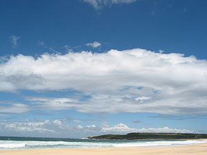
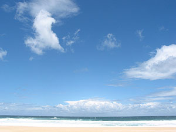
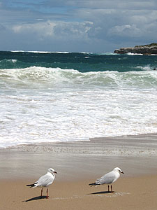
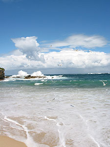
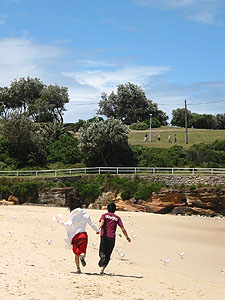
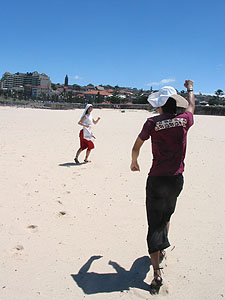

뭐랄까, 방학은 급물살을 타고 있다. 짧은 만큼 효율적으로? ;;;  

<!-- truncate -->

오늘은 수창씨, 미애씨와 함께 비치 순례에 나섰다. 사실 그러려고 그런 건 아니고 Cronulla Beach에 가서 좀 놀려고 했는데 바람이 너무 불어서 좀 걷기만 하다가, 위쪽으로 올라가기로 한 것.  
  

구름과

바다

  
다음번에 간 곳은 Coogee Beach. 원래 여기가 그런건지 올라오는 사이에 날씨가 좀 개인 건지 좀 더 따뜻하다. 물론 바람은 여전히 세차게 불었지만. 미애씨는 날아간다고 엄살도 좀 부리고.  
  
해변도 거닐고 사진도 찍고, 잠깐 산책도 하다가 Bronte Beach로 옮겼다.  
  

갈매기와

바다

  

아, 좋을 때다.

아무도 그들을 말릴 수 없다. :p

  
우리가 처음에 Cronulla Beach로 간 이유, 그리고 Bronte Beach로 옮긴 이유. 고기와 소세지를 싸갔기 때문 - 이 곳들에는 고기를 구워먹을 수 있는 불판(?)이 있다.  
  
가스불로 불판을 달구고, 동전을 넣으면 불이 켜진다. (장작을 사다가 불을 피우는 곳이 있다는 건 이야기로만 들었다.) 온도 조절 같은 거 없다. 그냥 냅다 구워진다. 20센트 동전 하나에 불이 나오는 시간은 10-15분 정도. 다른 사람들은 동행들도 많고 먹을 것도 엄청나게(!) 싸들고 와서 구워댔지만 우리는 소박하게 양껏 가져와서 먹었다.  
  
[20041229-7.jpg](./20041229-7.jpg)  
물론 다 먹고 난 후 다른 사람들도 잘 이용할 수 있도록 깨끗이 닦아 놓는 건 기본. 대체로 먹고 나서 깨끗이 닦지만 가끔씩 좀 소흘이(대충) 닦아놓고 가는 사람들도 있는 듯. (사실 아무리 깨끗이 닦아도 언뜻 보면 어; 여기다 구워 먹기에 좀 그렇다; 싶은 느낌이 들 수도 있지만, 일단 고기가 구워지기 시작하면 그런 마음은 사라진다.-\_-)
