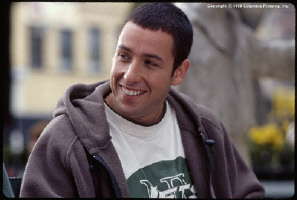
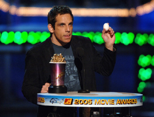

**1** **데니스 듀건**  

<!-- truncate -->

잡담 몇 개를 얽어주는 인물은 바로 이 사람, 배우 겸 감독 [데니스 듀건 (Dennis Dugan)](http://www.imdb.com/name/nm0240797/).  
  
[dennis\_dugan.jpg](./dennis_dugan.jpg)1946년, Illinois Wheaton 출생  
**2** **블루문특급 (Moonlighting)**  
  
얼마전 집에서 개인정비(!) 중일 때 우연히 블루문특급 (원제 Moonlighting)을 보게 되었다. 알고 보니 [CNTV](http://www.cntv.co.kr)에서 방송하고 있었던 것. 오랜만에 보니 요즘 드라마들에 비해서는 좀 어설프기도 하고 허전하기도 했지만 데이빗과 매디가 티격태격 싸우는 모습은 여전히 정겨웠다.  
  
[moonlighting.jpg](./moonlighting.jpg)  
블루문특급은 ABC에서 1985~89년에 방송된 드라마.  
  
예전에 KBS에서 이 드라마를 해주는 밤이면 졸음을 참아가며 본 기억이 난다. 그 당시 이 드라마의 유머 체계를 모두 이해하지 못하면서도 왠지 모르는 매력에 끌렸다고나 할까?  
  
데니스 듀건은 시빌 셰퍼드 (Cybill Shepherd)가 맡은 메디의 남편 역으로 출연하다가 마지막 시즌인 1988~89년에 몇편의 에피소드를 감독했다.  
  
한가지 재밌는 건 데니스 듀건도 브루스 윌리스 (Bruce Willis)가 맡았던 데이빗 역에 오디션을 봤다는 것. 그러고 보면 이 이야기를 무척 좋아했었나 보다.  
  
블루문특급은 ABC에서 1985-1989년에 방영된 TV 시리즈.  
팬사이트 : http://www.davidandmaddie.com  
CNTV의 블루문특급 : http://www.cntv.co.kr/tv/tv\_intro.asp?cid=605  
주제곡 Al Jarreau의 Moonlighting 듣기 : http://blog.naver.com/jason43/80007883119  
  
**3** **앨리의 사랑만들기 (Ally McBeal)**  
  
90년대 중반 이후 난 미국 드라마에 도통 취미를 붙이지 못했었는데, 국민드라마급(!)인 프렌즈도 난 심드렁했다. 지금도 제대로 본 에피소드가 양손으로 꼽을 수 있을 정도이고, 아직까지 주인공 이름도 모르니...  
  
그러던 나에게 필이 꼽힌 드라마가 있었으니 그건 바로 앨리의 사랑만들기 (원제 Ally McBeal). 이상하게 이 드라마는 처음 볼 때부터 재밌음을 느끼며 보게 되었는데, 곰곰히 생각해보니 내 취향에 어울리는 요소들을 가지고 있었는데 뭐 이런 점들이다.  
  
[ally\_mcbeal.jpg](./ally_mcbeal.jpg)  

1. 황당한 인물과 사건들, 엉뚱한 유머 감각  
2. 항상 밝지만은 않은 분위기  
3. 음악이 극에 적극적으로 개입  
4. 법정 드라마

  
앨리의 사랑만들기는 Fox에서 1997-2002년 동안 총 5시즌에 걸쳐 방영된 TV 시리즈이며, 데니스 듀건은 시즌 1 (1997~98년)의 에피소드 12~22를 감독했다.  
  
요즘은 [온 스타일](http://www.onstyletv.co.kr)에서 시즌 2를 하고 있다.  
  
**4** **아담 샌들러 (Adam Sandler)**  
  
예전엔 기억 속에서 늘 헷갈렸던 두 배우 - 아담 샌들러 (Adam Sandler)와 벤 스틸러 (Ben Stiller). 둘 다 슬랩스틱류의 코미디를 구사해서 헷갈려 했었나? 어쨌든, 나름대로 구분해서 기억하기 시작할 무렵부터, 두 배우를 굳이 비교하자면 벤 스틸러보다는 아담 샌들러에게 한 표를 던졌다.  
  

Adam Sandler

Ben Stiller

  
벤 스틸러가 자신을 혹사시키고 어려워진 상황을 구성한 후 그 속에 자신을 투신하여 처절하게 (육체적으로도) 만들면서 웃긴다면 아담 샌들러는 그보다는 조금 가볍고 따뜻하게 웃긴다고나 할까?  
  
아담 샌들러의 영화배우로서의 성공이 시작된 1996년작 해피 길모어 (Happy Gilmore)의 감독이 바로 데니스 듀건. 그 이후로도 빅 대디 (Big Daddy)에서 한번 더 아담 샌들러와 조우.  
  
**그리고**  
  
어떤 인터뷰에서 데니스 듀건은 TV 작업보다 영화 작업을 좋아한다고 했었는데, 그 이유는 TV 드라마는 프로듀서의 작품이기 때문이라고 했다. 하긴 미국 드라마는 편마다 감독은 바뀌어도 프로듀서가 세팅한 처음의 톤이 크게 달라지지 않으니 그렇게 생각하는 게 당연하리라 본다.
