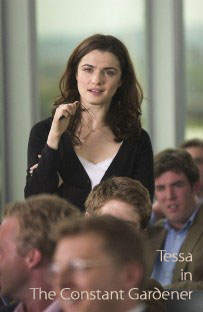
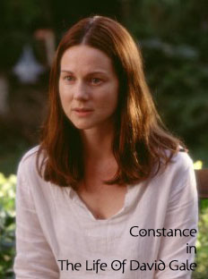

[constant\_gardener.jpg](./constant_gardener.jpg)aka 콘스탄트 가드너  

<!-- truncate -->

영화 [<시티 오브 갓>\*1](#513-1)을 만든 감독 페르난도 메이렐레스 (Fernando Meirelles)가 감독을 했다. 영화는 2000년도에 발표된 존 르 카레 (John Le Carre)의 동명 소설을 원작으로 했다고 한다. (읽어보진 못했지만)  
  
언제 어떤 맥락으로 말했는지 전혀 모르지만 이 감독이 이런 이야기를 했다고 한다 (아래 씨네21 기사 참조).  
  
**"문제를 아는 것과 그에 대한 감정이입이 해결의 첫걸음"**  
세상엔 수많은 사람들이 있고, 수많은 문제들이 있고, 그것들은 점차 엉키고 설켜서 이상한 또아리를 이루고 있는 듯한 느낌이다. 아니, <매트릭스>의 그것처럼 우리는 현대 사회의 문제란 풀기 어렵고 복잡한 것이라는 고정관념을 가지고 있는지도 모른다. 누가 알겠어. 세상은 이미 모든 사람의 꿈 속에 하나씩 존재하는지도 모르는걸.  
  
그래서 인지 가끔 당연한 일을 하는 사람들이 되려 이상하게 보이고, 자신의 인생을 돌보지 않고 엉뚱한 곳에 정열을 소비하는 사람들처럼 보이기도 하고, '강 건너 불구경'을 즐기며 히죽거리며 한마디 하는 농담에 이야깃감이 되기도 하나보다. 직접 보기 전엔 알 수 없는 법이니까.  
  
영화 속 테사 ([레이첼 바이스\*2](#513-2) 분)는 마치 빨간약을 선택한 <매트릭스>의 네오처럼 문제를 풀어내기 위해 시종일관 돌진하고 스스로 산화하길 두려워하지 않는다. 남은 건 그의 남편 저스틴 ([레이프 파인즈\*3](#513-3) 분). 저스틴은 아내의 뒤를 따라 그녀가 남겨놓은 숙제를, 아내가 밝혀놓은 길을 조용히 따라갈 뿐이다.  
  
테사는 여러 모로 [<데이비드 게일](http://movie.naver.com/movie/bi/mi/basic.nhn?code=36763) ([The Life of David Gale](http://imdb.com/title/tt0289992/))>의 콘스탄스 (로라 린니 분)를 떠올리게 한다. 불가능할 것만 같은 일에 자신의 목숨을 걸고 신념을 위해 돌진하는 여성 캐릭터라는 점에서 보면 자연스러운 게 아닌가 싶다. (두 영화 모두 스릴러 장르이기도 하고)  
  

  
영화를 다 보고 현실에 돌아온 뒤 한참 후에 생각해보면 저스틴이 그렇게까지 아내가 끝내지 못한 일을 해야할 그 어떤 이유도 없었던 것 같았지만, 영화 속 저스틴은 온 힘을 다해 그 일을 하나씩 해 나간다. 그 과정을 별 무리 없이 아니 가슴 조이며 본 것은 차곡차곡 그 감정들과 사건들을 쌓아올린 연출과 연기의 힘이겠지.  
  
  
  
... 내가 내 인생에서 최선을 다하지 못하고 있다는 생각이 든다는 건 내가 내 스스로 내 인생에 빠져있지 못하기 때문인 건가...  
  
  
  
**\*1** 예전 씨네 21에 기사가 실렸었다.  
- <시티 오브 갓> 탄생비화 [[1]](http://www.cine21.com/Magazine/mag_pub_view.php?mm=005001001&mag_id=34686), [[2]](http://www.cine21.com/Index/magazine.php?mm=005001001&mag_id=34687) (글 오정연)  
- [간교한 유혹의 기술, <시티 오브 갓>](http://www.cine21.com/Magazine/mag_pub_view.php?mm=005004004&mag_id=35014) (글 허문영)  
  
**\*2** 레이첼 바이스 (Rachel Weisz)는 이 영화로 [63회 골든 글러브 여우조연상 (best supporting actress)을 받았다](http://www.hfpa.org/videogallery/video/49346/index.html).  
  
**\*3** 레이프 파인즈 (Ralph Fiennes)의 역할은 알게 모르게 잉글리쉬 페이션트 (English Patient)에서 그가 연기했던 역할과 알게 모르게 닮아있다.  
  

**참고**  
  
Rachel Weisz의 바른 발음은 **레이첼 바이스**라고 한다.  
Ralph Fiennes의 발음 역시 **레이프 파인즈**라고.  
  
우리나라에서 오랫동안 레이첼 와이즈, 랄프 파인즈라고 불렸지만.

  
 /  / 
