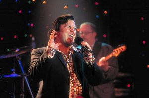
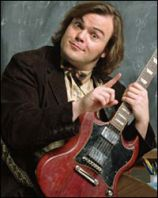
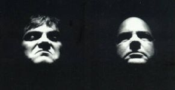
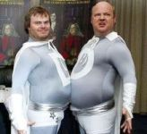

아래 잭 블랙의 신작 <Nacho Libre> 이야기를 하다가 문득 생각이 나서 올립니다. 뭐, 잭 블랙이 음악적으로도 소질이 있다는 건 아는 사람은 모두 아는 얘기죠.  

<!-- truncate -->

<사랑도 리콜이 되나요 (High Fidelity)>의 마지막 씬에서 마빈 게이 (Marvin Gaye)의 노래를 열창한다거나 <스쿨 오브 락>의 가짜 (그러나 마음만은 진짜) 음악선생 역할을 훌륭하게 소화해냈으니까요.  
  
  
  
  

High Fidelity

School Of Rock

  
  
**Jack Black + Kyle Gass = Tenacious D**  
  
[tenacious\_d\_greatest\_band\_on\_earth.gif](./tenacious_d_greatest_band_on_earth.gif)  
이번에 영화 <킹콩>으로 당당히 흥행배우로 자리를 굳힌 [**잭 블랙 (Jack Black)**](http://us.imdb.com/name/nm0085312/)은 [**카일 개스 (Kyle Gass)**](http://us.imdb.com/name/nm0309307/)와 2인조로 이루어진 [**테네이셔스 디 (Tenacious D)**](http://tenaciousd.com/)라는 밴드의 멤버이기도 합니다.  
  

이건 퀸 스타일로-

카일 너무 귀여워요.

  
참고로 D는 Defense의 D라고 하는군요. 점점 투어도 하고 그러면서 D에 다른 의미들이 붙는다고는 하지만 공식 홈페이지의 [**FAQ에 의하면**](http://forums1.epicrecords.com/webx?50@6.eB6haCPhgqy.0@.ef34190) 원래 뜻은 tenacious defense의 디펜스라고 하네요. 해석하자면 **'악착같은 수비'** 정도가 될까요?  
  
위에서 말한 것처럼 갑자기 그가 부른 노래 몇 곡이 떠올랐어요. 요즘 뜨고 있는 동영상 사이트 [**YouTube**](http://www.youtube.com)에 가면 왠만큼 있을 것 같아서 찾아봤더니 역시 있군요. 자, 그럼 시작합니다. 잭 블랙과 테네이셔스 디 !!!  
  

**King Kong Jam** (Saturday Night Live)  
  
  
그래도 우선 잭 블랙의 노래부터 한곡.  
  
노래 정말 잘하는군요. (가수에게 노래 잘한다는 칭찬이 좀 이상한가요?) 곡도 좋고요. 이쯤되면 "가사는 좀 웃기지만" 이라는 표현보다는 "가사도 재치있고" 라는 표현이 더 어울리겠어요. 무대 매너는 말할 필요도 없고요.  
  
다른 연예인들도 이런 식으로 자신이 출연한 영화라던가 음반 홍보를 하는 거라면 TV를 보더라도 별로 짜증나지는 않을 것 같아요. 아니, 한층 즐거워질 걸요? :)  
  
 Jack Black - King Kong Jam 스크립트 보기 

(적당히 의역했어요. 앞에 잘린 것까지 적어놓죠 뭐.)  
  
(voice over) Ladies and gentlemen - Jack Black!  
(목소리) 신사숙녀 여러분- 잭 블랙입니다!  
  
Thank you! Thank you very much! You guys, oh my God. Well, listen -  
감사합니다, 감사합니다. 여러분. 오마이갓. 저... 들어보세요.  
I don't know if you know, I'm in a little movie called "King Kong."  
여러분도 아실지 모르겠지만 제가 이번에 "킹콩"이라는 작은 영화에 나오거든요.  
  
[ audience cheers ]  
  
You know, it was a loy of fun making it,  
알다시피 영화 찍는 건 너무 재밌는 일이예요,  
but here's the thing. I had an idea for a song,  
그런데 여기 말할 게 하나 있는데요. 제가 노래에 대한 아이디어가 있었어요.  
and I figured, you know, Will Smith wrote a song for his movie - "Hitch" -  
생각해봤죠, 윌 스미스도 자신의 영화 "히치"에 곡을 쓰고  
and Eminem did a song for "8 Mile",  
에미넴도 8마일에 곡을 썼잖아요.  
so why shouldn't I give it a shot? So I recorded the "King Kong Jam",  
"그럼 내가 또 못할 게 뭐가 있는가?" 그래서 "킹콩잼"이라는 곡을 녹음했어요.  
and I gave it to Peter Jackson and I said, you know,  
그리고 이걸 피터 잭슨에게 갖다주고 이렇게 말했죠.  
"It's nothing. Just listen to it, I wrote it on a lark,  
"아무것도 아니지만 한번 들어봐요, 제가 재미로 해본 거예요.  
you might get a laugh out of it."  
들으면 아마 저절로 웃음이 나올 거예요."  
But, secretly.. I was hoping, you know, he would say,  
그렇지만, 사실 저는 그가 이렇게 말해주길 기대했었죠.  
"Wait a minute. This is really good. I'm gonna put this in the movie."   
"잠깐만, 이거 굉장한데요? 이 곡, 영화에 넣고 싶어요."  
  
So, you know, I gave it to him, and I heard nothing from him.  
그래서, 내가 이 노래를 그한테 준거거든요. 그런데 그후로 그로부터 들은 게 없어요.  
They didn't put it in the movie. But, you know what? I heard the song, and  
그들은 이걸 영화에 넣고 싶지 않아 했어요, 그런데 알아요? 제가 이 노래 들어봤는데,  
I think it's pretty damn good. Uh.. let's do this thing!  
이 노래가 X나 좋은 것 같아요, 음... 한번 불러보죠.  
  
KOOOOOOOOOOOOOONG-ah!!!!!   
콩~~~~  
  
There's a little place I know where a bunch of funky people live.   
내가 알고 있는 작은 장소가 있는데, 거기엔 무시무시한 사람들이 살지.  
They were looking for a sacrifice, one that they had to give.   
그들은 꼭 바쳐야만 하는 재물을 찾고 있었어.  
  
To King Kong.   
킹콩에게 말야.  
Where did he go wrong?   
걔는 어디로 가서 잘못 된거야?  
King Kong.   
킹콩  
That's why I wrote this song   
그게 내가 이 곡을 쓴 이유지.  
King Kong.   
킹콩  
They took him to a world where he don't belong.   
그들은 킹콩이 속하지 않는 세상으로 킹콩을 끌어냈어.  
  
Had to find a lady to give to Kong   
킹콩에게 줄 여자를 찾아야만 했어  
To keep that chunky monkey tame.   
그 땅딸보 원숭이 (킹콩-\_-)를 길들이기 위해서 말야.  
He fell in love with Naomi Watts' character,  
킹콩은 나오미 와츠가 연기한 캐릭터와 사랑에 빠졌지,  
I forget her name.  
그녀 이름은 까먹었어.  
Okay, I have to admit I didn't read the script.  
좋아, 나 사실 대본을 읽지 않았어.  
'Cause I find that it gets in the way of my acting pro-cess  
which I've carefully honed   
내가 이제까지 갈고 닦은 내 연기 방식은 그런 식이거든.  
And also I don't know how to read.   
난 대본 읽는 법도 모른다고.  
  
King Kong   
킹콩  
Pass the Grey Poupon   
그레이 푸퐁을 지나서  
King Kong   
킹콩  
Fighting the Viet Kong   
베트남 콩과 싸워  
King Kong   
킹콩  
Everybody bang a gong   
모두가 공을 울렸지  
King Kong  
킹콩  
'Cause he don't belong.  
킹콩은 여기에 속하지 않으니까  
  
[ the band slows down for a minute ]   
  
Alright, this is where the song gets really personal, so listen up.   
자, 여기서부터 진짜 개인적인 부분이니까 잘 들어요.  
  
[ the band pop right back into action again ]   
  
Jack Black: [ singing ]   
"I show up to the set at a quarter to noon   
내가 세트에 11시 45분에 나왔을 때  
And then I pretend to get a nasty cramp.   
심한 복통이 일어난 척 했어.  
So I can go back to my sweet-ass trailer   
그래서 난 내 편안한 개인 트레일러로 갈 수 있었지  
And take myself a tasty nap.   
그리고는 맛있는 낫잠을 잤어  
Then the director dude come and pound on my door   
그런데, 감독 녀석이 와서 문을 두들기는 거야  
And say, "Jack this has got to STOP!"   
"잭- 그만둬-"  
But then the next day I had my sweet revenge   
그러나 다음날 난 달콤한 복수를 했어  
By urinating in his coffee pot.   
감독의 커피 포트에 쉬를 했거든  
  
On the set of King Kong   
킹콩 세트에서  
Wears a massive thong   
큰 슬리퍼를 신은  
King Kong   
킹콩  
He got it going on   
가는 거야  
King Kong   
킹콩  
Jack Black wrote this song   
잭 블랙이 이 노래를 썼어  
  
So do yourself a favor   
그러니 여러분에게 부탁하는데  
Please clap along   
박수를 치라고  
Everybody now clap with me   
모두들 나와 함께 박수를  
But do not sing   
그러나, 노래는 하지마  
The singing's my job   
노래는 내 일이야  
You'll only mess up the song, trust me.   
너네가 부르면 틀림없이 망칠 거야.  
  
1, 2, 3 - King Kong!   
하나 둘 셋 킹콩  
Opening in Hong Kong   
홍콩에서 오프닝을 하는  
King Kong   
킹콩  
He listens to Cheech and Chong   
그는 Cheeh와 Chong을 들어 (이거 뭐죠? 치체, 총)  
King Kong   
킹콩  
This is his theme song   
이게 그의 테마야.  
He's a crazy old gorilla   
그는 미치고 늙은 고릴라  
And he guarantee a thrilla'   
그리고 그는 스릴을 주지  
And once you see the movie   
그리고 너네가 이 영화를 본다면  
You'll be feeling pretty groovy   
틀림없이 기분이 좋아질 거야  
And a rooby dooby da ba do ba ba bo oh   
루비 두비 다바두바바보오-  
KING KONG!  
킹콩!  
  
[ audience cheers ]   
  
That's the song.  
바로 이 노래입니다.  
They didn't want it in the movie, I don't know why.   
그들은 이 노래를 영화에 넣고 싶지 않아했어요. 전 이유를 모르겠지만.  
  
코러스에 좀 말도 안되는 번역이 있는데 그건 대체로 운율을 맞추기 위해 큰 의미없는 단어들을 넣은 거라 그런 거라고 변명을 해봅니다. (적절하게 뭐라고 번역을 해야할지도 애매하고요). 크게 틀린 부분이 있으면 알려주세요. 고칠게요. ^^

  

**Tenacious D - Tribute** (music video)  
  
  
[tenacious\_d.jpg](./tenacious_d.jpg)Tenacious D의 동명 앨범 Tenacious D에 수록된 곡입니다. 사실 All Music Guide에서 별점을 [무려 4.5개나 받은 앨범](http://www.allmusic.com/cg/amg.dll?p=amg&sql=10:fxdsyl13xpcb)입니다. (5개 만점) 물론 All Music Guide 별점이 절대적인 건 절대로 아니지만요.  
  
앨범의 다른 곡들과 마찬가지로 이 곡도 참 좋습니다. 가사 내용은 오래 전에 잭과 카일이 여행을 하다가 악마를 만났는데, 악마가 "세상에서 제일가는 노래를 들려주면 안잡아먹지-"라고 해서 둘은 세상에서 제일 위대한 노래를 악마에게 들려주게 되었다는 내용입니다.  
  
듣다보면 [가사](http://www.sing365.com/music/lyric.nsf/Tribute-lyrics-Tenacious-D/589CBC388EDA74EA48256B720008C6F1)가 좀 웃기다고 생각되기도 하는데, 다 듣고나면 마냥 웃기다가 끝나는 곡은 아니라는 생각이 듭니다.  
  
"이건 세상에서 제일 위대한 곡이야..." 로 시작하는 곡은 왠지 이들의 터무니 없는 패기와 배짱을 코믹하게만 이야기해주는 듯 하지만, "악마에게 들려줬던 그 위대한 곡은 사실 생각이 나지 않아, 이건 단지 그 때 그 곡의 트리뷰트일 뿐이야-" 라고 말합니다.  
  
이 가사에 좁은 노래방 기기에서 자신들의 노래를 부르는 뮤직 비디오까지 더해지고 나면 이들의 장난기 가득한 모습으로 보였던 이들의 모습이 사실 락에 대한 열정을 표현하고 있었음을 알게 되지요.  
  
역사에 길이 남은 훌륭한 락들을 열심히 듣다가 급기야는 기타 하나 들고 조그만 레코더를 앞에 놓고 혼자서 뚱땅거려본 사람이라면 모두 공감할 수 있을 거예요. 열심히 뚱땅 거리다 보면 어느 순간에는 정말 대단한 곡을 만든 것 같은 느낌이 들 때가 있거든요. 문제는 대체로 그게 기억나지 않는다는 겁니다. 녹음도 되어있지 않고 말이죠. "Tribute"는 그 순간을 잘 포착한 곡이라는 거죠. :)  
  
또한 그러면서도 음악적으로는 절묘한(^^) 레드 제플린 (Led Zeppelin)의 <Stairway To Heaven>에 대한 Tribute이기도 합니다. 앨범에 실린 버전은 편곡상 느낌이 약간 달라졌지만 [**이 공연 실황을 보시면**](http://www.tenaciousd.com/video/tribute_mtv2fullvid_300.asx) 조금 더 분명해집니다.  
  
그리고, 푸 파이터즈 (Foo Fighters)의 [**데이브 그롤 (Dave Grohl)이 드럼을 쳐주기도**](http://tvpot.daum.net/clip/ClipView.do?clipid=3023520&page=1&rowNum=4&sort=wtime&svcid=t) 합니다. 뮤직비디오에 나오는 악마가 바로 데이브 그롤이거든요.

  

**Tenacious D - Wonderboy** (music video)  
  
  
이 곡 역시 좋습니다. Wonderboy와 Young Nastyman이 힘을 합쳐서 밴드를 이루었는데, 그게 바로 자신들 Tenacious D라고 하는 노래입니다. 여기서 KG는 Kyle Gass고, JB는 Jack Black이지요. (Kage와 Jables라고도 하는군요.)  
  
[가사](http://www.sing365.com/music/lyric.nsf/Wonderboy-lyrics-Tenacious-D/3AC48C7CD93FF58A48256B720008C2C0)의 단어들도 약간 판타지적인 냄새가 나는데 멋진 표현들도 많아요. 마치 스스로에게 물어보는 듯한 "What is the secret of your power?"라던가, 자신들의 노래를 표현한 듯한 "blasting forth with three-part harmony" 라던가, 카일의 기타를 지칭한 듯한 broadsword 같은 것들 말이죠.  
  
그리고 이 가사는 눈발이 휘날리는 산악 지역을 힘들게 오르며 임무를 수행하는 잭 블랙과 카일의 모습이 인상적인 뮤직 비디오와 참 잘 어울립니다.

  

**Jack Black + Foo Fighters = Black In Black** (MTV New Year's Eve Party 2003)  
  
  
푸 파이터즈와 조인트 공연도 했었지요.  
AC/DC의 Back In Black의 리메이크이군요.

  

그리고 이건 보너스 클립들

[**Tenacious D - First Appearance on SNL**](http://video.google.com/videoplay?docid=-8253333109276518413)  
테네이셔스 디의 첫번째 SNL 출연입니다. "The History Of Tenacious D"와 "Sex Supreme"을 부릅니다. 잭 블랙이야 많이 봐서 웃겨도 그런가보다 하겠는데, 카일 개스의 무덤덤한 표정과 동작은 그와 비교되니 더 웃겨요. 크.  
  
[**Tenacious D - F\*\*k Her Gently**](http://video.google.com/videoplay?docid=-703228774233913211) (music video)  
15금내지는 18금정도 됩니다. 악마와 여자와 두 명의 천사 (잭과 카일)이 나오는 애니메이션인데, 제목부터 대담한데 가사도 웃기고 애니메이션도 재밌어요.  
  
[**Tenacious D - Spelling Bee (SNL)**](http://vids.myspace.com/index.cfm?fuseaction=vids.individual&videoID=1971425375)  
잭 블랙이 호스트를 맡은 Saturday Night Live에서 스팰링 맞추는 대회에서의 악몽을 코미디로 보여주고, 마지막에 노래를 합니다. 스팰링 말하는 부분... 정말 웃겨요.  
  
[**Spiderman parody (2002 MTV Movie Awards)**](http://www.metacafe.com/watch/44547/spider_man_parody/)  
MTV 무비 어워드에서 사라 미셸 겔러와 함께 스파이더 맨을 패러디합니다. 그 유명한 스파이더 키스까지 패러디합니다. 잭 블랙, 복 터졌군요.  
  
[**Lord Of The Piercing (2002 MTV Movie Awards) with Sarah Michel Geller**](http://www.youtube.com/watch?v=zD8XYX7CrJs)  
Lord Of The Cock Rings 라고도 하는군요. 역시 MTV 무비 어워드에서 사라 미셸 겔러와 함께 패러디했습니다. 한 15금 정도 될까요? 링을 거기에... 음...  
  
[**Panic Room padrody (2002 MTV Movie Awards)**](http://www.myvideo.de/watch/334250)  
역시 MTV 무비 어워드에서 한 패러디입니다. 이건 <그녀는 요술쟁이 (Bewitched)>의 윌 패럴과 함께 합니다.  
  
[**Tenacious D in The Pick of Destiny**](http://tenaciousdmovie.com/)  
Tenacious D는 영화도 찍었습니다. 지금 [포스트 프로덕션 중](http://us.imdb.com/title/tt0365830/)이라고 하니, 올해 안에 나오겠지요? 재밌는 건 <Nacho Libre>에서 어린 잭 블랙을 연기한 배우가 여기서도 어린 잭 블랙을 연기한다는군요.
