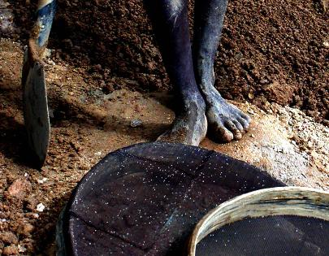
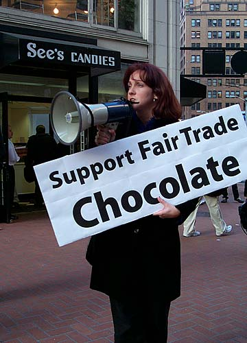
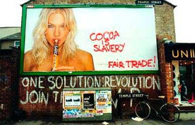

아침에 라디오에서 들은 이야기를 바탕으로 인터넷을 찾아보았다. 그리고는, 길게 썼다가 지웠다. 그냥 몇개의 링크로 대신.  

<!-- truncate -->

**다이아몬드**  
  
한국일보 코리아타임즈는 [**밸런타인스 데이 올해의 핫 아이템** (2006년 2월 11일)](http://www.koreatimes.com/article/articleview.asp?id=297325) 이라는 기사에서 선물 1순위로 다이아몬드를 뽑았다. 그러나, 한겨레는 [**[아!프리카]3. 자원 풍부한데 왜 가난할까** (2005년 12월 5일)](http://www.hani.co.kr/kisa/section-004007000/2005/12/004007000200512051611979.html) 라는 기사에서 그 다이아몬드가 사실은 사람들을 착취하고 전쟁을 위한 수단으로 쓰인다고 설명한다.  
  

사진출처: [Pahte's home page](http://www.pahte.com/Diamonds_pg-1.html)

사진제목: (다이아몬드를 캐는데 필요한) 모든 도구

  
또한 시중에는 "'영원한 사랑과 헌신의 상징' 다이아몬드를 둘러싸고 벌어진 비극의 세계사를 다룬 책"인 [**다이아몬드 잔혹사 (Blood Diamonds)**](http://www.aladdin.co.kr/shop/wproduct.aspx?ISBN=8972882283) 란 책이 팔리고 있다.  
  
**초콜릿**  
  
그리고, GEOreport에는 [**잔인하지 않은 초콜릿을 먹고 싶다** (2003년 2월 5일)](http://www.georeport.net/news/articleview.asp?menu_code=&no=12899) 라는 기사가 올라가 있으며, 이 글은 아이보리 코스트를 비롯한 아프리카의 카카오 농장에서 벌어지는 아동 노예들의 학대에 대한 내용이다.  
  

사진출처: [SF.INDYMEDIA.ORG](http://sf.indymedia.org/global-exchange/global-exchange18.html)

  
또한, 사이버 민주,인권관에서는 [**달콤쌉싸름한 초콜릿의 거짓말** (2005년 8월 19일)](http://www.cyberhumanrights.com/xboard/xboard.php?mode=view&bbs=board04&no=16&page=2&n=&t=&c=&k=&category=) 이라는 글에서 초콜릿에 대한 착취의 역사를 설명하고 있으며 노컷뉴스는 [**'달콤한' 발렌타인 초콜릿, '쌉싸름한' 아동착취의 산물** (2006년 2월 13일)](http://www.cbs.co.kr/nocut/show.asp?idx=164088) 이라는 기사에서 국제노동권리기금(ILRF) 테리 콜링스워스 사무총장과 최근 상황에 대한 이야기를 나눴다.  
  
**그렇다면,**  
  
담배에 붙는 문구 "건강을 해치는 담배, 그래도 피우시겠습니까?" 처럼 다이아몬드나 초콜릿에도 이런 문구를 붙이면 어떨까?  
  

"본 제품은 OOO명의 아이들이 XX일간 일해서 캐낸 다이아몬드입니다."  
"본 제품은 아동 노예 XXX명이 일해서 따낸 카카오가 OO% 들어간 초콜릿입니다."

  

사진출처 : [옥스팜 UK (Photo: Crispin Zeeman)](http://www.oxfam.org.uk/what_we_do/fairtrade/uniguide/index.htm)

  
이 시대에 정작 필요한 건 Free Trade Agreement 가 아니라 **Fair Trade Agreement** 가 아닌가 싶다.
