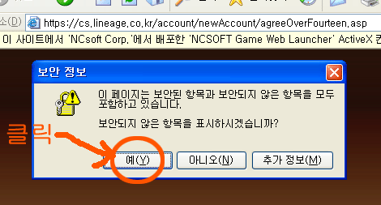
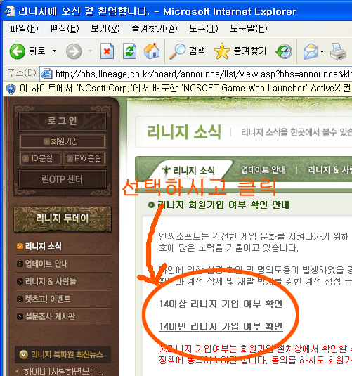
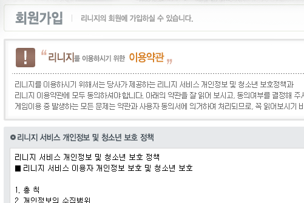
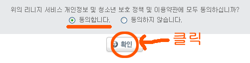
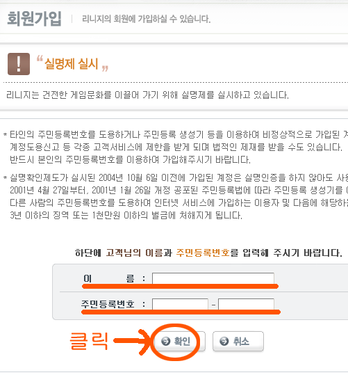
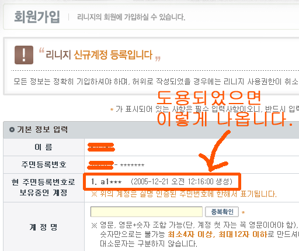

엔씨소프트의 게임, [**리니지에서 명의도용 회원가입 사건**](http://news.media.daum.net/snews/society/affair/200602/14/munhwa/v11697027.html)이 일어났습니다. 사실 새로운 사건이 일어났다기 보다는 예전부터 설왕설래 하던 게 수면으로 올라온 것이라 보는 게 맞겠지요. 저는 [**자바월드**](http://jawol.com)에서 확인했습니다.  

<!-- truncate -->

문화일보 기사를 보면 명의도용 신고 건수가 14일 오전 현재 1200건 이상이라고 하는데, 이보다 수십배 많을 거라고 보는 게 맞을 것입니다.  
  

**0. 시작하기 전에 알아둘 것**  
  
도용 여부를 확인하려고 리니지 홈페이지에 들어가면 ActiveX를 설치하라고 하거나, 보안되지 않는 항목도 표시하려 한다고 하거나 하는 메시지가 뜹니다.  
  
ActiveX는 설치하지 않아도 아무런 이상이 없습니다. 윈도XP sp2가 깔렸다면 아래와 같이 표시될 것이고, 그 이전 버전이라면 설치 화면에서 [아니오]를 눌러주면 됩니다.  
  
또한, 보안되지 않는 항목도 표시하겠냐는 메세지에는 [예(Y)]을 선택해주면 됩니다.   
  
그리고. 마치 회원가입을 하는 듯한 페이지로 연결이 되나 실제로 가입은 하지 않으면 되니 걱정하지 않아도 되지요.  
  

  

**1. 14세 미만인지 14세 이상인지 체크.**  
  
자신의 주민등록번호 + 실명이 도용되었는지 확인하려면 일단 아래의 주소를 클릭하셔서 14세 이상인지 14세 미만인지를 확인하고,  
  
**주소 : http://bbs.lineage.co.kr/board/announce/list/view.asp?bbs=announce&kind=&ls=0&lnp=1&bid=2202&sm=0&st=**  
  

  

**2. 약관에 동의하고 확인**  
  
마치 서비스에 가입하는 것과 같은 페이지로 이동하는데, 확인만 하고 가입하지 않을 것이나 개의치 말고 일단 약관에 동의하고 다음 페이지로 넘어갑니다.  
  
  

  

**실명과 주민등록번호를 넣고 확인**  
  
역시 서비스에 가입하지 않을 것이나 개의치 말고 이름과 주민등록번호를 넣어줍니다.  
  

  

**4. 계정은 등록하지 말고 보유중인 계정만 확인하기**  
  
그러고 나면 계정을 등록하는 페이지가 나오는데, 여기에 **[현 주민등록번호로 보유중인 계정]** 이라는 항목이 있습니다. 자신이 리니지에 가입한 적이 없는데도 여기에 뭔가 목록이 나타난다면 누군가 명의를 도용한 것입니다.  
  

  
저도 어떤 넘들이 도용을 해서 가입을 했더군요. 이런 !@$#@%#@$@!$#@ 같은 넘들 같으니라고.  
  
당장 전국 동일한 번호인 리니지 고객선터로 전화를 걸었습니다.  
  
**리니지 고객센터 : 1566-6600**  
  

**결과. 문제 해결하기**  
  
문제해결은 의외로 간단하였으나 좀 짜증이 났습니다. 일단 고객센터로 전화가 잘 걸리지 않는다는 것이지요. 그냥 끊어진다거나 통화 중이니 나중에 걸라는 메시지가 나오기 일쑤입니다.  
  
뭐, 어쨌든 성공적으로 통화에 성공하면 ARS 음성이 나옵니다. 이 때, **[1] 리니지 고객 -> [주민등록번호 + #] -> [0] 상담원 연결** 순으로 누르면 상담원과 연결할 수 있는데, 이 때 연결이 되기 까지는 다시 엄청난 인내를 요구합니다.  
  
항간에 도는 게시물들을 보면 해지 신청은 FAX나 이메일을 통해서만 가능하다고 되어 있으나 도용 신고가 많아져서인지 **전화상으로 바로 해지신청이 가능했습니다.**  
  
몇가지 개인정보를 물어본 후 (주민등록번호, 실명, 신분증 발급날짜, 전화번호, 이메일 등) 리니지 서비스를 탈퇴할 수 있었습니다.  
  
그리고, 간단한 팁.  
  
평생 엔씨소프트에서 나온 서비스를 사용할 일이 없는 분들은 이 때, 앞으로도 엔씨소프트의 모든 서비스에 가입을 하지 않겠다고 밝히시면 앞으로도 영원히 가입이 되지 않는다고 합니다. (추후에 본인이 재가입하겠다고 밝혀도 불가능하다고 하니 유의하여야겠지요.)  
  
참, 이렇게 신청해두면 15일 이내에 처리가 된다고 하더군요. 몇마디 따졌는데 미리 준비해둔 듯한 답변만 반복해서 그만 뒀습니다. 어쨌든 15일 이내에 처리하여 이메일로 알려준다고 합니다. [명의도용 문제가 매출에 별 영향을 미치지 않을 것이라는 엔씨소프트](http://news.inews24.com/php/news_view.php?g_serial=191512&g_menu=020500)... KIN- 입니다.

  
한번도 이런 일이 없었는데, 상당히 짜증이 나더군요. 여러 동호회의 글들을 읽어보니, 대규모로 정보가 유출된 것 같다고도 하고요. 문제는 이게 리니지와 엔씨소프트만의 문제가 아니라는 거죠. 이런 식으로 유출된 정보는 다른 모든 서비스에도 적용이 가능하기 때문에 더욱 짜증이 났습니다.  
  
그 동안 개인정보 보호 프로그램에 가입하지 않고 있었는데, 이번에 하나 가입할까 생각 중입니다. 매월 1,000원 정도 되는 상품부터 있다고 하는데, 한번 찾아봐야겠습니다.  
  
  
추가)  
핸드폰 인증으로 계정 삭제를 하는 방법이 추가되었다고 합니다.  
단, 핸드폰의 명의자가 본인이어야겠지요.  
  
**주소 : <https://secure.ncsoft.co.kr/lineage/default.asp>**
