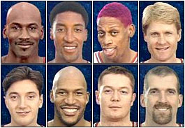
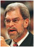

나이키의 스물 한번째 [**에어 조단**](http://www.answers.com/topic/air-jordan)이군요. Let Your Game Speak.  

<!-- truncate -->

자신의 영웅을 좋아하고 존경해서 열심히 노력하다 못해 그의 플레이 패턴과 버릇까지 흉내내는 아이들이라니. 조던을 좋아했던 사람으로서 감동적인 광고네요. 게다가 음악이 한 몫 해주는군요.  
  
  
  
마이클 조던 (Michael Jordan)  
스코티 피펜 (Scottie Pippen)  
데니스 로드맨 (Dennis Rodman)  
스티브 커 (Steve Kerr)  
토니 쿠코치 (Toni Kukoc)  
론 하퍼 (Ron Harper)  
룩 롱리 (Luc Longley)  
빌 웨닝턴 (Bill Wennington)  
  
  
  
그리고, 필 잭슨 (Phil Jackson) 감독  
  
전 NBA에 대해서 잘 모르지만, 딱 한번 좋아했을 때가 있었습니다. 바로 [**90년대**](http://sports.imbc.com/contents/html/contents.asp?cat=301060500&fname=index.html) 시카고 불스가 NBA를 주름잡던 바로 그 당시죠. 예, 전 NBA 매니아도 아니었고 NBA에 대해 잘 몰랐지만 (지금도 모르고) 그 당시 마이클 조던이 좋아서 경기를 보고, EA의 NBA 라이브를 하고, 친구들과 이야기를 했었죠. 저 같은 비농구팬까지 NBA에 열광하게 만들었다니, 무슨 말이 더 필요하겠습니까. 정말 대단한 사람들입니다.  
  
저 위에 있는 [**링크**](http://sports.imbc.com/contents/html/contents.asp?cat=301060500&fname=index.html)를 보니 정겨운 사람들 이름이 많이 보이네요. 매직 존슨, 호레이스 그랜트, 케빈 존슨, 게리 페이튼, 숀 캠프, 무톰보, 닉 밴 엑셀, 릭 스미츠, 에디 존슨, 존 스탁턴, 칼 말론, 레지 밀러... 생각해보니 제 기억 속에 이 이름들은 NBA 라이브를 하며 단련된 이름들이군요. -\_-)v  
  
생각난 김에 조던과 관련된 동영상 몇 개 찾았습니다. 역시 [YouTube](http://youtube.com)와 함께 합니다.  
  

**다른 "조던 + 나이키" 광고들**  
  
  
  
**Frozen Moment** 다른 훌륭한 플레이어들 처럼 조던도 그의 플레이를 지켜보는 수많은 팬들을 손에 땀을 쥐고 그의 경기를 보게 만들었죠. 그가 움직이기 시작하고 점프를 하면 정말 시간이 정지된 것 같았어요.  
  
  
  
**Failure** 기자들의 플래시가 터지지만 조던은 밝지 않은 표정이고, 나지막히 자신이 놓친 9000개 이상의 불발된 슛과 300번 이상 진 게임, 자신 때문에 진 62번의 게임에 대해 말합니다. 마치 경기에 진 것 같군요. 그러나, 마지막에 '내 인생의 그 수많은 실패들 때문에 자신이 성공했다'고 한마디 하는군요. 멋진 광고입니다.  
  
  
  
**23 vs. 39 (이건 게토레이, Gatorade 광고)** 39살의 조던과 23살의 조던이 '1 on 1'을 합니다. 늙었지만 노련해진 조던과 어리지만 패기 넘치는 조던의 승부는 디지털로 합성된 것이지요. 그들이 욕해가면서 대화하는 분위기도 재밌어요. 끝날 때는 노스 캐롤라이나 대학 시절의 조던까지 등장시키는 재치까지 발휘합니다.

  

**그리고 이건 보너스**  
  
  
  
**Michael Jordan Top 10 Assists** 조던은 슛도 많이 넣었지만, 다른 모든 면에서 경기 중 돋보이는 선수였지요. 특히 전 피펜과 함께 다이나믹 듀오라고 불렸을 때 정말 멋졌던 것 같아요.  
  
  
  
**Michael Jordan Top 10 Amazing Foul In** 많은 사람들이 그의 팬이 된 이유 중 하나는 분명 다른 선수들이 그의 슛을 끊으려 파울을 해도 결국 골을 넣는 그의 집중력과 타고난 감각 때문이었을 거예요.  
  
  
  
**Michael Jordan Top 10 Best Dunks** 에어 조던이 괜히 에어 조던이었겠습니까. 한창 때 그의 체공시간을 다른 선수들과 비교했던 게 생각나네요. 덕분에 나이키는 조던의 이름을 딴 신발을 많이도 팔아치우고 있죠.  
  
  
  
**Michael Jordan + I Believe I Can Fly (by R. Kelly)** 누가 그의 활약상을 담은 비디오에 알 켈리의 노래를 붙여놨군요. 그에게 잘 어울리는 문구입니다. '난 날 수 있어!'

  

**그리고 조금 더**  
  
- ["조던 + 나이키" 광고: What is Love](http://www.youtube.com/?v=uGwpkxJNgiI)  
- ["조던 + 나이키" 광고: Heart](http://www.youtube.com/?v=k8U6urXm6bI)  
- ["조던 + 나이키" 광고: Air Jordan 1](http://www.youtube.com/?v=SJLur-Af-8A)  
- ["조던 + 나이키" 광고: Air Jordan 3](http://www.youtube.com/?v=OYb99pakiKU)  
- ["조던 + 나이키" 광고: Air Jordan 7](http://www.youtube.com/?v=pABkT_hEe6w)  
  
- [Jordan/Pippen 'The Truth' (music by Mysonne)](http://www.youtube.com/?v=kzpx81UO8nw)  
- [Michael Jordans First Comeback](http://www.youtube.com/?v=oEPZFdLs0wo)  
  
- [Dennis Rodman Mix](http://www.youtube.com/?v=8G3Ccll7QUQ)  
- [Retirement of Chicago 33 jersey: Tribue to Scottie Pippen](http://www.youtube.com/?v=nykfHSOG55o)
