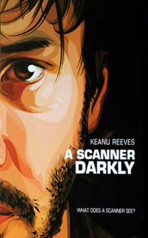
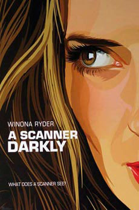
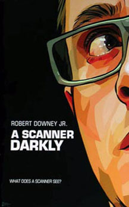
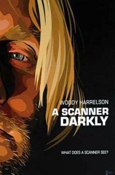

내가 좋아하는 감독 리처드 링클레이터 ([Richard Linklater](http://us.imdb.com/name/nm0000500/)) 감독의 영화 <A Scanner Darkly>가 촬영과 후반작업을 모두 끝내고 개봉을 기다리고 있다고 한다. 2006년 7월 7일 개봉 예정.  

<!-- truncate -->

  
예고편 속 문구 "**지금으로부터 7년 후, 당신이 하는 모든 것은 기록된다.** **(Seven years from now, everything you do will be recorded.)**"가 인상적이다. 하지만,  
  
  
  
[a\_scanner\_darkly.jpg](./a_scanner_darkly.jpg)  
원작은 필립 K. 딕의 소설. 가까운 미래, 미국은 약물 (마약)과의 전쟁에서 졌다. Fred는 정부의 위장 수사관 (undercover cops)이고, 약물 공급자를 추적하기 위해 'Substance D' 라는 약물을 정기적으로 복용하고 있다. 그는 다른 하나의 자아가 더 있는데 그의 이름은 Bob Arctor이며 그가 바로 약물 공급자이다. 그러다가 이 두 자아가 서서히 분열하기 시작한다.... (이후 생략) 이처럼 약물 중독에 관한 내용을 다루는 이 소설은 필립 K. 딕 본인의 경험을 바탕으로 썼다고 한다.  
  
[a\_scanner\_darkly\_movie.jpg](./a_scanner_darkly_movie.jpg)  
영화는 원래 찰리 카우프만 (Charlie Kaufman)이 각본을 만졌다는데, 그는 빠지고 리처드 링클레이터의 작품으로 태어났다. 이제껏 많은 필립 K. 딕의 소설을 원작으로 한 영화들이 실망스러웠지만, 이 작품은 **리처드 링클레이터이기 때문에** 기대가 된다.  
  
     
  
출연진은 키아누 리브스 (Keanu Reeves), 위노나 라이더 (Winona Ryder), 로버트 다우니 주니어 (Robert Downey Jr.), 우디 해럴슨 (Woody Harrelson). 영화는 리처드 링클레이터 감독의 2001년작 [<웨이킹 라이프](http://movie.naver.com/movie/bi/mi/media.nhn?code=32053) ([Waking Life](http://us.imdb.com/title/tt0243017/))>처럼 배우들을 실사로 찍은 뒤 로토스코핑을 거쳐서 개봉된다.  
  

**관련 링크**  
  
[**2번째 트레일러** (from themoviebox.net)](http://www.themoviebox.net/movies/2005/STUVWXYZ/Scanner-Darkly,A/trailer.php) (2번째 트레일러를 보고 싶으면)  
[Warner Independent Picture - Official Site](http://wip.warnerbros.com/index.html?site=ascannerdarkly)  (공식 홈페이지, 영어)  
[Rotten Tomatoes Flipbook](http://www.rottentomatoes.com/m/10004234-scanner_darkly/flipbook.php?trailer=10006022&page=1&nopop=1) (더 많은 스틸컷을 보고 싶으면)  
[IGN: Scanner Darkly, A (2006) images](http://media.filmforce.ign.com/media/670/670907/imgs_1.html) (더 많은 스틸컷을 보고 싶으면)  
  
[Philip K. Dick (the official site) - A Scanner Darkly Film News](http://www.philipkdick.com/films_scanner.html) (영어)  
[Philip K. Dick (the official site) - A Note from the PKD Trust](http://www.philipkdick.com/films_scanner-061204.html) (영어)  
[Wired - The Second Coming of Philip K. Dick](http://wired-vig.wired.com/wired/archive/11.12/philip.html?pg=1&topic=&topic_set=) (Wired 기사, 2003년 12월, 영어)  
[Amazon: Listmania! - PKD in film](http://www.amazon.com/gp/richpub/listmania/fullview/AYN3O66QJKQA/102-7541230-5727364?%5Fencoding=UTF8)  
  
[FILM 2.0 오 마이 DVD - <웨이킹 라이프>](http://www.film2.co.kr/include/webcast_player3.asp?mode=1&cate=오%20마이%20DVD&wkey=1824) (<웨이킹 라이프> 소개 동영상)  
[Wikipedia.org - rotoscope](http://en.wikipedia.org/wiki/Rotoscope) (영어)  
[Issac Story - 로토스코핑....](http://blog.naver.com/kjy8138/20012959573) (로토스코핑의 예)  
[[연예]개그맨 김진수, 영화 주연급 캐스팅](http://photo.media.daum.net/gallery/today_enter/200602/14/sportskr/v11693409.html) (국내 로토스코핑 영화 제작)

  

**내 맘대로 trivia**  
  
위에서 말한 것처럼 원래는 찰리 카우프만이 각본을 맡았었다. 아, 이 버전 역시 보고 싶다.  
  
테리 길리엄 (Terry Gilliam) 감독도 이 영화를 탐냈었다고.  
  
라디오헤드 (Radiohead)가 이 영화의 사운드트랙에 참여할지도 모른다는 [**소문**](http://www.twitchfilm.net/archives/004469.html)이 있는데, 반대로 맡지 않았다는 [**소문**](http://www.ateaseweb.com/news/archive/2005/12/radiohead_decli_1.php)도 있다.  
  
재밌게도 주요 배역을 맡은 키아누, 다우니, 해럴슨, 위노나 4명 모두 마약 때문에 말썽 좀 부렸던 배우들이다. 감독의 의도인가?

  
 /  /   
  

**추가**  
  
2006년 3월 30일, 씨네21에 의하면 라디오헤드가 참여하는 게 맞는 듯 하다.  
[씨네21 - SF애니로 듣는 라디오헤드?!](http://www.cine21.com/Magazine/mag_pub_view.php?mm=005002003&mag_id=37486)
