  
아시는 분들은 모두 아시는 [**판도라**](http://www.pandora.com/). The Music Genome Project에 의해 만들어진 서비스인데, 간단히 말하면 **새로운 형태의 인터넷 라디오**라고 할 수 있습니다.  

<!-- truncate -->

사용자가 새로운 스테이션을 생성하고 자신이 원하는 가수 이름이나 노래 이름을 키워드로 집어 넣으면 판도라는 그 키워드와 유사한 종류의 음악들을 계속해서 들려줍니다. 스테이션의 생성과 삭제는 자유롭게 할 수 있습니다.  
  
사용해 본 결과 (키워드만 넣으면 되는) 너무나 간단한 서비스이면서 굉장히 훌륭한 선곡을 보여줍니다. 인터페이스도 매우 심플합니다.  
  
[스타세일러 (Starsailor)](http://www.allmusic.com/cg/amg.dll?p=amg&sql=11:eif1zfo2ehok)와 [콜드플레이 (Coldplay)](http://www.allmusic.com/cg/amg.dll?p=amg&sql=11:5krsa9ygl230) 풍의 음악을 좋아하고, [켈리 클락슨 (Kelly Clarkson)](http://www.allmusic.com/cg/amg.dll?p=amg&sql=11:j9kmu3r0an4k)의 노래 중에서 "Since U Been Gone"을 좋아하는 사람이라고 가정하고 아래 사용 예를 보세요.  
  

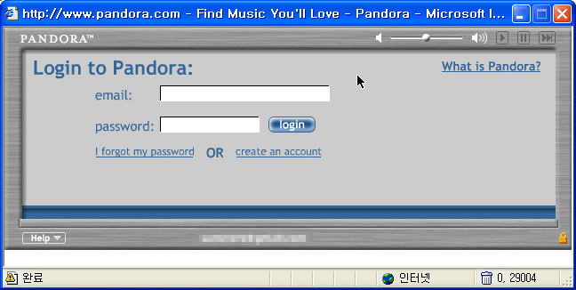

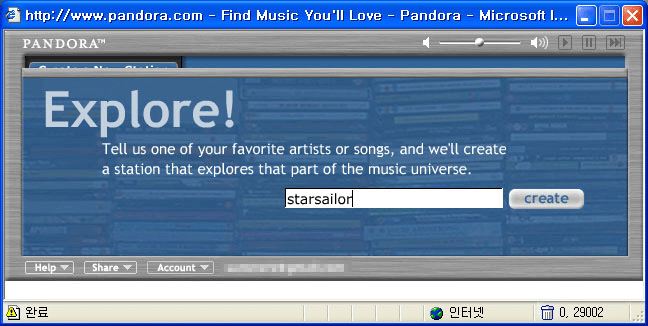

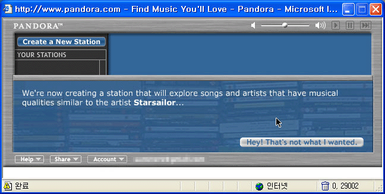

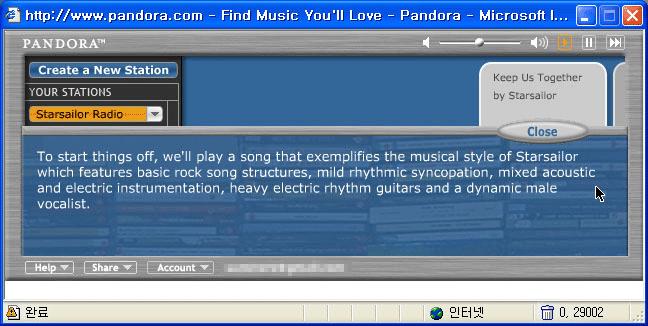

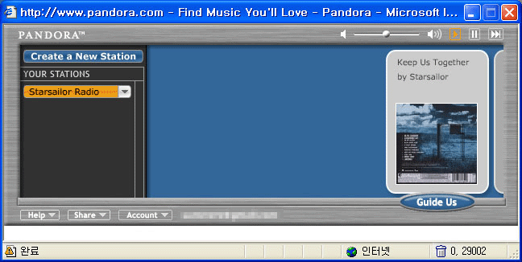

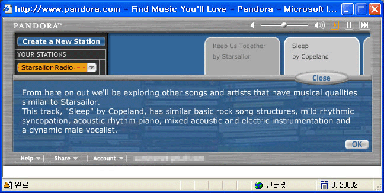

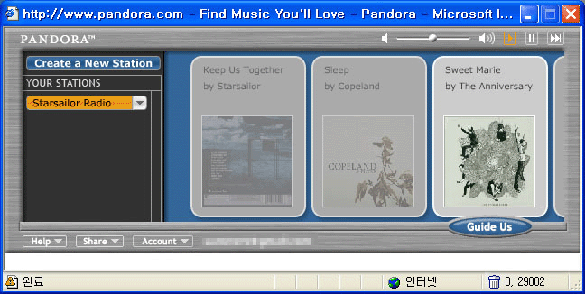

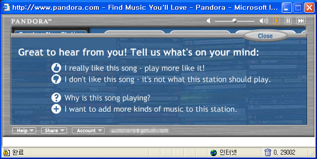

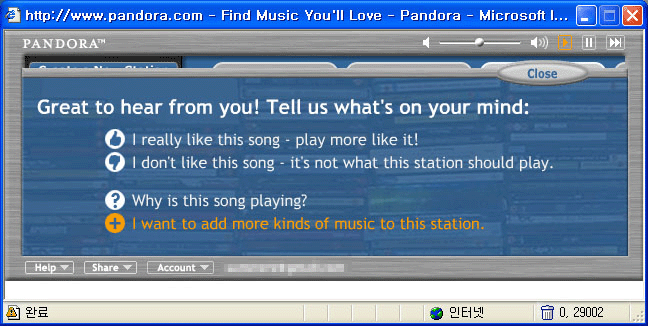

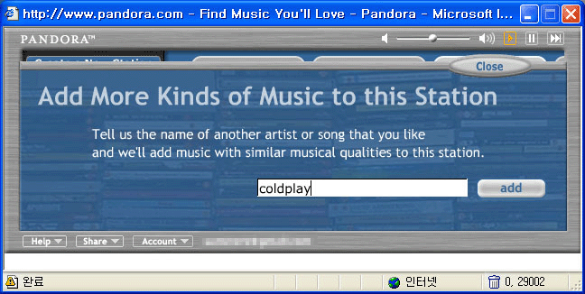

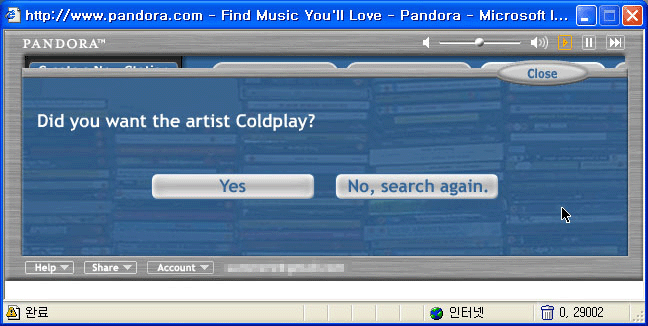

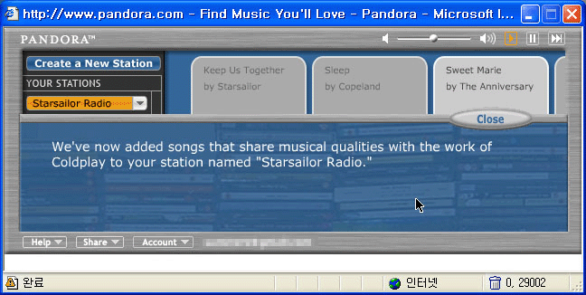

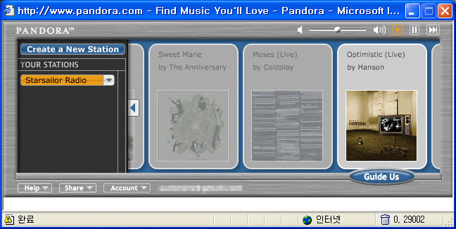

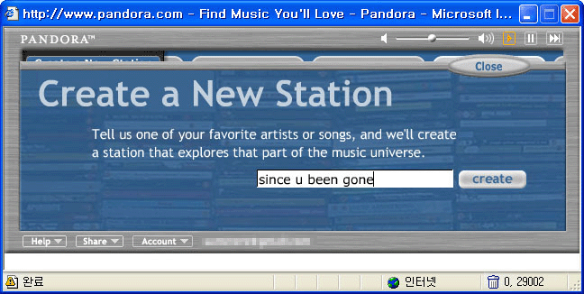

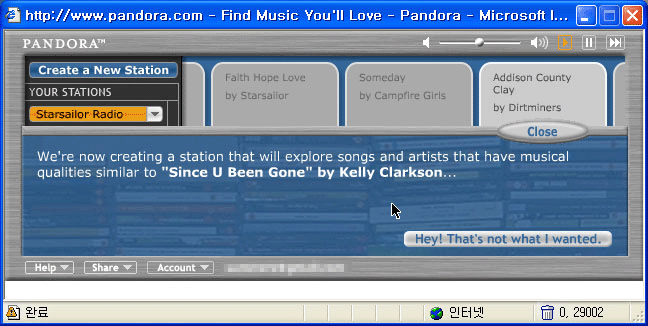

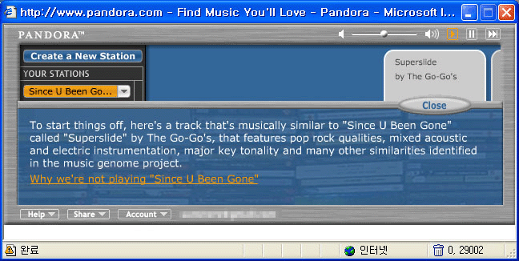

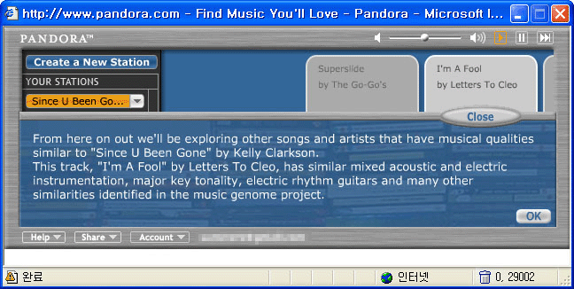

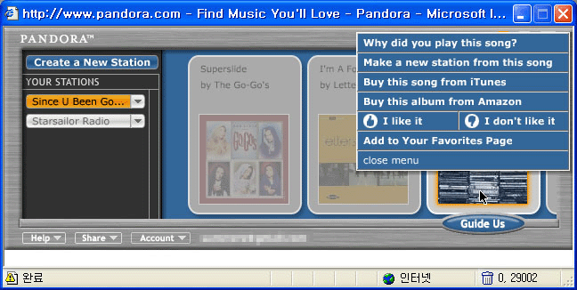

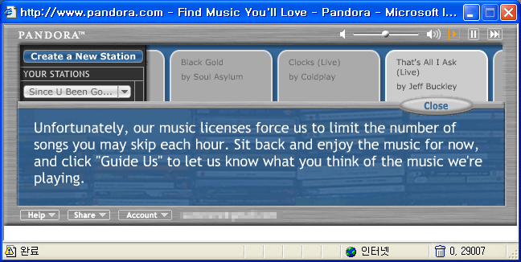

  
저는 이런 서비스가 너무 좋아요. 여기서 이런 서비스란, **(1) 사용법은 매우 간단하지만 (2) 기능상으로 불편함이 거의 없는** 서비스죠. 요즘 구글이 조금 공격받고는 있지만 여전히 구글에 열광하는 사람들이 많은 것도 이 때문이라고 생각해요.  
  
어떤 사람들은 강력한 커스터마이징을 원하기도 하고, 셀 수 없이 다양한 부가적인 기능들까지 직접 만질 수 있길 원하기도 하지만 전 반대로 사용하기 편하면서도 제 손으로 완전히 통제가 가능하지 않는 그런 서비스가 더 매력적이예요.  
  
제가 느끼는 [**Pandora**](http://www.pandora.com/)의 매력은 바로 다른 리스트나 구차한 예시 등을 열거해서 보여주지 않는다는 점과 자기 컴퓨터에 들어 있는 음악 파일들처럼 [이전곡], [다음곡]을 마음대로 선택할 수 없다는 점입니다. [다음곡]으로 갈 수 있는 횟수도 제한적이고 [이전곡]은 아예 다시 들을 수가 없지요.  
  
이건 다른 여느 음악듣기 서비스와는 다른 부분입니다. 오히려 초창기 라디오의 음악 프로그램과 비슷해요. 다음 곡으로 어떤 곡이 나올지 전혀 알 수 없는 거죠. 비지니스적으로도 서비스의 성격을 기존의 라디오와 유사하게 가져감으로써 음반업계의 동의를 구하기도 쉬울 거예요.  
  
게다가 이 자동선곡 서비스가 이들의 자료에 의하면 - 6년여 동안 30여명의 아티스트와 분석가들이 400여가지나 되는 곡의 성격을 분류하는 일을 해온 결과라고 하는군요. 게다가 이 작업은 지금도 하고 있고요. (아... 이 DB 탐나는군요.)  
  
무엇보다 이 서비스가 마음에 드는 점은 사용자의 자유도가 거의 없는 이 서비스가 제시하는 선곡이 무척 만족스럽다는 겁니다 (특히 최근의 록, 팝의 경우). 물론 수많은 인터넷 방송국도 있고, 개인이 하는 웹방송 채널들도 많이 있지만 그들이 들려주는 음악은 어느 정도 편향되어 있다면 이 서비스는 아티스트 이름만 알면 꼬리에 꼬리를 물면서 좋은 음악들을 많이 들을 수 있다고나 할까요? **음악 듣는 사람들의 취향을 잘 간파한 것 같아요.**  
  
앞으로도 이들의 분류 실력이 녹슬지 않길 기대하고, 이들이 되도록 많은 음악을 구하여 듣고 서비스에 적용시킬 수 있길 기대합니다.
